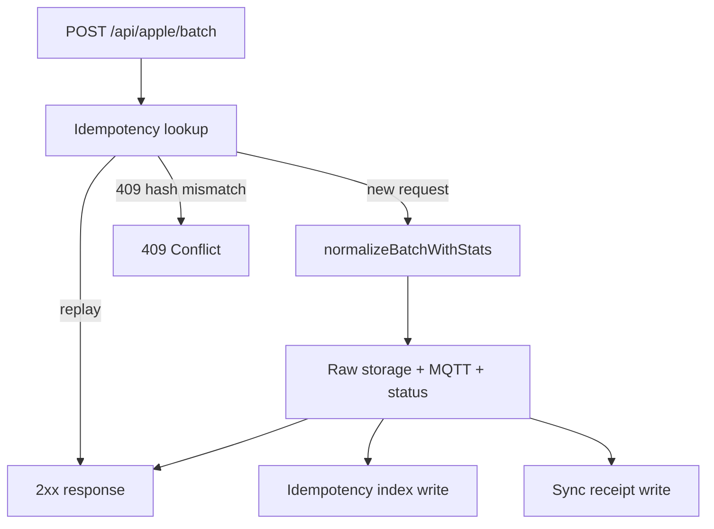

# API Alignment Improvement Plan

## Context

The current port already satisfies the **v1 HealthSave sync contract** and the **v2 additive receipt/diagnostics endpoints**. The work below targets gaps identified in the API review: behaviors the spec recommends or documents, but the implementation only partially covers — including the missing **`GET /ready`** readiness endpoint.



Today, **idempotency lookup and storage both depend on sync receipt rows**, and receipt rows are only created when `X-HealthSave-Sync-Run-ID` is present ([`createReceiptRecord`](src/state/sync-receipts.ts)). That is the main functional gap.

---

## 1. Decouple idempotency from sync-run receipts (highest priority)

### Why

[`reference-implementation/API.md`](reference-implementation/API.md) treats retry-safe batch ingest as **recommended production behavior**, separate from v2 proof endpoints. It documents `Idempotency-Key` + payload-hash conflict handling on batch upload itself.

HealthSave 1.5 usually sends sync-run headers together with idempotency headers, but the API does not require that coupling. Today, a client sending only `Idempotency-Key` (or losing the sync-run header on retry) will **re-run MQTT publication and status updates** on every retry because [`getIdempotencyReceipt`](src/state/sync-receipts.ts) only searches receipt records that were never written.

### What to do

1. **Introduce a dedicated idempotency index** in [`src/state/sync-receipts.ts`](src/state/sync-receipts.ts) (or a small sibling module under `src/state/`) with the same backend pattern as status/receipts:
   - File path: `<DATA_PATH>/idempotency/<context>/keys.ndjson`
   - Memory backend for tests (`STATE_BACKEND=memory`)
   - Record shape: `{ idempotency_key, payload_hash?, response, recorded_at }`

2. **Split responsibilities clearly:**
   - **Idempotency index** — written on every successful batch when `Idempotency-Key` is present (with or without sync-run ID)
   - **Sync receipt ledger** — unchanged requirement: only when `X-HealthSave-Sync-Run-ID` is present (v2 operator proof)

3. **Update [`src/routes/apple.ts`](src/routes/apple.ts) flow:**
   - Keep early idempotency check before side effects
   - On success (processed **and** empty batches), write idempotency entry whenever `Idempotency-Key` is set
   - Keep `409` when same key + different `X-HealthSave-Payload-Hash`

4. **Refactor `getIdempotencyReceipt`** to read the idempotency index first; optionally fall back to receipt records for backward compatibility with data already on disk.

5. **Update docs:**
   - [`PORTING.md`](PORTING.md) §Phase D — change “complete when sync run ID present” to “idempotency complete for all batches with `Idempotency-Key`; v2 receipts still require sync run ID”
   - [`README.md`](README.md) — one sentence on idempotency vs delivery receipts if operator-facing

### Tests to add/update

| Test | Location | Why |
|------|----------|-----|
| Idempotency replay without sync-run ID skips MQTT/status | `test/integration/app.test.ts` | Proves the main gap is closed |
| Idempotency index persists across restart | `test/unit/sync-receipts.test.ts` or new file | Matches file-backed durability expectations |
| Existing sync-run idempotency tests keep passing | current integration tests | No regression |

Update [`TEST_MATRIX.md`](TEST_MATRIX.md) — replace “ignores batches without sync run IDs” idempotency implication with two explicit rows: idempotency-without-run-id vs receipts-without-run-id.

---

## 2. Reference-compatible status timestamp formatting (medium priority)

### Why

The API status examples use PostgreSQL-style timestamps (`"2026-04-01 08:00:00+00:00"`) and date-only values for `daily_activity` (`"2026-04-01"`). The server currently returns ISO-8601 UTC from [`parseTimestamp`](src/ingest.ts) (`"2026-04-10T12:00:00.000Z"`) through the status ledger unchanged ([`getStatus`](src/state/store.ts)).

Internal storage can stay ISO; the risk is **client display/parsing** if HealthSave or downstream tools expect the reference format. Formatting at the **response boundary** avoids migrating existing NDJSON ledgers.

### What to do

1. Add a formatter in a small compat helper (e.g. `src/compat/status-format.ts`):
   - **Timestamp metrics** (`heart_rate`, `hrv`, `blood_oxygen`, `sleep_sessions`, `workouts`, `quantity_samples`): convert stored ISO → `"YYYY-MM-DD HH:mm:ss+00:00"`
   - **`daily_activity`**: keep date-only when value is already `YYYY-MM-DD`; otherwise slice to date portion

2. Apply formatting in `StateStore.getStatus()` implementations ([`createMemoryStateStore`](src/state/store.ts), [`FileStateStore`](src/state/store.ts)) before returning the snapshot — not when writing observations.

3. **Do not change** ingest normalization or MQTT payloads (they can remain ISO).

### Tests

- Unit tests for formatter edge cases (offsets, midnight UTC, date-only daily activity)
- Update integration status assertions in [`test/integration/app.test.ts`](test/integration/app.test.ts) and [`test/unit/state-store.test.ts`](test/unit/state-store.test.ts) to expect reference format on API responses

Update [`PORTING.md`](PORTING.md) §4.3 with explicit “API response format vs internal storage format” note.

---

## 3. Implement `GET /ready` (medium priority)

### Why

[`reference-implementation/API.md`](reference-implementation/API.md) documents `GET /ready` as a **readiness probe** distinct from liveness (`/health`, `/api/health`):

```json
{
  "status": "ok",
  "database": "ok"
}
```

Liveness only proves the HTTP process is up. Readiness proves the server can **actually accept and persist work**. Operators, Docker Compose, and orchestrators use `/ready` to decide whether to route traffic or restart a container that is alive but unusable.

The reference Data Hub checks TimescaleDB connectivity. This MQTT port has no primary database, but it **does** have operational dependencies that must be healthy before ingest is safe:

- **Durable state** — status ledger and (when used) receipt/idempotency files under `DATA_PATH`
- **MQTT broker** — when `MQTT_ENABLED=true`, the server’s primary output path; a connected process with a dead broker will accept batches and return `502`

Today only [`GET /health`](src/routes/health.ts) exists. The [Dockerfile](Dockerfile) `HEALTHCHECK` also hits `/health`, so a container can report healthy even when persistence or MQTT is broken.

Implementing `/ready` closes the documented API gap and gives operators a meaningful readiness signal without pretending TimescaleDB exists.

### What to do

1. **Add `GET /ready`** in [`src/routes/health.ts`](src/routes/health.ts) (or a small `src/routes/ready.ts` registered from [`src/app.ts`](src/app.ts)).

2. **Preserve the reference response shape** on success:
   - `{ "status": "ok", "database": "ok" }`
   - Keep the `database` key name even though this service uses file-backed state, not PostgreSQL — downstream tools and API parity expect that field.

3. **Define readiness checks** (all must pass for `200`):
   - **State backend probe** — maps to `database: "ok"`:
     - `STATE_BACKEND=file`: verify `DATA_PATH` exists and is writable (e.g. `access(W_OK)` on `<DATA_PATH>/status` or a lightweight probe write/delete)
     - `STATE_BACKEND=memory`: always OK (used in tests/disposable runs; document that production should use `file`)
   - **MQTT probe** (only when `MQTT_ENABLED=true`):
     - Expose a cheap `isConnected()` (or equivalent) on [`HealthMqttPublisher`](src/mqtt/publisher.ts) / underlying mqtt client
     - Readiness fails if the client is disconnected or reconnecting after startup

4. **Failure behavior** — return **`503 Service Unavailable`** when any probe fails:
   - Example body: `{ "status": "error", "database": "unavailable" }` when state probe fails
   - When MQTT is enabled and down, still return `503`; include enough detail for operators (e.g. `"database": "ok"` but a separate `"mqtt": "unavailable"` field is acceptable as an **additive** extension, as long as success shape stays reference-compatible)

5. **Authentication** — keep `/ready` **unauthenticated**, same as `/health` (API.md does not protect it).

6. **Documentation updates**:
   - Add `/ready` to required endpoints table in [`PORTING.md`](PORTING.md) §4.1 with MQTT-specific probe semantics
   - Mention `/ready` vs `/health` in [`README.md`](README.md) operator section
   - Optionally update [Dockerfile](Dockerfile) `HEALTHCHECK` to use `/ready` instead of `/health` for stricter container readiness (document the trade-off: slower/more brittle startup if broker is slow)

### Tests

| Test | Location | Why |
|------|----------|-----|
| `GET /ready` returns `200` + reference shape when dependencies OK | `test/integration/app.test.ts` | API contract |
| `GET /ready` returns `503` when `DATA_PATH` is not writable | integration test with temp unwritable path | Proves state probe works |
| `GET /ready` returns `503` when MQTT enabled but client disconnected | integration test with mock publisher reporting disconnected | Proves broker probe works |
| `GET /ready` stays unauthenticated when `API_KEY` is set | `test/integration/app.test.ts` | Matches health endpoint behavior |

Update [`TEST_MATRIX.md`](TEST_MATRIX.md) with readiness endpoint rows.

---

## 4. Record failed batches in sync receipts (medium priority)

### Why

v2 run summaries expose `batches_seen`, `batches_processed`, and `batches_failed` ([API example](reference-implementation/API.md)). Today [`runSummary`](src/state/sync-receipts.ts) hard-codes `batches_failed: 0`, and [`recordBatch`](src/routes/apple.ts) runs only **after** successful ingest.

When MQTT publish fails (`502`) or raw storage fails (`500`), the client may retry while operators see an **incomplete or silent run** in `/api/v2/sync/runs/*` — no signal that a batch was attempted but failed.

### What to do

1. Extend receipt model with a **batch outcome** field, e.g. `outcome: "processed" | "failed"` and optional `failure_reason` / HTTP status.

2. Add `recordFailedBatch()` (or extend `RecordSyncReceiptInput`) called from error paths in [`src/routes/apple.ts`](src/routes/apple.ts) when:
   - `X-HealthSave-Sync-Run-ID` is present, **and**
   - ingest failed after validation (raw storage error, MQTT error)
   - Do **not** record failures for idempotency `409` or validation `400` (those are client errors, not partial sync delivery)

3. Update [`runSummary`](src/state/sync-receipts.ts):
   - `batches_processed` = successful receipt rows
   - `batches_failed` = failed receipt rows
   - `batches_seen` = unique batch IDs across both (existing `uniqueBatchCount` logic)

4. Failed rows should **not** increment accepted record counts or update idempotency (retries must be able to succeed).

### Tests

- Integration: batch with sync-run headers + forced MQTT failure → run summary shows `batches_failed: 1`, status unchanged, retry succeeds
- Unit: run aggregation with mixed success/failure rows

Update [`TEST_MATRIX.md`](TEST_MATRIX.md) with failed-batch receipt coverage.

---

## 5. ECG compatibility and explicit non-goals (lower priority, quick wins)

### Why

The API states `ecg` batches are **accepted for compatibility** but not persisted. The generic ingest path likely already returns `200` + `"processed"` + `records: 0`, but there is **no test** proving HealthSave won’t see an error. Undocumented omission of insights endpoints can confuse operators comparing against Data Hub.

### What to do

1. **ECG test** in [`test/unit/ingest.test.ts`](test/unit/ingest.test.ts) and/or integration test:
   - Payload with typical ECG fields (`start`, `end`, `classification`, …) without quantity-like `date`/`qty`
   - Assert zero normalized records, zero rejections (compatibility accept)

2. **Document intentional non-implementation** in [`PORTING.md`](PORTING.md) (new subsection under compatibility):
   - `GET /api/insights/*` — out of scope for sync replacement; no HealthSave client dependency

No code required for insights unless explicitly wanted later.

---

## 6. Category event timestamp fallback (lower priority)

### Why

Category events in the API can carry `date`, `endDate`, and `qty`. [`normalizeGenericQuantity`](src/ingest.ts) only reads `sample.date`. Instant or duration-based category samples that only provide `endDate` would be silently skipped and counted as validation failures — unnecessary data loss for symptom/mindful-session style metrics.

### What to do

1. In `normalizeGenericQuantity`, resolve time via `firstPresent(sample, "date", "endDate", "startDate")` (same pattern used elsewhere in ingest).

2. Add unit test with a mindful-session-style payload (from API.md example) asserting one accepted `quantity_samples` record.

Update [`TEST_MATRIX.md`](TEST_MATRIX.md) with category-event coverage row.

---

## 7. Minor auth polish (optional, lowest priority)

### Why

HealthSave 1.5 classifies **both** `401` and `403` on liveness/protected paths as auth failures. The server only returns `401` ([`requireApiKey`](src/auth.ts)). This is unlikely to break sync but is a small compatibility nicety.

### What to do

- Either return `403` instead of `401` for wrong keys, **or** accept both codes in tests/docs
- Recommendation: **keep `401`** (matches FastAPI/reference Data Hub default) and document in [`PORTING.md`](PORTING.md) that only `401` is emitted — unless iOS testing shows `403` is needed

**Defer unless you have evidence iOS misclassifies `401`.**

---

## Execution order

| Step | Item | Rationale |
|------|------|-----------|
| 1 | Idempotency index | Prevents duplicate MQTT/status on retries — highest user impact |
| 2 | `GET /ready` | Documented API endpoint; meaningful readiness for Docker/operators |
| 3 | Status timestamp formatting | Low-risk response-layer change; improves reference fidelity |
| 4 | Failed-batch receipts | Improves v2 operator diagnostics for partial syncs |
| 5 | ECG test + insights non-goal docs | Cheap confidence + clearer scope boundaries |
| 6 | Category `endDate` fallback | Edge-case ingest completeness |
| 7 | Auth 403 (optional) | Only if needed after testing |

---

## Files likely touched

- [`src/state/sync-receipts.ts`](src/state/sync-receipts.ts) — idempotency index, failed-batch records, summary math
- [`src/routes/apple.ts`](src/routes/apple.ts) — write idempotency on all successes; record failures
- [`src/routes/health.ts`](src/routes/health.ts) (or new ready module) — `GET /ready` readiness probes
- [`src/mqtt/publisher.ts`](src/mqtt/publisher.ts) — expose connection state for MQTT readiness probe
- [`src/state/store.ts`](src/state/store.ts) — status response formatting hook; optional state probe helper
- [`Dockerfile`](Dockerfile) — optional HEALTHCHECK switch to `/ready`
- New: `src/compat/status-format.ts` (or similar)
- [`test/integration/app.test.ts`](test/integration/app.test.ts), [`test/unit/sync-receipts.test.ts`](test/unit/sync-receipts.test.ts), [`test/unit/ingest.test.ts`](test/unit/ingest.test.ts), [`test/unit/state-store.test.ts`](test/unit/state-store.test.ts)
- [`PORTING.md`](PORTING.md), [`TEST_MATRIX.md`](TEST_MATRIX.md), possibly [`README.md`](README.md)

Run full test suite after each step per [`AGENTS.md`](AGENTS.md).

---

## Out of scope (explicitly)

- Insights endpoints (`GET /api/insights/*`) or Timescale `inserted_vs_existing` storage levels
- Broad deterministic record-key idempotency beyond `Idempotency-Key` (still listed as “planned” in PORTING.md Phase D)
- Changes inside `reference-implementation/` (read-only)
