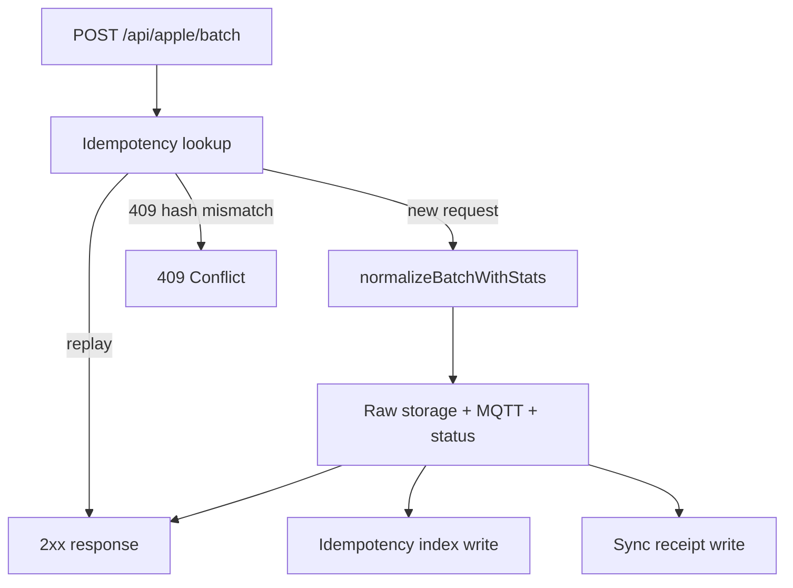

<!-- Generated by SpecStory, Markdown v2.1.0 -->

# 2026-06-02 15:41:47Z

<!-- Codex CLI Session 019e88fe-356d-7233-8c3d-8da57c8debb4 (2026-06-02 15:41:47Z) -->

_**User (2026-06-02 15:41:47Z)**_

in reference-implementation ist die API.md aktualisiert worden. Konkret wurde ein iOS liveness probe behavior und neue /api/v2 Endpunkte hinzugefügt die implementiert werden müssen und in das bestehende system eingepflegt werden.

Analysiere die existierende version und erstelle einen plan


---

_**Agent (gpt-5.5 2026-06-02 15:41:54Z)**_

Ich schaue mir zuerst die aktuelle Port-Struktur und die aktualisierte Referenz-API an, ohne Dateien zu ändern. Danach grenze ich ab, welche v2- und iOS-liveness-Verhalten schon abgedeckt sind und wo der Plan präzise werden muss.

_**Agent (gpt-5.5 2026-06-02 15:41:54Z)**_

<tool-use data-tool-type="shell" data-tool-name="exec_command"><details>
<summary>Tool use: **exec_command** `rg --files`</summary>
```
Chunk ID: 4789be
Wall time: 0.0000 seconds
Process exited with code 0
Original token count: 183
Output:
src/auth.ts
src/ingest.ts
src/routes/health.ts
src/routes/apple.ts
src/server.ts
src/config.ts
src/mqtt/topics.ts
src/mqtt/publisher.ts
src/storage/raw-batch-storage.ts
src/state/store.ts
src/app.ts
reference-implementation/BRIDGE.md
reference-implementation/README.md
reference-implementation/API.md
AGENTS.md
docker-compose.yml
tsconfig.json
package.json
package-lock.json
TEST_STRATEGY.md
README.md
PORTING.md
screenshot.png
Dockerfile
config/app.config.example.yaml
config/mosquitto.conf
CHANGELOG.md
test/integration/app.test.ts
test/unit/raw-batch-storage.test.ts
test/unit/config.test.ts
test/unit/state-store.test.ts
test/unit/auth.test.ts
test/unit/mqtt-publisher.test.ts
test/unit/ingest.test.ts
LICENSE
TEST_MATRIX.md
```
</details></tool-use>

_**Agent (gpt-5.5 2026-06-02 15:41:54Z)**_

<tool-use data-tool-type="shell" data-tool-name="exec_command"><details>
<summary>Tool use: **exec_command** `find reference-implementation -maxdepth 3 -type f | sort`</summary>
```
Chunk ID: d75482
Wall time: 0.0000 seconds
Process exited with code 0
Original token count: 26
Output:
reference-implementation/API.md
reference-implementation/BRIDGE.md
reference-implementation/README.md
```
</details></tool-use>

_**Agent (gpt-5.5 2026-06-02 15:41:54Z)**_

<tool-use data-tool-type="shell" data-tool-name="exec_command"><details>
<summary>Tool use: **exec_command** `git status --short`</summary>
```
Chunk ID: 68b0f7
Wall time: 0.0000 seconds
Process exited with code 0
Original token count: 278
Output:
 M .specstory/history/2026-04-18_00-49-33Z-bump-version-to-0.md
 M .specstory/statistics.json
 M reference-implementation/API.md
 D reference-implementation/Dockerfile
 D reference-implementation/LICENSE
 M reference-implementation/README.md
 D reference-implementation/docker-compose.yml
 D reference-implementation/grafana/dashboards/activity.json
 D reference-implementation/grafana/dashboards/healthsave-overview.json
 D reference-implementation/grafana/dashboards/workouts.json
 D reference-implementation/grafana/provisioning/dashboards/default.yaml
 D reference-implementation/grafana/provisioning/datasources/healthsave.yaml
 D reference-implementation/home-assistant/healthsave-package.yaml
 D reference-implementation/home-assistant/secrets.example.yaml
 D reference-implementation/migrations/001_audit_hardening.sql
 D reference-implementation/pyproject.toml
 D reference-implementation/requirements.txt
 D reference-implementation/schema.sql
 D reference-implementation/server.py
 D reference-implementation/tests/test_api_contract.py
?? .cursorindexingignore
?? reference-implementation/BRIDGE.md
```
</details></tool-use>

_**Agent (gpt-5.5 2026-06-02 15:42:24Z)**_

Ich sehe bereits: die Referenzdateien sind im Working Tree verändert, und `reference-implementation/` bleibt laut Regeln strikt read-only. Ich werde diese Änderungen nur lesen und den Plan so formulieren, dass die Implementierung ausschließlich außerhalb davon passiert.

_**Agent (gpt-5.5 2026-06-02 15:42:24Z)**_

<tool-use data-tool-type="shell" data-tool-name="exec_command"><details>
<summary>Tool use: **exec_command** `sed -n '1,260p' reference-implementation/API.md`</summary>
```
Chunk ID: ec68d3
Wall time: 0.0000 seconds
Process exited with code 0
Original token count: 1946
Output:
# HealthSave API Contract

HealthSave expects the server URL to be the base URL only, for example
`https://health.example.com`. The app appends the paths below.

If `API_KEY` is set on the server, protected endpoints require:

```http
x-api-key: your-api-key
```

## Health Checks

### `GET /health`

Returns a minimal process health response.

```json
{
  "status": "ok"
}
```

### `GET /api/health`

Returns the same app-friendly health response.

```json
{
  "status": "ok"
}
```

### `GET /ready`

Checks that the API can reach the database.

```json
{
  "status": "ok",
  "database": "ok"
}
```

## Batch Ingest

### `POST /api/apple/batch`

Receives one HealthKit metric batch.

```json
{
  "metric": "heart_rate",
  "batch_index": 0,
  "total_batches": 1,
  "samples": [
    {
      "date": "2026-04-10T12:00:00Z",
      "qty": 72,
      "unit": "count/min",
      "source": "Apple Watch"
    }
  ]
}
```

Success response:

```json
{
  "status": "processed",
  "metric": "heart_rate",
  "batch": 0,
  "total_batches": 1,
  "records": 1
}
```

The server records the original batch in `raw_ingestion_log` before processing
and marks the raw log row as processed after the batch commit succeeds. This
keeps a replay/debug trail without changing the HealthSave response shape.

Empty batch response:

```json
{
  "status": "empty",
  "metric": "heart_rate",
  "batch": 0,
  "records": 0
}
```

### Dedicated Metrics

These metrics are stored in first-class tables:

| Metric | Table | Notes |
|--------|-------|-------|
| `heart_rate` | `heart_rate` | Beats per minute |
| `heart_rate_variability` | `hrv` | Stored as SDNN milliseconds |
| `blood_oxygen` | `blood_oxygen` | Accepts `97` or `0.97` |
| `oxygen_saturation` | `blood_oxygen` | Alias used by HealthSave |
| `body_temperature` | `body_temperature` | Celsius |
| `wrist_temperature` | `body_temperature` | Alias used by HealthSave |
| `sleep_analysis` | `sleep_sessions` | Aggregates sleep stage samples into sessions |
| `workouts` | `workouts` | Stores workout summaries |
| `activity_summaries` | `daily_activity` | Stores day-level activity summary payloads |

### Daily Activity Quantity Metrics

HealthSave can send these day-level totals as ordinary quantity batches.
The server maps them into `daily_activity` so Grafana dashboards populate
without requiring a separate `activity_summaries` payload.

| Metric | `daily_activity` column |
|--------|--------------------------|
| `step_count` | `steps` |
| `distance_walking_running` | `distance_m` |
| `flights_climbed` | `floors_climbed` |
| `active_energy_burned` | `active_calories` |
| `basal_energy_burned` | `total_calories` |
| `apple_exercise_time` | `active_minutes` |

`apple_stand_time` stays in `quantity_samples` because HealthKit sends it in
minutes, while `daily_activity.stand_hours` is populated from
`activity_summaries.appleStandHours`. `distance_cycling` and
`distance_wheelchair` also stay in `quantity_samples`; the reference schema has
only one `daily_activity.distance_m` column, so mapping multiple sport-specific
distance totals into it would make the stored value depend on batch order.

### Blood Pressure Correlation

When the iOS app sends `"metric": "blood_pressure"`, individual samples may
carry an inner `"metric"` field with the sub-type:

- `blood_pressure_systolic`
- `blood_pressure_diastolic`

The server preserves the inner metric name when storing to `quantity_samples`.

### Device / Source Identity

Each sample's `source`, `source_id`, `sourceName`, `device`, `deviceName`, or
`device_id` field is used as the device identity when present. If no source-like
field is present, the server falls back to `HealthSave`. This prevents samples
from different devices at the same timestamp from overwriting each other.

### ECG

`ecg` batches are accepted for compatibility. HealthSave ECG samples can
include `start`, `end`, `classification`, `numberOfVoltageMeasurements`,
`samplingFrequency`, and `averageHeartRate`. ECG records are not persisted by
this small-footprint server because the current schema has no ECG table.

### Workout Payload Details

Workout samples can include these fields:

```json
{
  "name": "Running",
  "start": "2026-04-10T07:00:00Z",
  "end": "2026-04-10T07:45:00Z",
  "duration": 2700,
  "source": "Apple Watch",
  "activeEnergy": 420,
  "distance": 6500,
  "avgHeartRate": 145,
  "maxHeartRate": 178,
  "heartRateData": [
    {"date": "2026-04-10T07:01:00Z", "qty": 132}
  ],
  "route": [
    {
      "latitude": 41.01,
      "longitude": 28.97,
      "altitude": 42.0,
      "speed": 2.8,
      "timestamp": "2026-04-10T07:01:00Z"
    }
  ]
}
```

The reference server stores the workout summary fields in `workouts`.
`heartRateData` and `route` are accepted as part of the client payload but are
not persisted by this small-footprint server.

### Full HealthKit Metric Catalog

The server accepts any m
... (truncated)
```
</details></tool-use>

_**Agent (gpt-5.5 2026-06-02 15:42:24Z)**_

<tool-use data-tool-type="shell" data-tool-name="exec_command"><details>
<summary>Tool use: **exec_command** `sed -n '1,240p' src/routes/apple.ts`</summary>
```
Chunk ID: dc6af2
Wall time: 0.0000 seconds
Process exited with code 0
Original token count: 1578
Output:
import type { FastifyInstance, FastifyReply, FastifyRequest } from "fastify";
import { getRequestApiKey, isAuthorized } from "../auth.js";
import type { AppConfig, AppContextConfig } from "../config.js";
import {
  batchRequestSchema,
  createStatusObservations,
  normalizeBatch,
} from "../ingest.js";
import type { HealthMqttPublisher } from "../mqtt/publisher.js";
import type { StateStore } from "../state/store.js";
import type { RawBatchStorage } from "../storage/raw-batch-storage.js";

interface AppleRouteOptions {
  config: AppConfig;
  context: AppContextConfig;
  stateStore: StateStore;
  mqttPublisher: HealthMqttPublisher;
  rawBatchStorage: RawBatchStorage;
}

function requireApiKey(
  request: FastifyRequest,
  reply: FastifyReply,
  config: AppConfig,
): boolean {
  if (isAuthorized(config, getRequestApiKey(request))) {
    return true;
  }

  reply.code(401).send({ detail: "Invalid API key" });
  return false;
}

export async function registerAppleRoutes(
  app: FastifyInstance,
  options: AppleRouteOptions,
): Promise<void> {
  app.post("/api/apple/batch", async (request, reply) => {
    if (!requireApiKey(request, reply, options.config)) {
      return reply;
    }

    request.log.debug(
      { body_keys: getObjectKeys(request.body) },
      "received apple health batch request body",
    );
    request.log.trace(
      { body: request.body },
      "received raw apple health batch request body",
    );

    const rawBody = request.body;
    const parsed = batchRequestSchema.safeParse(rawBody);
    if (!parsed.success) {
      return reply.code(400).send({
        status: "error",
        error: "Invalid batch payload",
        details: parsed.error.flatten(),
      });
    }

    const batch = parsed.data;
    const rawRecords = batch.samples.length;
    const normalizedRecords = normalizeBatch(batch);
    const processedRecords = normalizedRecords.length;
    const statusObservations = createStatusObservations(normalizedRecords);
    request.log.debug(
      {
        context: options.context.name,
        prefix: options.context.prefix,
        metric: batch.metric,
        batch_index: batch.batch_index,
        total_batches: batch.total_batches,
        raw_records: rawRecords,
        processed_records: processedRecords,
        status_observations: statusObservations.length,
        first_sample_keys: getFirstSampleKeys(batch.samples),
        mqtt_enabled: options.config.mqtt.enabled,
      },
      "received apple health batch",
    );

    if (batch.samples.length === 0) {
      return {
        status: "empty",
        metric: batch.metric,
        batch: batch.batch_index,
        records: 0,
      };
    }

    try {
      await options.rawBatchStorage.storeBatch(
        options.context,
        batch,
        rawBody,
      );
    } catch (error) {
      request.log.error(
        {
          err: error,
          context: options.context.name,
          metric: batch.metric,
          batch_index: batch.batch_index,
          total_batches: batch.total_batches,
          raw_records: rawRecords,
        },
        "failed to store raw apple health batch",
      );

      return reply.code(500).send({
        status: "error",
        error: "Failed to store raw batch",
      });
    }

    try {
      const rawPublishResult = await options.mqttPublisher.publishRawBatch(
        options.context,
        batch,
      );
      const normalizedPublishResult =
        await options.mqttPublisher.publishNormalizedBatch(
          options.context,
          batch,
          normalizedRecords,
        );
      const currentPublishResult =
        await options.mqttPublisher.publishCurrentBatch(
          options.context,
          normalizedRecords,
        );
      request.log.debug(
        {
          context: options.context.name,
          metric: batch.metric,
          raw_topic: rawPublishResult.topic,
          normalized_topics: normalizedPublishResult.topics,
          current_topics: currentPublishResult.topics,
          raw_records: rawRecords,
          processed_records: processedRecords,
          raw_published_records: rawPublishResult.records,
          normalized_published_records: normalizedPublishResult.records,
          current_published_records: currentPublishResult.records,
        },
        "published apple health batch to mqtt",
      );
    } catch (error) {
      request.log.error(
        {
          err: error,
          context: options.context.name,
          metric: batch.metric,
          batch_index: batch.batch_index,
          total_batches: batch.total_batches,
          raw_records: rawRecords,
          processed_records: processedRecords,
        },
        "failed to publish apple health batch to mqtt",
      );

      return reply.code(502).send({
        status: "error",
        error: "Failed to publish batch to MQTT",
      });
    
... (truncated)
```
</details></tool-use>

_**Agent (gpt-5.5 2026-06-02 15:42:24Z)**_

<tool-use data-tool-type="shell" data-tool-name="exec_command"><details>
<summary>Tool use: **exec_command** `sed -n '1,220p' src/routes/health.ts`</summary>
```
Chunk ID: d67b75
Wall time: 0.0000 seconds
Process exited with code 0
Original token count: 62
Output:
import type { FastifyInstance } from "fastify";

export async function registerHealthRoutes(app: FastifyInstance): Promise<void> {
  app.get("/health", async () => ({ status: "ok" }));
  app.get("/api/health", async () => ({ status: "ok" }));
}
```
</details></tool-use>

_**Agent (gpt-5.5 2026-06-02 15:42:24Z)**_

<tool-use data-tool-type="shell" data-tool-name="exec_command"><details>
<summary>Tool use: **exec_command** `sed -n '1,240p' src/app.ts`</summary>
```
Chunk ID: a7b4fa
Wall time: 0.0000 seconds
Process exited with code 0
Original token count: 446
Output:
import Fastify, { type FastifyInstance } from "fastify";
import type { AppConfig } from "./config.js";
import { loadConfig } from "./config.js";
import {
  createMqttPublisher,
  type HealthMqttPublisher,
} from "./mqtt/publisher.js";
import { registerAppleRoutes } from "./routes/apple.js";
import { registerHealthRoutes } from "./routes/health.js";
import { createStateStore, type StateStore } from "./state/store.js";
import {
  createRawBatchStorage,
  type RawBatchStorage,
} from "./storage/raw-batch-storage.js";

interface BuildAppOptions {
  config?: AppConfig;
  stateStore?: StateStore;
  mqttPublisher?: HealthMqttPublisher;
  rawBatchStorage?: RawBatchStorage;
}

export async function buildApp(
  options: BuildAppOptions = {},
): Promise<FastifyInstance> {
  const config = options.config ?? loadConfig();
  const stateStore = options.stateStore ?? createStateStore(config);
  const mqttPublisher =
    options.mqttPublisher ?? (await createMqttPublisher(config));
  const rawBatchStorage =
    options.rawBatchStorage ?? createRawBatchStorage(config);

  const app = Fastify({
    bodyLimit: config.httpBodyLimitBytes,
    logger: config.logEnabled
      ? {
          level: config.logLevel,
          redact: ["req.headers.x-api-key"],
        }
      : false,
  });

  app.addHook("onClose", async () => {
    await mqttPublisher.close();
  });

  for (const context of config.contexts) {
    await app.register(
      async (contextApp) => {
        await registerHealthRoutes(contextApp);
        await registerAppleRoutes(contextApp, {
          config,
          context,
          stateStore,
          mqttPublisher,
          rawBatchStorage,
        });
      },
      { prefix: context.prefix === "/" ? "" : context.prefix },
    );
  }

  return app;
}
```
</details></tool-use>

_**Agent (gpt-5.5 2026-06-02 15:42:41Z)**_

Die aktuelle App ist Fastify-basiert und registriert Health plus Apple-v1-Routen pro konfiguriertem Kontext. Als nächstes lese ich die restliche `API.md` ab den neuen Abschnitten und die Ingest-/Status-Logik, damit der Plan nicht nur neue URLs, sondern auch Payload- und Counter-Auswirkungen sauber abdeckt.

_**Agent (gpt-5.5 2026-06-02 15:42:41Z)**_

<tool-use data-tool-type="shell" data-tool-name="exec_command"><details>
<summary>Tool use: **exec_command** `sed -n '261,620p' reference-implementation/API.md`</summary>
```
Chunk ID: ee4fda
Wall time: 0.0000 seconds
Process exited with code 0
Original token count: 3130
Output:
`dietary_chromium`, `dietary_molybdenum`, `dietary_chloride`,
`dietary_biotin`, `dietary_vitamin_a`, `dietary_vitamin_b6`,
`dietary_vitamin_b12`, `dietary_vitamin_c`, `dietary_vitamin_d`,
`dietary_vitamin_e`, `dietary_vitamin_k`, `dietary_folate`,
`dietary_niacin`, `dietary_pantothenic_acid`, `dietary_riboflavin`,
`dietary_thiamin`, `dietary_iodine`, `dietary_water`, `dietary_caffeine`

**Structured Types:**
`workouts`, `activity_summaries`, `ecg`

**Category Events:**
`high_heart_rate_event`, `low_heart_rate_event`,
`irregular_heart_rhythm_event`, `low_cardio_fitness_event`,
`mindful_session`, `handwashing_event`, `toothbrushing_event`,
`environmental_audio_exposure_event`, `headphone_audio_exposure_event`,
`apple_walking_steadiness_event`

**Reproductive Health:**
`menstrual_flow`, `intermenstrual_bleeding`, `ovulation_test_result`,
`cervical_mucus_quality`, `sexual_activity`, `contraceptive`,
`pregnancy`, `pregnancy_test_result`, `lactation`,
`progesterone_test_result`, `infrequent_menstrual_cycles`,
`irregular_menstrual_cycles`, `persistent_intermenstrual_bleeding`,
`prolonged_menstrual_periods`

**Symptoms:**
`abdominal_cramps`, `acne`, `appetite_changes`,
`generalized_body_ache`, `bloating`, `breast_pain`,
`chest_tightness_or_pain`, `chills`, `constipation`, `coughing`,
`diarrhea`, `dizziness`, `fainting`, `fatigue`, `fever`, `headache`,
`heartburn`, `hot_flashes`, `lower_back_pain`, `loss_of_smell`,
`loss_of_taste`, `mood_changes`, `nausea`, `pelvic_pain`,
`rapid_pounding_or_fluttering_heartbeat`, `runny_nose`,
`shortness_of_breath`, `sinus_congestion`, `skipped_heartbeat`,
`sleep_changes`, `sore_throat`, `vomiting`, `wheezing`,
`bladder_incontinence`, `dry_skin`, `hair_loss`, `vaginal_dryness`,
`memory_lapse`, `night_sweats`

**iOS 18+ Category Events:**
`bleeding_after_pregnancy`, `bleeding_during_pregnancy`, `sleep_apnea_event`

### Category Event Sample Format

Category events use the same batch structure as quantity metrics. The iOS app
sends `date`, `qty`, `source`, and, when available, `endDate` plus `rawValue`.
For duration-based events, `qty` is the duration in seconds and `rawValue`
keeps the raw HealthKit category value. For instant events without a duration,
`qty` is the raw HealthKit category value.

```json
{
  "metric": "mindful_session",
  "batch_index": 0,
  "total_batches": 1,
  "samples": [
    {
      "date": "2024-03-15T08:00:00Z",
      "endDate": "2024-03-15T08:15:00Z",
      "qty": 900,
      "rawValue": 0,
      "source": "Apple Watch"
    }
  ]
}
```

**Symptom category values:** `0` = not present, `1` = mild, `2` = moderate,
`3` = severe, `4` = unspecified.

**Menstrual flow values:** `1` = unspecified, `2` = light, `3` = medium,
`4` = heavy, `5` = none.

**Heart event values:** `0` = the event occurred (no severity scale).

All other metric names are accepted and stored in `quantity_samples` with:

```json
{
  "time": "sample date",
  "metric_name": "metric",
  "value": "qty",
  "unit": "unit",
  "source_id": "source"
}
```

## Sync Status

### `GET /api/apple/status`

Returns a flat JSON object. This shape is important: the HealthSave iOS app
reads each top-level value as a metric status object.

Correct response shape:

```json
{
  "heart_rate": {
    "count": 123,
    "oldest": "2026-04-01 08:00:00+00:00",
    "newest": "2026-04-10 12:00:00+00:00"
  },
  "hrv": {
    "count": 45,
    "oldest": "2026-04-01 08:00:00+00:00",
    "newest": "2026-04-10 12:00:00+00:00"
  },
  "blood_oxygen": {
    "count": 12,
    "oldest": "2026-04-02 09:00:00+00:00",
    "newest": "2026-04-09 21:00:00+00:00"
  },
  "daily_activity": {
    "count": 10,
    "oldest": "2026-04-01",
    "newest": "2026-04-10"
  },
  "sleep_sessions": {
    "count": 8,
    "oldest": "2026-04-02 23:10:00+00:00",
    "newest": "2026-04-10 06:45:00+00:00"
  },
  "workouts": {
    "count": 3,
    "oldest": "2026-04-03 17:30:00+00:00",
    "newest": "2026-04-08 18:15:00+00:00"
  },
  "quantity_samples": {
    "count": 900,
    "oldest": "2026-04-01 00:00:00+00:00",
    "newest": "2026-04-10 12:00:00+00:00"
  }
}
```

Do not wrap this endpoint as `{"status":"ok","counts":{...}}`; that shape is
not compatible with the current iOS status UI.

## Sync Receipts and Setup Diagnostics

These v2 operator endpoints are additive. They do not change the released v1
HealthSave ingest/status contract, but they make setup and end-to-end proof much
clearer.

## Compatibility tiers

HealthSave-compatible servers do **not** need to be Data Hub. The stable minimum
contract is split into a small core app/setup surface, recommended retry-safe
behavior, and optional Data Hub proof endpoints.

**Core app/setup contract**

1. `GET /api/health` returns a successful `2xx` liveness response. iOS 1.5+
   also accepts `GET /health` as a fallback — see "iOS liveness probe
   behavior" below.
2. `GET /api/apple/status` returns flat metric st
... (truncated)
```
</details></tool-use>

_**Agent (gpt-5.5 2026-06-02 15:42:41Z)**_

<tool-use data-tool-type="shell" data-tool-name="exec_command"><details>
<summary>Tool use: **exec_command** `sed -n '1,320p' src/ingest.ts`</summary>
```
Chunk ID: 2c7a57
Wall time: 0.0000 seconds
Process exited with code 0
Original token count: 1970
Output:
import { z } from "zod";
import type {
  StatusMetricKey,
  StatusObservation,
} from "./state/store.js";

const sampleSchema = z.preprocess(
  deserializeSampleValue,
  z.record(z.unknown()),
);

const samplesSchema = z.preprocess(
  deserializeSampleArray,
  z.array(sampleSchema).default([]),
);

export const batchRequestSchema = z.preprocess(
  deserializeBatchPayload,
  z.object({
    metric: z.string().default("unknown"),
    batch_index: z.number().int().nonnegative().default(0),
    total_batches: z.number().int().positive().default(1),
    samples: samplesSchema,
  }),
);

export type BatchRequest = z.infer<typeof batchRequestSchema>;

export interface NormalizedRecord {
  metric: string;
  normalizedMetric: string;
  recordIndex: number;
  deviceId: string;
  normalizedSample: Record<string, unknown>;
}

interface DedicatedMetricSpec {
  normalizedMetric: string;
  valueField: string;
  timeFields?: string[];
  valueFields?: string[];
  transformValue?: (value: number) => number;
  defaults?: Record<string, unknown>;
}

const bloodOxygenSpec: DedicatedMetricSpec = {
  normalizedMetric: "blood_oxygen",
  valueField: "spo2_pct",
  valueFields: [
    "qty",
    "spo2_pct",
    "spo2",
    "oxygenSaturation",
    "oxygen_saturation",
    "bloodOxygen",
    "blood_oxygen",
    "percentage",
    "percent",
    "value",
  ],
  transformValue: normalizeOxygenSaturation,
};

const dedicatedMetricSpecs: Record<string, DedicatedMetricSpec> = {
  heart_rate: {
    normalizedMetric: "heart_rate",
    valueField: "bpm",
  },
  heart_rate_variability: {
    normalizedMetric: "hrv",
    valueField: "value_ms",
    defaults: { algorithm: "sdnn" },
  },
  blood_oxygen: bloodOxygenSpec,
  oxygen_saturation: bloodOxygenSpec,
  oxygenSaturation: bloodOxygenSpec,
  body_temperature: {
    normalizedMetric: "body_temperature",
    valueField: "temp_celsius",
  },
  wrist_temperature: {
    normalizedMetric: "body_temperature",
    valueField: "temp_celsius",
  },
};

const dailyQuantityMetricSpecs: Record<
  string,
  { field: string; transformValue?: (value: number) => number }
> = {
  step_count: {
    field: "steps",
    transformValue: toInteger,
  },
  distance_walking_running: {
    field: "distance_m",
  },
  flights_climbed: {
    field: "floors_climbed",
    transformValue: toInteger,
  },
  active_energy_burned: {
    field: "active_calories",
  },
  basal_energy_burned: {
    field: "total_calories",
  },
  apple_exercise_time: {
    field: "active_minutes",
    transformValue: toInteger,
  },
};

const publicStatusMetrics = new Set<StatusMetricKey>([
  "heart_rate",
  "hrv",
  "blood_oxygen",
  "daily_activity",
  "sleep_sessions",
  "workouts",
  "quantity_samples",
]);

const activityFields: Record<string, string> = {
  steps: "steps",
  distance: "distance_m",
  flights_climbed: "floors_climbed",
  active_energy: "active_calories",
  activeEnergyBurned: "active_calories",
  basal_energy: "total_calories",
  exercise_minutes: "active_minutes",
  appleExerciseTime: "active_minutes",
  stand_hours: "stand_hours",
  appleStandHours: "stand_hours",
};

export function createStatusObservations(
  records: NormalizedRecord[],
): StatusObservation[] {
  return records.flatMap((record) => {
    const statusMetric = publicStatusMetricForRecord(record);
    const observedAt = observedAtForRecord(record);
    const identityKey = identityKeyForRecord(record);

    if (!statusMetric || !observedAt || !identityKey) {
      return [];
    }

    return [
      {
        statusMetric,
        identityKey,
        observedAt,
      },
    ];
  });
}

export function normalizeBatch(batch: BatchRequest): NormalizedRecord[] {
  if (batch.metric === "activity_summaries") {
    return normalizeActivity(batch);
  }

  const dailyQuantitySpec = dailyQuantityMetricSpecs[batch.metric];
  if (dailyQuantitySpec) {
    return normalizeDailyQuantity(batch, dailyQuantitySpec);
  }

  if (batch.metric === "sleep_analysis") {
    return normalizeSleep(batch);
  }

  if (batch.metric === "workout") {
    return normalizeActiveEnergyQuantity(batch);
  }

  if (batch.metric === "workouts") {
    const workoutRecords = normalizeWorkouts(batch);
    return workoutRecords.length > 0
      ? workoutRecords
      : normalizeActiveEnergyQuantity(batch);
  }

  const dedicatedSpec = dedicatedMetricSpecs[batch.metric];
  if (dedicatedSpec) {
    return normalizeDedicated(batch, dedicatedSpec);
  }

  return normalizeGenericQuantity(batch);
}

function normalizeDedicated(
  batch: BatchRequest,
  spec: DedicatedMetricSpec,
): NormalizedRecord[] {
  const records = batch.samples.flatMap((sample, sampleIndex) => {
    const time = parseTimestamp(
      firstPresent(sample, ...(spec.timeFields ?? ["date", "startDate", "start"])),
    );
    const value = toNumber(firstPresent(sample, ...(spec.valueFields ?? ["qty"])));
    if (!time || value === undef
... (truncated)
```
</details></tool-use>

_**Agent (gpt-5.5 2026-06-02 15:42:41Z)**_

<tool-use data-tool-type="shell" data-tool-name="exec_command"><details>
<summary>Tool use: **exec_command** `sed -n '1,280p' src/state/store.ts`</summary>
```
Chunk ID: 4a09be
Wall time: 0.0000 seconds
Process exited with code 0
Original token count: 1907
Output:
import { appendFile, mkdir, readFile } from "node:fs/promises";
import { join } from "node:path";
import type { AppConfig } from "../config.js";
import { encodeContextName } from "../storage/raw-batch-storage.js";

export const statusMetricKeys = [
  "heart_rate",
  "hrv",
  "blood_oxygen",
  "daily_activity",
  "sleep_sessions",
  "workouts",
  "quantity_samples",
] as const;

export type StatusMetricKey = (typeof statusMetricKeys)[number];

export interface MetricStatus {
  count: number;
  oldest: string | null;
  newest: string | null;
}

export type StatusSnapshot = Record<StatusMetricKey, MetricStatus>;

export interface StatusObservation {
  statusMetric: StatusMetricKey;
  identityKey: string;
  observedAt: string;
}

export interface ApplyObservationsResult {
  applied: number;
  duplicates: number;
}

export interface StateStore {
  getStatus(contextName?: string): Promise<StatusSnapshot>;
  applyObservations(
    observations: StatusObservation[],
    contextName?: string,
  ): Promise<ApplyObservationsResult>;
}

export function createStateStore(config: AppConfig): StateStore {
  if (config.stateBackend === "memory") {
    return createMemoryStateStore();
  }

  return new FileStateStore(join(config.dataPath, "status"));
}

export function createEmptyStatus(): StatusSnapshot {
  return Object.fromEntries(
    statusMetricKeys.map((key) => [
      key,
      {
        count: 0,
        oldest: null,
        newest: null,
      } satisfies MetricStatus,
    ]),
  ) as StatusSnapshot;
}

export function createMemoryStateStore(
  initialStatus: StatusSnapshot = createEmptyStatus(),
): StateStore {
  const contexts = new Map<string, ContextState>([
    ["default", createContextState(initialStatus)],
  ]);

  function contextForName(contextName = "default"): ContextState {
    const existingContext = contexts.get(contextName);
    if (existingContext) {
      return existingContext;
    }

    const nextContext = createContextState();
    contexts.set(contextName, nextContext);
    return nextContext;
  }

  return {
    async getStatus(contextName) {
      return cloneStatus(contextForName(contextName).status);
    },

    async applyObservations(observations, contextName) {
      return applyObservationsToContext(contextForName(contextName), observations);
    },
  };
}

export class FileStateStore implements StateStore {
  private readonly contexts = new Map<string, ContextState>();
  private readonly loadedContexts = new Set<string>();
  private operationQueue: Promise<void> = Promise.resolve();

  constructor(private readonly basePath: string) {}

  async getStatus(contextName?: string): Promise<StatusSnapshot> {
    const normalizedContextName = normalizeContextName(contextName);
    await this.ensureLoaded(normalizedContextName);
    return cloneStatus(this.contextForName(normalizedContextName).status);
  }

  async applyObservations(
    observations: StatusObservation[],
    contextName?: string,
  ): Promise<ApplyObservationsResult> {
    if (observations.length === 0) {
      return { applied: 0, duplicates: 0 };
    }

    const normalizedContextName = normalizeContextName(contextName);
    return this.enqueue(async () => {
      await this.ensureLoaded(normalizedContextName);
      const context = this.contextForName(normalizedContextName);
      const { result, appliedObservations } = collectAppliedObservations(
        context,
        observations,
      );
      if (result.applied > 0) {
        await this.appendObservations(normalizedContextName, appliedObservations);
      }

      return result;
    });
  }

  private async ensureLoaded(contextName: string): Promise<void> {
    if (this.loadedContexts.has(contextName)) {
      return;
    }

    await this.load(contextName);
    this.loadedContexts.add(contextName);
  }

  private async load(contextName: string): Promise<void> {
    const context = this.contextForName(contextName);
    const filePath = ledgerFilePath(this.basePath, contextName);

    try {
      const content = await readFile(filePath, "utf8");
      for (const observation of parseObservationLines(content)) {
        applyObservation(context, observation);
      }
    } catch (error) {
      if (isNodeError(error) && error.code === "ENOENT") {
        return;
      }

      throw error;
    }
  }

  private contextForName(contextName: string): ContextState {
    const existingContext = this.contexts.get(contextName);
    if (existingContext) {
      return existingContext;
    }

    const nextContext = createContextState();
    this.contexts.set(contextName, nextContext);
    return nextContext;
  }

  private async appendObservations(
    contextName: string,
    observations: StatusObservation[],
  ): Promise<void> {
    const filePath = ledgerFilePath(this.basePath, contextName);
    const lines = observations.map((observation) => `${JSON.stringify(observati
... (truncated)
```
</details></tool-use>

_**Agent (gpt-5.5 2026-06-02 15:42:41Z)**_

<tool-use data-tool-type="shell" data-tool-name="exec_command"><details>
<summary>Tool use: **exec_command** `sed -n '1,320p' test/integration/app.test.ts`</summary>
```
Chunk ID: e5b80b
Wall time: 0.0000 seconds
Process exited with code 0
Original token count: 2058
Output:
import { mkdtempSync, rmSync } from "node:fs";
import { readFile, readdir } from "node:fs/promises";
import { tmpdir } from "node:os";
import { join } from "node:path";
import { afterEach, describe, expect, it } from "vitest";
import type { FastifyInstance } from "fastify";
import { buildApp } from "../../src/app.js";
import { loadConfig, type AppContextConfig } from "../../src/config.js";
import type { BatchRequest, NormalizedRecord } from "../../src/ingest.js";
import type {
  CurrentPublishResult,
  HealthMqttPublisher,
  NormalizedPublishResult,
  RawPublishResult,
} from "../../src/mqtt/publisher.js";
import {
  createMqttPublisherFromClient,
  type MqttPublishClient,
} from "../../src/mqtt/publisher.js";
import type { RawBatchStorage } from "../../src/storage/raw-batch-storage.js";

const baseConfig = loadConfig({
  HOST: "127.0.0.1",
  PORT: "0",
  LOG_ENABLED: "false",
  API_KEY: "",
  STATE_BACKEND: "memory",
});

let app: FastifyInstance | undefined;
let tempDirectory: string | undefined;

interface PublishCall {
  topic: string;
  message: string | Buffer;
  options?: { qos?: 0 | 1 | 2; retain?: boolean };
}

async function createApp(apiKey = "") {
  app = await buildApp({
    config: {
      ...baseConfig,
      apiKey,
      logEnabled: false,
      mqtt: {
        ...baseConfig.mqtt,
        enabled: false,
      },
    },
  });

  return app;
}

function createRecordingMqttPublisher(): HealthMqttPublisher & {
  batches: Array<{
    context: AppContextConfig;
    batch: BatchRequest;
  }>;
  normalizedBatches: Array<{
    context: AppContextConfig;
    batch: BatchRequest;
    records: NormalizedRecord[];
  }>;
  currentBatches: Array<{
    context: AppContextConfig;
    records: NormalizedRecord[];
  }>;
} {
  return {
    batches: [],
    normalizedBatches: [],
    currentBatches: [],
    async publishRawBatch(context, batch): Promise<RawPublishResult> {
      this.batches.push({ context, batch });
      return {
        topic: `${context.name}/raw/${batch.metric}`,
        records: batch.samples.length,
      };
    },
    async publishNormalizedBatch(
      context,
      batch,
      records,
    ): Promise<NormalizedPublishResult> {
      this.normalizedBatches.push({ context, batch, records });
      return {
        records: records.length,
        topics: records.map(
          (record) => `${context.name}/normalized/${record.normalizedMetric}`,
        ),
      };
    },
    async publishCurrentBatch(context, records): Promise<CurrentPublishResult> {
      this.currentBatches.push({ context, records });
      return {
        records: records.length,
        topics: records.map(
          (record) => `${context.name}/current/${record.normalizedMetric}`,
        ),
      };
    },
    async close() {
      return undefined;
    },
  };
}

function createRecordingPublishClient(): MqttPublishClient & {
  publishCalls: PublishCall[];
  closed: boolean;
} {
  return {
    publishCalls: [],
    closed: false,
    async publishAsync(topic, message, options) {
      this.publishCalls.push({ topic, message, options });
      return undefined;
    },
    async endAsync() {
      this.closed = true;
    },
  };
}

function emptyMetricStatus() {
  return {
    count: 0,
    oldest: null,
    newest: null,
  };
}

function emptyStatusResponse() {
  return {
    heart_rate: emptyMetricStatus(),
    hrv: emptyMetricStatus(),
    blood_oxygen: emptyMetricStatus(),
    daily_activity: emptyMetricStatus(),
    sleep_sessions: emptyMetricStatus(),
    workouts: emptyMetricStatus(),
    quantity_samples: emptyMetricStatus(),
  };
}

function metricStatus(
  count: number,
  oldest: string,
  newest = oldest,
) {
  return {
    count,
    oldest,
    newest,
  };
}

afterEach(async () => {
  await app?.close();
  app = undefined;
  if (tempDirectory) {
    rmSync(tempDirectory, { recursive: true, force: true });
    tempDirectory = undefined;
  }
});

describe("compatibility endpoints", () => {
  it("returns health responses", async () => {
    const server = await createApp();

    await expect(server.inject({ method: "GET", url: "/health" })).resolves.toMatchObject({
      statusCode: 200,
      json: expect.any(Function),
    });

    const response = await server.inject({ method: "GET", url: "/api/health" });
    expect(response.statusCode).toBe(200);
    expect(response.json()).toEqual({ status: "ok" });
  });

  it("accepts batches without an API key when auth is disabled", async () => {
    const server = await createApp();
    const response = await server.inject({
      method: "POST",
      url: "/api/apple/batch",
      payload: {
        metric: "heart_rate",
        batch_index: 0,
        total_batches: 1,
        samples: [{ date: "2026-04-10T12:00:00Z", qty: 72 }],
      },
    });

    expect(response.statusCode).toBe(200);
    expect(response.json()).toEqual({
      status: "processe
... (truncated)
```
</details></tool-use>

_**Agent (gpt-5.5 2026-06-02 15:42:54Z)**_

Wichtiges Zwischenbild: Die v1-Verträge sind schon ziemlich bewusst umgesetzt, inklusive flacher Statusantwort, Idempotenz über Status-Ledger und großem Body-Limit. Die neue Referenz erweitert vor allem um Setup-Diagnostik, Sync-Receipt-Header und zwei bis drei `/api/v2/sync/*` Diagnoseflächen; das passt eher als additive State-/Receipt-Schicht neben dem bestehenden MQTT-Publish-Fluss.

_**Agent (gpt-5.5 2026-06-02 15:42:54Z)**_

<tool-use data-tool-type="shell" data-tool-name="exec_command"><details>
<summary>Tool use: **exec_command** `sed -n '321,760p' src/ingest.ts`</summary>
```
Chunk ID: f84e5a
Wall time: 0.0000 seconds
Process exited with code 0
Original token count: 3061
Output:
          unit: "kcal",
          source_id: resolveDeviceIdentity(sample),
        },
      ),
    ];
  });

  return dedupeRecords(
    records,
    (record) =>
      `${record.normalizedMetric}:${record.metric}:${record.deviceId}:${String(record.normalizedSample.time)}`,
  );
}

function normalizeActivity(batch: BatchRequest): NormalizedRecord[] {
  const records = batch.samples.flatMap((sample, sampleIndex) => {
    const activityDate = parseDateValue(sample.date);
    if (!activityDate) {
      return [];
    }

    const normalizedSample: Record<string, unknown> = { date: activityDate };
    for (const [sourceField, normalizedField] of Object.entries(activityFields)) {
      if (Object.hasOwn(sample, sourceField)) {
        const value = toNumber(sample[sourceField]);
        if (value !== undefined) {
          normalizedSample[normalizedField] = value;
        }
      }
    }

    return [
      createNormalizedRecord(
        batch.metric,
        "daily_activity",
        sampleIndex,
        sample,
        normalizedSample,
      ),
    ];
  });

  return dedupeRecords(
    records,
    (record) =>
      `${record.normalizedMetric}:${record.deviceId}:${String(record.normalizedSample.date)}`,
  );
}

function normalizeSleep(batch: BatchRequest): NormalizedRecord[] {
  if (batch.samples.some((sample) => "startDate" in sample || "value" in sample)) {
    return aggregateSleepStages(batch);
  }

  const records = batch.samples.flatMap((sample, sampleIndex) => {
    const start = parseTimestamp(
      firstPresent(sample, "start_date", "startDate", "date"),
    );
    const end = parseTimestamp(firstPresent(sample, "end_date", "endDate"));
    if (!start || !end) {
      return [];
    }

    return [
      createNormalizedRecord(
        batch.metric,
        "sleep_sessions",
        sampleIndex,
        sample,
        {
          start_time: start,
          end_time: end,
          total_duration_ms: toNumberOrNull(sample.total_duration_ms),
          deep_ms: toNumberOrNull(sample.deep_ms),
          rem_ms: toNumberOrNull(sample.rem_ms),
          light_ms: toNumberOrNull(sample.light_ms ?? sample.core_ms),
          awake_ms: toNumberOrNull(sample.awake_ms),
          respiratory_rate: toNumberOrNull(sample.respiratory_rate),
        },
      ),
    ];
  });

  return dedupeRecords(
    records,
    (record) =>
      `${record.normalizedMetric}:${record.deviceId}:${String(record.normalizedSample.start_time)}`,
  );
}

function aggregateSleepStages(batch: BatchRequest): NormalizedRecord[] {
  const segments = batch.samples.flatMap((sample, sampleIndex) => {
    const start = parseDateObject(
      firstPresent(sample, "start_date", "startDate", "start", "date"),
    );
    const end = parseDateObject(firstPresent(sample, "end_date", "endDate", "end"));
    if (!start || !end || end <= start) {
      return [];
    }

    return [
      {
        start,
        end,
        sampleIndex,
        deviceId: deviceIdFromSample(sample),
        stage: String(firstPresent(sample, "value", "stage") ?? "")
          .trim()
          .toLowerCase(),
      },
    ];
  });

  if (segments.length === 0) {
    return [];
  }

  segments.sort((left, right) => left.start.getTime() - right.start.getTime());

  const sessions: Array<{
    start: Date;
    end: Date;
    lastEnd: Date;
    firstSampleIndex: number;
    deviceId: string;
    lastStage: string;
    deepMs: number;
    remMs: number;
    lightMs: number;
    awakeMs: number;
  }> = [];
  const gapThresholdMs = 4 * 60 * 60 * 1000;
  let current: (typeof sessions)[number] | undefined;

  for (const segment of segments) {
    if (
      !current ||
      segment.start.getTime() - current.lastEnd.getTime() > gapThresholdMs
    ) {
      current = {
        start: segment.start,
        end: segment.end,
        lastEnd: segment.end,
        firstSampleIndex: segment.sampleIndex,
        deviceId: segment.deviceId,
        lastStage: segment.stage,
        deepMs: 0,
        remMs: 0,
        lightMs: 0,
        awakeMs: 0,
      };
      sessions.push(current);
    } else {
      current.end = maxDate(current.end, segment.end);
      current.lastEnd = maxDate(current.lastEnd, segment.end);
      current.lastStage = segment.stage;
    }

    const durationMs = durationMsBetween(segment.start, segment.end);
    if (segment.stage === "deep") {
      current.deepMs += durationMs;
    } else if (segment.stage === "rem") {
      current.remMs += durationMs;
    } else if (segment.stage === "awake") {
      current.awakeMs += durationMs;
    } else if (
      ["core", "light", "asleep", "asleep unspecified"].includes(segment.stage)
    ) {
      current.lightMs += durationMs;
    }
  }

  return sessions.flatMap((session, index) => {
    const totalDurationMs = session.deepMs + session.remMs + session.lightMs;
    if (totalDurationMs === 0 && session.awak
... (truncated)
```
</details></tool-use>

_**Agent (gpt-5.5 2026-06-02 15:42:54Z)**_

<tool-use data-tool-type="shell" data-tool-name="exec_command"><details>
<summary>Tool use: **exec_command** `sed -n '281,620p' src/state/store.ts`</summary>
```
Chunk ID: 71d020
Wall time: 0.0000 seconds
Process exited with code 0
Original token count: 334
Output:

  if (metricStatus.newest === null || observedAt > metricStatus.newest) {
    metricStatus.newest = observedAt;
  }
}

function parseObservationLines(content: string): StatusObservation[] {
  const observations: StatusObservation[] = [];

  for (const line of content.split("\n")) {
    const trimmed = line.trim();
    if (trimmed.length === 0) {
      continue;
    }

    const parsed = JSON.parse(trimmed) as Partial<StatusObservation>;
    if (
      isStatusMetricKey(parsed.statusMetric) &&
      typeof parsed.identityKey === "string" &&
      parsed.identityKey.length > 0 &&
      typeof parsed.observedAt === "string" &&
      parsed.observedAt.length > 0
    ) {
      observations.push({
        statusMetric: parsed.statusMetric,
        identityKey: parsed.identityKey,
        observedAt: parsed.observedAt,
      });
    }
  }

  return observations;
}

function ledgerFilePath(basePath: string, contextName: string): string {
  return join(
    basePath,
    encodeContextName(contextName),
    "observations.ndjson",
  );
}

function isStatusMetricKey(value: unknown): value is StatusMetricKey {
  return typeof value === "string" && statusMetricKeys.includes(value as StatusMetricKey);
}

function isNodeError(error: unknown): error is NodeJS.ErrnoException {
  return error instanceof Error && "code" in error;
}
```
</details></tool-use>

_**Agent (gpt-5.5 2026-06-02 15:42:54Z)**_

<tool-use data-tool-type="shell" data-tool-name="exec_command"><details>
<summary>Tool use: **exec_command** `sed -n '321,760p' test/integration/app.test.ts`</summary>
```
Chunk ID: b1035b
Wall time: 0.0000 seconds
Process exited with code 0
Original token count: 2975
Output:
  });

  it("publishes blood oxygen aliases as normalized and current data", async () => {
    const mqttPublisher = createRecordingMqttPublisher();
    app = await buildApp({
      config: {
        ...baseConfig,
        logEnabled: false,
      },
      mqttPublisher,
    });

    const response = await app.inject({
      method: "POST",
      url: "/api/apple/batch",
      payload: {
        metric: "blood_oxygen",
        batch_index: 0,
        total_batches: 1,
        samples: [
          {
            startDate: "2026-04-10T12:00:00Z",
            oxygenSaturation: 0.973,
            source: "Watch",
          },
        ],
      },
    });

    expect(response.statusCode).toBe(200);
    expect(response.json()).toMatchObject({
      status: "processed",
      metric: "blood_oxygen",
      records: 1,
    });
    expect(mqttPublisher.normalizedBatches[0]?.records).toMatchObject([
      {
        metric: "blood_oxygen",
        normalizedMetric: "blood_oxygen",
        normalizedSample: {
          time: "2026-04-10T12:00:00.000Z",
          spo2_pct: 97.3,
          source_id: "Watch",
        },
      },
    ]);
    expect(mqttPublisher.currentBatches[0]?.records).toMatchObject([
      {
        metric: "blood_oxygen",
        normalizedMetric: "blood_oxygen",
        normalizedSample: {
          spo2_pct: 97.3,
        },
      },
    ]);

    const status = await app.inject({ method: "GET", url: "/api/apple/status" });
    expect(status.json()).toMatchObject({
      blood_oxygen: metricStatus(1, "2026-04-10T12:00:00.000Z"),
    });
  });

  it("skips invalid samples in non-empty batches without changing status", async () => {
    const server = await createApp();
    const response = await server.inject({
      method: "POST",
      url: "/api/apple/batch",
      payload: {
        metric: "walking_speed",
        batch_index: 0,
        total_batches: 1,
        samples: [
          { date: "not-a-date", qty: 1.2 },
          { source: "Phone" },
        ],
      },
    });

    expect(response.statusCode).toBe(200);
    expect(response.json()).toMatchObject({
      status: "processed",
      metric: "walking_speed",
      records: 0,
    });

    const status = await server.inject({ method: "GET", url: "/api/apple/status" });
    expect(status.json()).toEqual(emptyStatusResponse());
  });

  it("counts blood pressure correlations as separate quantity samples", async () => {
    const server = await createApp();

    const response = await server.inject({
      method: "POST",
      url: "/api/apple/batch",
      payload: {
        metric: "blood_pressure",
        samples: [
          {
            metric: "blood_pressure_systolic",
            date: "2026-04-10T09:00:00Z",
            qty: 120,
            source: "Monitor",
          },
          {
            metric: "blood_pressure_diastolic",
            date: "2026-04-10T09:00:00Z",
            qty: 80,
            source: "Monitor",
          },
        ],
      },
    });

    expect(response.statusCode).toBe(200);
    expect(response.json()).toMatchObject({
      status: "processed",
      metric: "blood_pressure",
      records: 2,
    });

    const status = await server.inject({ method: "GET", url: "/api/apple/status" });
    expect(status.json()).toMatchObject({
      quantity_samples: metricStatus(
        2,
        "2026-04-10T09:00:00.000Z",
        "2026-04-10T09:00:00.000Z",
      ),
    });
  });

  it("processes body temperature without exposing it in public status", async () => {
    const server = await createApp();

    const response = await server.inject({
      method: "POST",
      url: "/api/apple/batch",
      payload: {
        metric: "wrist_temperature",
        samples: [
          {
            date: "2026-04-10T12:00:00Z",
            qty: 32.6,
            deviceName: "Apple Watch",
          },
        ],
      },
    });

    expect(response.statusCode).toBe(200);
    expect(response.json()).toMatchObject({
      status: "processed",
      metric: "wrist_temperature",
      records: 1,
    });

    const status = await server.inject({ method: "GET", url: "/api/apple/status" });
    expect(status.json()).toEqual(emptyStatusResponse());
  });

  it("persists status counters in the configured data path", async () => {
    tempDirectory = mkdtempSync(join(tmpdir(), "health-api-state-"));
    const config = loadConfig({
      HOST: "127.0.0.1",
      PORT: "0",
      LOG_ENABLED: "false",
      API_KEY: "",
      MQTT_ENABLED: "false",
      STATE_BACKEND: "file",
      DATA_PATH: tempDirectory,
    });

    app = await buildApp({ config });
    await app.inject({
      method: "POST",
      url: "/api/apple/batch",
      payload: {
        metric: "heart_rate",
        samples: [{ date: "2026-04-10T12:00:00Z", qty: 72 }],
      },
    });
    await app.close();

    app = await buildApp({ config });
    co
... (truncated)
```
</details></tool-use>

_**Agent (gpt-5.5 2026-06-02 15:42:54Z)**_

<tool-use data-tool-type="shell" data-tool-name="exec_command"><details>
<summary>Tool use: **exec_command** `sed -n '1,260p' src/config.ts`</summary>
```
Chunk ID: 21dc9b
Wall time: 0.0000 seconds
Process exited with code 0
Original token count: 1872
Output:
import { readFileSync } from "node:fs";
import { parse as parseYaml } from "yaml";
import { z } from "zod";

export interface MqttTopicConfig {
  raw: string;
  normalized: string;
  current: string;
}

export interface AppContextConfig {
  name: string;
  prefix: string;
  mqtt: {
    topics: MqttTopicConfig;
  };
}

export const DEFAULT_HTTP_BODY_LIMIT_BYTES = 500 * 1024 * 1024;

const booleanFromEnv = z
  .union([z.boolean(), z.string(), z.undefined()])
  .transform((value) => {
    if (typeof value === "boolean") {
      return value;
    }

    if (value === undefined || value === "") {
      return undefined;
    }

    return ["1", "true", "yes", "on"].includes(value.toLowerCase());
  });

const integerFromEnv = z
  .union([z.number(), z.string(), z.undefined()])
  .transform((value, context) => {
    if (value === undefined || value === "") {
      return undefined;
    }

    const parsed = typeof value === "number" ? value : Number.parseInt(value, 10);
    if (!Number.isInteger(parsed)) {
      context.addIssue({
        code: z.ZodIssueCode.custom,
        message: "Expected an integer",
      });
      return z.NEVER;
    }

    return parsed;
  });

const topicConfigSchema = z.object({
  raw: z.string().optional(),
  normalized: z.string().optional(),
  current: z.string().optional(),
});

const contextConfigSchema = z.object({
  name: z.string().min(1),
  prefix: z.string().optional().default("/"),
  topics: topicConfigSchema.optional(),
});

const envSchema = z
  .object({
    HOST: z.string().default("0.0.0.0"),
    PORT: integerFromEnv.default(8000),
    HTTP_BODY_LIMIT_BYTES: integerFromEnv
      .default(DEFAULT_HTTP_BODY_LIMIT_BYTES)
      .refine((value) => value > 0, {
        message: "HTTP body limit must be greater than 0",
      }),
    API_KEY: z.string().optional().default(""),
    LOG_ENABLED: booleanFromEnv.default(true),
    LOG_LEVEL: z.string().default("info"),
    MQTT_ENABLED: booleanFromEnv.default(true),
    MQTT_URL: z.string().url().default("mqtt://broker:1883"),
    MQTT_CLIENT_ID: z.string().default("healthsave-proxy"),
    MQTT_USERNAME: z.string().optional().default(""),
    MQTT_PASSWORD: z.string().optional().default(""),
    MQTT_QOS: integerFromEnv.default(1),
    MQTT_RETAIN: booleanFromEnv.default(false),
    MQTT_TOPIC_RAW: z.string().default("healthsave/raw/{metric}"),
    MQTT_TOPIC_NORMALIZED: z
      .string()
      .default("healthsave/normalized/{metric}"),
    MQTT_TOPIC_CURRENT: z.string().default("healthsave/current/{metric}"),
    DATA_PATH: z.string().default("/data"),
    STATE_BACKEND: z.enum(["file", "memory"]).default("file"),
    RAW_STORAGE_PATH: z.string().optional().default(""),
  })
  .transform((env) => ({
    host: env.HOST,
    port: env.PORT,
    httpBodyLimitBytes: env.HTTP_BODY_LIMIT_BYTES,
    apiKey: env.API_KEY,
    logEnabled: env.LOG_ENABLED,
    logLevel: env.LOG_LEVEL,
    mqtt: {
      enabled: env.MQTT_ENABLED,
      url: env.MQTT_URL,
      clientId: env.MQTT_CLIENT_ID,
      username: env.MQTT_USERNAME || undefined,
      password: env.MQTT_PASSWORD || undefined,
      qos: env.MQTT_QOS,
      retain: env.MQTT_RETAIN,
      topics: {
        raw: env.MQTT_TOPIC_RAW,
        normalized: env.MQTT_TOPIC_NORMALIZED,
        current: env.MQTT_TOPIC_CURRENT,
      },
    },
    dataPath: env.DATA_PATH.trim() || "/data",
    stateBackend: env.STATE_BACKEND,
    rawStoragePath:
      env.RAW_STORAGE_PATH.trim().length > 0
        ? env.RAW_STORAGE_PATH.trim()
        : undefined,
  }));

type BaseAppConfig = z.infer<typeof envSchema>;
export type AppConfig = BaseAppConfig & {
  contexts: AppContextConfig[];
};

const fileConfigSchema = z
  .object({
    http: z
      .object({
        host: z.string().optional(),
        port: z.number().int().optional(),
        bodyLimitBytes: z.number().int().positive().optional(),
      })
      .optional(),
    auth: z
      .object({
        apiKey: z.string().optional(),
      })
      .optional(),
    logging: z
      .object({
        enabled: z.boolean().optional(),
        level: z.string().optional(),
      })
      .optional(),
    mqtt: z
      .object({
        enabled: z.boolean().optional(),
        url: z.string().optional(),
        clientId: z.string().optional(),
        username: z.string().optional(),
        password: z.string().optional(),
        qos: z.number().int().optional(),
        retain: z.boolean().optional(),
        topics: z
          .object({
            raw: z.string().optional(),
            normalized: z.string().optional(),
            current: z.string().optional(),
          })
          .optional(),
      })
      .optional(),
    contexts: z.array(contextConfigSchema).optional(),
    state: z
      .object({
        backend: z.enum(["file", "memory"]).optional(),
      })
      .optional(),
    storage: z
      .object({
        dataPath: z.strin
... (truncated)
```
</details></tool-use>

_**Agent (gpt-5.5 2026-06-02 15:43:03Z)**_

Ich prüfe noch Konfiguration, Doku-Stand und Testinventar, weil der fertige Plan hier zwingend README/PORTING/CHANGELOG/TEST_MATRIX mitdenken muss. Besonders bei Receipts ist entscheidend, ob der bestehende File-State erweitert werden soll oder ob ein separater Ledger sauberer ist.

_**Agent (gpt-5.5 2026-06-02 15:43:03Z)**_

<tool-use data-tool-type="shell" data-tool-name="exec_command"><details>
<summary>Tool use: **exec_command** `sed -n '261,560p' src/config.ts`</summary>
```
Chunk ID: 7f8c2d
Wall time: 0.0000 seconds
Process exited with code 0
Original token count: 558
Output:

function buildContexts(
  config: BaseAppConfig,
  inputs: ContextConfigInput[] | undefined,
): AppContextConfig[] {
  const defaultInput = inputs?.find((input) => {
    return input.name === "default" || normalizeContextPrefix(input.prefix) === "/";
  });
  const contexts: AppContextConfig[] = [
    createContextConfig("default", "/", config.mqtt.topics, defaultInput?.topics),
  ];

  for (const input of inputs ?? []) {
    const name = input.name.trim();
    const prefix = normalizeContextPrefix(input.prefix);

    if (name === "default" || prefix === "/") {
      continue;
    }

    contexts.push(
      createContextConfig(name, prefix, config.mqtt.topics, input.topics),
    );
  }

  assertUniqueContexts(contexts);
  return contexts;
}

function createContextConfig(
  name: string,
  prefix: string,
  defaults: MqttTopicConfig,
  overrides: Partial<MqttTopicConfig> | undefined,
): AppContextConfig {
  return {
    name,
    prefix,
    mqtt: {
      topics: {
        ...defaults,
        ...removeUndefinedValues(overrides ?? {}),
      },
    },
  };
}

function parseContextsEnv(
  contextsValue: string | undefined,
): ContextConfigInput[] | undefined {
  if (!contextsValue || contextsValue.trim().length === 0) {
    return undefined;
  }

  try {
    return z.array(contextConfigSchema).parse(JSON.parse(contextsValue));
  } catch (error) {
    throw new Error("Invalid CONTEXTS JSON configuration", { cause: error });
  }
}

function normalizeContextPrefix(prefix: string | undefined): string {
  const trimmed = (prefix ?? "/").trim();
  if (trimmed === "" || trimmed === "/") {
    return "/";
  }

  const withLeadingSlash = trimmed.startsWith("/") ? trimmed : `/${trimmed}`;
  return withLeadingSlash.replace(/\/+$/, "");
}

function assertUniqueContexts(contexts: AppContextConfig[]): void {
  const names = new Set<string>();
  const prefixes = new Set<string>();

  for (const context of contexts) {
    if (names.has(context.name)) {
      throw new Error(`Duplicate context name: ${context.name}`);
    }

    if (prefixes.has(context.prefix)) {
      throw new Error(`Duplicate context prefix: ${context.prefix}`);
    }

    names.add(context.name);
    prefixes.add(context.prefix);
  }
}
```
</details></tool-use>

_**Agent (gpt-5.5 2026-06-02 15:43:03Z)**_

<tool-use data-tool-type="shell" data-tool-name="exec_command"><details>
<summary>Tool use: **exec_command** `sed -n '1,260p' src/storage/raw-batch-storage.ts`</summary>
```
Chunk ID: 56d56e
Wall time: 0.0000 seconds
Process exited with code 0
Original token count: 530
Output:
import { mkdir, appendFile } from "node:fs/promises";
import { join } from "node:path";
import type { AppConfig, AppContextConfig } from "../config.js";
import type { BatchRequest } from "../ingest.js";

export interface RawBatchStorageRecord {
  ingested_at: string;
  context: string;
  metric: string;
  batch_index: number;
  total_batches: number;
  body: unknown;
}

export interface RawBatchStorage {
  storeBatch(
    context: AppContextConfig,
    batch: BatchRequest,
    rawBody: unknown,
  ): Promise<RawBatchStorageRecord | undefined>;
}

export function createRawBatchStorage(config: AppConfig): RawBatchStorage {
  if (!config.rawStoragePath) {
    return createNoopRawBatchStorage();
  }

  return new FileRawBatchStorage(config.rawStoragePath);
}

export function createNoopRawBatchStorage(): RawBatchStorage {
  return {
    async storeBatch() {
      return undefined;
    },
  };
}

export class FileRawBatchStorage implements RawBatchStorage {
  constructor(private readonly basePath: string) {}

  async storeBatch(
    context: AppContextConfig,
    batch: BatchRequest,
    rawBody: unknown,
  ): Promise<RawBatchStorageRecord> {
    const ingestedAt = new Date().toISOString();
    const contextDirectory = join(
      this.basePath,
      encodeContextName(context.name),
    );
    const filePath = join(contextDirectory, monthFileName(ingestedAt));
    const record: RawBatchStorageRecord = {
      ingested_at: ingestedAt,
      context: context.name,
      metric: batch.metric,
      batch_index: batch.batch_index,
      total_batches: batch.total_batches,
      body: rawBody,
    };

    await mkdir(contextDirectory, { recursive: true });
    await appendFile(filePath, `${JSON.stringify(record)}\n`, "utf8");

    return record;
  }
}

export function encodeContextName(contextName: string): string {
  const normalized = contextName.trim() || "default";
  if (/^[A-Za-z0-9_-]+$/.test(normalized)) {
    return normalized;
  }

  return encodeURIComponent(normalized).replace(/\./g, "%2E");
}

function monthFileName(ingestedAt: string): string {
  return ingestedAt.slice(0, 7);
}
```
</details></tool-use>

_**Agent (gpt-5.5 2026-06-02 15:43:03Z)**_

<tool-use data-tool-type="shell" data-tool-name="exec_command"><details>
<summary>Tool use: **exec_command** `sed -n '1,240p' TEST_MATRIX.md`</summary>
```
Chunk ID: 5c67bf
Wall time: 0.0000 seconds
Process exited with code 0
Original token count: 3187
Output:
# Test Matrix

This file is the current inventory of existing, planned, and blocked tests. Update it in the same change whenever tests are added, removed, or changed.

| Area | Test | Status | Location | Notes |
| --- | --- | --- | --- | --- |
| Auth | No configured API key accepts missing header | Existing | `test/unit/auth.test.ts` | Reference-compatible auth disabled behavior |
| Auth | Configured API key accepts matching header | Existing | `test/unit/auth.test.ts` | Unit-level auth helper coverage |
| Auth | Configured API key rejects missing or wrong header | Existing | `test/unit/auth.test.ts` | Unit-level auth helper coverage |
| Config | Local YAML configuration file loads successfully | Existing | `test/unit/config.test.ts` | Covers local-only `--config` file format including MQTT topic templates |
| Config | Environment variables override YAML configuration | Existing | `test/unit/config.test.ts` | Preserves container-first env behavior |
| Config | HTTP body limit loads from defaults, environment, and YAML | Existing | `test/unit/config.test.ts` | Covers the 500 MiB default and `HTTP_BODY_LIMIT_BYTES` override for large sync batches |
| Config | Contexts load from environment JSON | Existing | `test/unit/config.test.ts` | Covers Docker-friendly multi-client context configuration |
| Config | Data path loads from environment and YAML | Existing | `test/unit/config.test.ts` | Covers `DATA_PATH`, YAML `storage.dataPath`, and env override |
| Config | Raw storage path loads from environment and YAML | Existing | `test/unit/config.test.ts` | Covers opt-in `RAW_STORAGE_PATH`, YAML `storage.rawDataPath`, env override, and empty-path disabled behavior |
| Ingest | Unknown metrics map to `quantity_samples` | Existing | `test/unit/ingest.test.ts` | Reference-compatible fallback for generic quantity metrics |
| Ingest | Batch schema applies reference-compatible defaults | Existing | `test/unit/ingest.test.ts` | Covers missing metric, batch fields, and samples |
| Ingest | JSON-encoded batch and sample wrappers deserialize | Existing | `test/unit/ingest.test.ts` | Covers wrapped `data` payloads and sample-level JSON strings |
| Ingest | Dedicated metrics normalize datapoints | Existing | `test/unit/ingest.test.ts` | Covers heart rate timestamp, value, and source extraction |
| Ingest | Blood oxygen aliases normalize datapoints | Existing | `test/unit/ingest.test.ts` | Covers HealthKit-style `oxygenSaturation` values and fractional saturation conversion |
| Ingest | Daily quantity metrics normalize into `daily_activity` | Existing | `test/unit/ingest.test.ts` | Covers `step_count` routing and date-level deduped records |
| Ingest | Daily quantity mapping matrix stays complete | Existing | `test/unit/ingest.test.ts` | Covers every supported `daily_activity` quantity metric and field transform |
| Ingest | Non-summary daily metrics remain in `quantity_samples` | Existing | `test/unit/ingest.test.ts` | Covers `apple_stand_time` fallback behavior |
| Ingest | Generic quantity metrics normalize datapoints | Existing | `test/unit/ingest.test.ts` | Covers unknown metric fallback fields |
| Ingest | Activity summaries normalize aliases | Existing | `test/unit/ingest.test.ts` | Covers reference activity field aliases |
| Ingest | Activity summary alias matrix stays complete | Existing | `test/unit/ingest.test.ts` | Covers all supported activity summary source fields and aliases |
| Ingest | Sleep stage samples aggregate into sessions | Existing | `test/unit/ingest.test.ts` | Covers reference stage bucket and duration behavior |
| Ingest | Sleep sessions expose latest awake state | Existing | `test/unit/ingest.test.ts` | Covers normalized `awake` boolean from the latest sleep stage |
| Ingest | Workouts normalize field variants | Existing | `test/unit/ingest.test.ts` | Covers start/end aliases and duration seconds conversion |
| Ingest | Workout active energy normalizes from HealthSave aliases | Existing | `test/unit/ingest.test.ts` | Covers `workouts` calories from `activeEnergyBurned` plus sessionless active-energy fallback |
| Ingest | Blood pressure correlations preserve inner metric names | Existing | `test/unit/ingest.test.ts` | Covers subtype-specific `quantity_samples` identities |
| Ingest | Body temperature aliases normalize without public status entries | Existing | `test/unit/ingest.test.ts` | Covers `wrist_temperature` mapping to `body_temperature` |
| Ingest | Device identity honors source aliases and `HealthSave` fallback | Existing | `test/unit/ingest.test.ts` | Covers `sourceName`, `deviceName`, and fallback handling |
| Ingest | ISO timestamps normalize to UTC | Existing | `test/unit/ingest.test.ts` | Covers offset timestamp parsing |
| MQTT | Topic template rendering | Existing | `test/unit/ingest.test.ts` | Covers `{metric}` and `{context}` placeholders |
| MQTT | Raw event payload publication |
... (truncated)
```
</details></tool-use>

_**Agent (gpt-5.5 2026-06-02 15:43:03Z)**_

<tool-use data-tool-type="shell" data-tool-name="exec_command"><details>
<summary>Tool use: **exec_command** `sed -n '1,220p' PORTING.md`</summary>
```
Chunk ID: 465688
Wall time: 0.0000 seconds
Process exited with code 0
Original token count: 1798
Output:
# Porting Plan: Health Data Hub to MQTT

This document is the living engineering plan for porting the reference Health Data Hub implementation to a Node.js + TypeScript MQTT-first server.

Use this file for planning, technical discussion, implementation sequencing, open decisions, and compatibility tracking. User-facing documentation belongs in `README.md`. Agent and maintainer working rules belong in `AGENTS.md`.

## 1) Non-Negotiable Project Rules

- `reference-implementation/` is read-only reference material. Do not edit, format, rename, move, or delete anything inside it.
- All commits, documentation, code comments, review comments, and user-facing repository text must be written in English.
- Use current Node.js, current maintained frameworks, and established best practices at implementation time.
- Self-hosting must be first-class through `Dockerfile` and `docker-compose.yml`.
- Tests must be maintained alongside implementation changes. Every behavior change should include or update relevant tests.
- Preserve the HealthSave client-facing API contract unless an explicit planning decision changes it.

## 2) Project Goal

Build a production-ready drop-in replacement server for HealthSave-compatible sync clients.

The replacement server must:

- accept the same HTTP requests as the reference server,
- preserve optional `x-api-key` authentication behavior,
- publish incoming health data to MQTT,
- normalize data into stable metric-specific event shapes,
- keep enough local state for status counts and idempotency,
- optionally validate behavior against the TimescaleDB reference implementation,
- run reproducibly in Docker.

## 3) Source of Truth

### 3.1 Reference Implementation

The reference implementation lives in:

```text
reference-implementation/
```

It contains the original FastAPI + TimescaleDB server and schema. It is only a behavioral reference for:

- endpoint paths,
- request and response shapes,
- API-key behavior,
- metric routing,
- field mappings,
- status counter names,
- idempotency/upsert intent,
- Docker/self-hosting expectations.

Do not use the reference implementation as the runtime target. The new service should be implemented outside that directory.

### 3.2 Documentation Split

| File | Audience | Purpose |
| --- | --- | --- |
| `README.md` | Users/operators/integrators | Explain purpose, usage, options, deployment model |
| `PORTING.md` | Maintainers/implementers | Track porting plan, compatibility details, rollout, decisions |
| `AGENTS.md` | Coding agents/maintainers | Define working rules and repository guardrails |
| `TEST_STRATEGY.md` | Maintainers/implementers | Define the test approach and testing layers |
| `TEST_MATRIX.md` | Maintainers/implementers | Track existing, planned, and blocked tests |
| `CHANGELOG.md` | Users/maintainers | Track changes under the `package.json` version |

## 4) Compatibility Contract

### 4.1 Required Endpoints

| Endpoint | Method | Required response/behavior |
| --- | --- | --- |
| `/health` | GET | Return `{"status":"ok"}` |
| `/api/health` | GET | Return `{"status":"ok"}` |
| `/api/apple/batch` | POST | Receive and process one metric batch |
| `/api/apple/status` | GET | Return flat status objects in reference-compatible shape |

### 4.2 Authentication

The reference behavior is intentionally simple:

- If `API_KEY` is empty or unset, requests are accepted without `x-api-key`.
- If `API_KEY` is set, requests must include the matching `x-api-key` header.
- Invalid keys return HTTP `401`.

This must apply to:

- `POST /api/apple/batch`
- `GET /api/apple/status`

Health endpoints should remain unauthenticated unless we explicitly decide otherwise.

### 4.3 Status Response

`GET /api/apple/status` must return a flat object whose top-level keys are the
known HealthSave status metrics, even when they are empty:

```json
{
  "heart_rate": { "count": 0, "oldest": null, "newest": null },
  "hrv": { "count": 0, "oldest": null, "newest": null },
  "blood_oxygen": { "count": 0, "oldest": null, "newest": null },
  "daily_activity": { "count": 0, "oldest": null, "newest": null },
  "sleep_sessions": { "count": 0, "oldest": null, "newest": null },
  "workouts": { "count": 0, "oldest": null, "newest": null },
  "quantity_samples": { "count": 0, "oldest": null, "newest": null }
}
```

Status values should represent deduplicated logical records, not request
volume or retained MQTT messages.

## 5) Batch API Contract

### 5.1 Request Shape

`POST /api/apple/batch` receives JSON:

```json
{
  "metric": "heart_rate",
  "batch_index": 0,
  "total_batches": 1,
  "samples": [
    {
      "date": "2026-04-10T12:00:00Z",
      "qty": 72,
      "source": "Apple Watch"
    }
  ]
}
```

Fields:

| Field | Type | Default | Notes |
| --- | --- | --- | --- |
| `metric` | string | `unknown` in reference | Metric routing key |
| `batch_index` | number | `0` | Zero-based
... (truncated)
```
</details></tool-use>

_**Agent (gpt-5.5 2026-06-02 15:43:12Z)**_

Die Doku hat bisher v1 als Required Contract und nennt breitere Idempotenz noch als geplant. Für die neue API ergibt sich damit wahrscheinlich eine kleine neue Komponente: ein Receipt-Store, der Header aus Batch-Requests persistiert und daraus `latest`, run-spezifische Summary und Coverage ableitet.

_**Agent (gpt-5.5 2026-06-02 15:43:12Z)**_

<tool-use data-tool-type="shell" data-tool-name="exec_command"><details>
<summary>Tool use: **exec_command** `sed -n '220,520p' PORTING.md`</summary>
```
Chunk ID: 5ac92d
Wall time: 0.0000 seconds
Process exited with code 0
Original token count: 2285
Output:
| `active_energy_burned` | `active_calories` |
| `basal_energy_burned` | `total_calories` |
| `apple_exercise_time` | `active_minutes` |

The reference keeps `apple_stand_time`, `distance_cycling`, and
`distance_wheelchair` in `quantity_samples`.

Current MQTT values for `daily_activity` fan out per normalized field so
consumers can subscribe to scalar topics such as
`healthsave/current/daily_activity/steps`,
`healthsave/current/daily_activity/active_calories`, or
`healthsave/current/daily_activity/stand_hours`.

### 6.3 Sleep Analysis

Incoming metric:

```text
sleep_analysis
```

Logical counter:

```text
sleep_sessions
```

Reference behavior:

- Accepts stage-style samples with `startDate`, `endDate`, and `value`.
- Also accepts pre-aggregated session-style samples with `start_date`, `end_date`, `total_duration_ms`, `deep_ms`, `rem_ms`, `light_ms`/`core_ms`, `awake_ms`, and `respiratory_rate`.
- Aggregates stage samples into sessions when gaps are less than or equal to 4 hours.
- Buckets stages:
  - `deep` -> `deep_ms`
  - `rem` -> `rem_ms`
  - `awake` -> `awake_ms`
  - `core`, `light`, `asleep`, `asleep unspecified` -> `light_ms`
- Adds normalized `awake` from the latest stage in the session and publishes it as the `sleep_sessions` current MQTT value.

Open planning question: whether the MQTT-first implementation should strictly reproduce sleep session aggregation or publish raw stages plus a minimal normalized session event.

### 6.4 Workouts

Incoming metric:

```text
workouts
workout
```

Logical counter:

```text
workouts
```

Reference-compatible fields:

| Normalized field | Accepted source fields |
| --- | --- |
| `start_time` | `start_date`, `startDate`, `start`, `date` |
| `end_time` | `end_date`, `endDate`, `end` |
| `sport_type` | `sport_type`, `sportType`, `name` |
| `duration_ms` | `duration_ms`, or `duration` converted from seconds |
| `avg_hr` | `avg_hr`, `avgHeartRate` |
| `max_hr` | `max_hr`, `maxHeartRate` |
| `calories` | `calories`, `activeEnergy`, `activeEnergyBurned` |
| `distance_m` | `distance_m`, `distance` |

Workout session records publish current MQTT values from normalized `calories`. HealthSave can also send daily activity-style active energy samples as `workout` or as `workouts` without `endDate`/`end_date`; those samples are normalized as scalar `quantity_samples` records using `activeEnergyBurned` as the kilocalorie value so normalized and current MQTT topics still receive data.

### 6.5 Generic Quantity Metrics

All unknown metrics should follow `quantity_samples` semantics:

| Source field | Normalized field |
| --- | --- |
| `date` | `time` |
| `qty` | `value` |
| `unit` | `unit` |
| `source` | `source_id` |
| incoming `metric` | `metric_name` |

## 7) Target Architecture

### 7.1 Runtime and Frameworks

Use the current active Node.js LTS at implementation time and maintained framework versions.

Recommended stack:

- Node.js active LTS
- TypeScript
- Fastify for HTTP routing
- `mqtt` for MQTT client integration
- `zod` or equivalent schema validation
- `pino` for structured logging
- SQLite via `better-sqlite3` for default local state
- Redis as an optional future state backend for horizontal scaling
- Vitest or Node's built-in test runner for unit tests
- Supertest or Fastify injection for API tests
- Testcontainers for MQTT integration tests where practical

### 7.2 Module Layout

Planned structure:

```text
src/
  server.ts
  config.ts
  auth.ts
  routes/
    health.ts
    apple.ts
  ingest/
    router.ts
    schemas.ts
    mappers/
      heart-rate.ts
      hrv.ts
      blood-oxygen.ts
      activity.ts
      sleep.ts
      workouts.ts
      quantity.ts
  mqtt/
    publisher.ts
    topics.ts
  state/
    store.ts
    sqlite-store.ts
  storage/
    raw-batch-storage.ts
  compat/
    timescale.ts
test/
  unit/
  integration/
  replay/
config/
  topic-map.example.json
Dockerfile
docker-compose.yml
```

This structure can change if implementation reveals a simpler local pattern.

## 8) Data Flow

1. HealthSave sends `POST /api/apple/batch`.
2. Auth middleware validates `x-api-key` when configured.
3. Request schema validation accepts known and permissive client fields.
4. Ingest router selects the metric mapper.
5. Mapper parses timestamps/dates and normalizes fields.
6. Non-empty valid raw batches are optionally archived to local NDJSON storage.
7. Idempotency layer filters duplicates where enabled.
8. MQTT publisher emits raw, normalized, and current events using the active client context.
9. State store updates logical counters.
10. Optional Timescale reference mode performs shadow write or comparison.
11. API returns the reference-compatible response.

## 9) MQTT Plan

### 9.1 Default Topics

| Event kind | Default topic |
| --- | --- |
| Raw sample | `healthsave/raw/{metric}` |
| Normalized sample | `healthsave/normalized/{metric}` |
| Current scalar value |
... (truncated)
```
</details></tool-use>

_**Agent (gpt-5.5 2026-06-02 15:43:12Z)**_

<tool-use data-tool-type="shell" data-tool-name="exec_command"><details>
<summary>Tool use: **exec_command** `sed -n '1,260p' README.md`</summary>
```
Chunk ID: 10823f
Wall time: 0.0000 seconds
Process exited with code 0
Original token count: 2517
Output:
# Health Data to MQTT

Health Data to MQTT is a drop-in server for the [HealthSave iOS app](https://apps.apple.com/app/id6759843047). It accepts HealthKit-derived sync batches through the same HTTP API as the original [Health Data Hub](https://github.com/umutkeltek/health-data-hub/tree/main) server and is being ported toward an MQTT-first data pipeline instead of making TimescaleDB and Grafana the primary destination.

The repository currently contains a Node.js + TypeScript Fastify server with compatibility endpoints, optional API-key authentication, raw and normalized MQTT publishing, a durable local status ledger for `GET /api/apple/status`, optional raw batch storage, Docker support, and tests. Replay fixtures and persistent idempotency are still planned implementation phases.


## Why This Exists

[HealthSave](https://apps.apple.com/app/id6759843047) can already send Apple Health data to a self-hosted server. The original [Health Data Hub](https://github.com/umutkeltek/health-data-hub/tree/main) project stores that data in TimescaleDB and visualizes it with Grafana. This project keeps the same client-facing sync contract but changes the integration model:

- Health data becomes available through MQTT topics.
- Home automation systems can subscribe in near real time.
- Storage, dashboards, alerts, and automations can be chosen independently.
- The existing iOS app can keep syncing without client changes.
- A reference-compatible migration path remains possible during the port.

## Current Status

This repository contains the compatibility server, a durable status ledger, and the initial raw plus normalized MQTT pipeline, not the final idempotent pipeline.

Available now:

- `README.md` - user-facing project documentation.
- `PORTING.md` - living porting plan and implementation discussion document.
- `AGENTS.md` - working instructions for coding agents and maintainers.
- `TEST_STRATEGY.md` and `TEST_MATRIX.md` - test planning and test inventory.
- `src/` - Fastify compatibility server, reference-compatible datapoint extraction, MQTT publishers, and optional raw batch storage.
- `test/` - unit, API integration, and publisher behavior tests.
- `Dockerfile` and `docker-compose.yml` - initial self-hosting setup.
- `reference-implementation/` - read-only reference copy of the original FastAPI + TimescaleDB implementation.

The `reference-implementation/` directory is included only to document existing behavior. Do not edit it as part of this port.

## Upstream Reference and Required Client

This project is a porting effort based on the original [Health Data Hub](https://github.com/umutkeltek/health-data-hub/tree/main) project.

The required client app is [HealthSave](https://apps.apple.com/app/id6759843047) for iOS. HealthSave acts as the HealthKit bridge and sends sync batches to the configured server URL.

## Intended Usage

Run the development server:

```bash
npm install
npm run dev
```

Run tests:

```bash
npm test
```

Build and start:

```bash
npm run build
npm start
```

Run with Docker Compose:

```bash
cp .env.default .env
docker compose up --build
```

Run locally with a configuration file:

```bash
cp config/app.config.example.yaml config/app.config.local.yaml
npm run build
npm run start:local
```

The configuration file path is only intended for plain local `npm start` runs. Docker and Docker Compose deployments should use environment variables through `.env` instead.

Local development config quick guide:

1. Copy `config/app.config.example.yaml` to `config/app.config.local.yaml`.
2. Edit `config/app.config.local.yaml` for your machine, for example local port, API key, MQTT broker URL, or log level.
3. Build the TypeScript output with `npm run build`.
4. Start the server with `npm run start:local`.
5. Point HealthSave at `http://your-machine-ip:8000` or the port configured in your local YAML file.

`config/app.config.local.yaml` is ignored by Git, so it is safe to keep local secrets or machine-specific values there. Environment variables still override local YAML values when both are set.

Use the service as the HealthSave server endpoint:

```text
http://your-server-ip:8000
```

HealthSave app flow:

1. Open HealthSave on iOS.
2. Go to Settings -> Server Sync.
3. Set the server URL to your deployed Health Data to MQTT instance.
4. Optionally enter the configured API key.
5. Run "Sync New Data".

The app appends the API paths itself, so users should configure only the base URL.

## What It Will Receive

The server is designed to receive the same HealthSave batch payloads as the reference implementation:

- heart rate
- heart rate variability
- blood oxygen
- body temperature
- activity summaries
- sleep analysis
- workouts
- any other HealthKit quantity metric through a generic fallback

Supported client-facing endpoints:

| Endpoint | Metho
... (truncated)
```
</details></tool-use>

_**Agent (gpt-5.5 2026-06-02 15:43:12Z)**_

<tool-use data-tool-type="shell" data-tool-name="exec_command"><details>
<summary>Tool use: **exec_command** `cat package.json`</summary>
```
Chunk ID: 57e054
Wall time: 0.0000 seconds
Process exited with code 0
Original token count: 194
Output:
{
  "name": "health-data-to-mqtt",
  "version": "0.3.0",
  "description": "HealthSave-compatible Node.js server that publishes health data to MQTT.",
  "type": "module",
  "private": true,
  "engines": {
    "node": ">=24.0.0"
  },
  "scripts": {
    "build": "tsc -p tsconfig.json",
    "dev": "tsx watch src/server.ts",
    "start": "node dist/src/server.js",
    "start:local": "node dist/src/server.js --config config/app.config.local.yaml",
    "test": "vitest run",
    "typecheck": "tsc --noEmit -p tsconfig.json"
  },
  "dependencies": {
    "fastify": "^5.4.0",
    "mqtt": "^5.10.4",
    "yaml": "^2.8.3",
    "zod": "^3.24.2"
  },
  "devDependencies": {
    "@types/node": "^24.0.0",
    "tsx": "^4.20.0",
    "typescript": "^5.8.0",
    "vitest": "^3.1.0"
  }
}
```
</details></tool-use>

_**Agent (gpt-5.5 2026-06-02 15:43:12Z)**_

<tool-use data-tool-type="shell" data-tool-name="exec_command"><details>
<summary>Tool use: **exec_command** `sed -n '1,180p' CHANGELOG.md`</summary>
```
Chunk ID: 192b38
Wall time: 0.0000 seconds
Process exited with code 0
Original token count: 1105
Output:
# Changelog

All notable changes to this project will be documented in this file.

Version headers must match the `version` field in `package.json`.

## 0.3.0

### Changed

- Bumped the app version to 0.3.0.

## 0.2.0

### Changed

- Bumped the app version to 0.2.0.
- Changed `GET /api/apple/status` to return flat per-metric status objects with `count`, `oldest`, and `newest`.
- Changed batch `records` reporting to count valid deduplicated logical records and return `0` for non-empty batches whose samples are all invalid.
- Changed daily quantity routing so `step_count`, `distance_walking_running`, `flights_climbed`, `active_energy_burned`, `basal_energy_burned`, and `apple_exercise_time` normalize into `daily_activity`.
- Changed device identity extraction to honor the broader HealthSave source and device field aliases with a `HealthSave` fallback.
- Changed MQTT quantity-sample topic routing to use the normalized per-sample `metric_name` so correlated metrics publish to distinct topics.
- Changed current MQTT publication to fan out multi-field records like `daily_activity`, `sleep_sessions`, and `workouts` into field-specific subtopics while keeping legacy top-level sleep and workout topics.

### Added

- Added a deduplicated file-backed status ledger under `<DATA_PATH>/status/<context>/observations.ndjson`.
- Added coverage for flat status responses, duplicate-retry deduplication, blood-pressure subtype counting, body-temperature status exclusion, and daily-activity quantity routing.
- Added regression coverage for complete daily-activity mapping matrices, wrapped raw batch archive preservation, and end-to-end MQTT topic exports for wrapped step and blood-pressure payloads.
- Added documentation for the new status response shape, persistence layout, and upgrade expectation from the old counter-only state file.

## 0.1.0

### Added

- Added the initial Node.js + TypeScript Fastify server scaffold.
- Added HealthSave-compatible health, batch, and status endpoints.
- Added reference-compatible optional API-key behavior.
- Added in-memory status counters for the initial compatibility scaffold.
- Added Dockerfile and Docker Compose self-hosting setup with Mosquitto.
- Added commented default environment templates.
- Added a commented local YAML configuration file template for plain `npm start` runs.
- Added local config file loading with environment variable override behavior.
- Added `npm run start:local` for local development config files.
- Fixed npm start scripts to use the built server entrypoint.
- Expanded README guidance for local development configuration.
- Removed manual SpecStory requirements from agent commit instructions.
- Documented that external tooling manages `.specstory/` and generated changes may be committed.
- Added initial MQTT topic rendering helper.
- Added raw MQTT publishing for non-empty HealthSave batch samples.
- Added reference-compatible datapoint extraction for dedicated metrics, generic quantities, activity summaries, sleep sessions, and workouts.
- Added blood oxygen normalization aliases for HealthKit-style saturation fields.
- Added workout active-energy normalization and current values using `activeEnergy`, `activeEnergyBurned`, or `calories`.
- Added sleep awake-state current values from the latest sleep stage.
- Added normalized MQTT publishing for accepted datapoints.
- Added scalar current MQTT topics for datapoints with one primary value.
- Added multi-client contexts with configurable URL prefixes, per-context MQTT topics, and isolated status counters.
- Added JSON wrapper deserialization for encoded batch and sample data.
- Added batch-level debug logging for incoming body keys, metrics, sample keys, counter routing, and MQTT publish counts.
- Added `502` handling for MQTT publish failures so failed batches are not counted as accepted.
- Added accepted-sample status counting for non-empty batches that do not produce normalized records.
- Added optional raw batch NDJSON storage with per-context monthly files for replay/readout use cases.
- Added file-backed local status counter state under the configured data path.
- Added configurable HTTP body limits with a 500 MiB default for large HealthSave sync batches.
- Added unit and API integration tests.
- Added test strategy and test matrix documentation.
- Documented the upstream Health Data Hub reference project and required HealthSave iOS client.
```
</details></tool-use>

_**Agent (gpt-5.5 2026-06-02 15:43:32Z)**_

Ein Punkt ist noch nicht vollständig spezifiziert: `runs/latest` und `coverage` sind in `API.md` beschrieben, aber nur `runs/{sync_run_id}` zeigt ein Beispiel. Ich suche jetzt nach weiteren Referenzhinweisen, damit der Plan entweder konkrete Shapes übernimmt oder explizit mit minimalen kompatiblen Defaults arbeitet.

_**Agent (gpt-5.5 2026-06-02 15:43:32Z)**_

<tool-use data-tool-type="shell" data-tool-name="exec_command"><details>
<summary>Tool use: **exec_command** `rg -n "api/v2|sync_receipts|healthsave_sync|coverage|runs/latest|setup/diagnostics|liveness|Idempotency-Key|X-HealthSave" -S .`</summary>
```
Chunk ID: e09b01
Wall time: 0.0000 seconds
Process exited with code 0
Original token count: 47209
Output:
Total output lines: 46

./reference-implementation/API.md:413:1. `GET /api/health` returns a successful `2xx` liveness response. iOS 1.5+
./reference-implementation/API.md:414:   also accepts `GET /health` as a fallback — see "iOS liveness probe
./reference-implementation/API.md:429:Data Hub also implements `GET /api/v2/sync/runs/latest` and
./reference-implementation/API.md:430:`GET /api/v2/sync/coverage` for richer receipt and coverage diagnostics.
./reference-implementation/API.md:433:receipts via `GET /api/v2/sync/runs/{sync_run_id}` to light up its
./reference-implementation/API.md:437:### iOS liveness probe behavior (1.5+)
./reference-implementation/API.md:439:HealthSave 1.5 broadened the liveness probe so third-party servers don't fail
./reference-implementation/API.md:453:  liveness request when the user has set one. Servers that protect
./reference-implementation/API.md:455:- **Auth classification.** `401` or `403` on the liveness path is classified
./reference-implementation/API.md:459:- **Timeout.** 10 seconds on the liveness request.
./reference-implementation/API.md:465:### `GET /api/v2/setup/diagnostics`
./reference-implementation/API.md:481:  "latest_sync_endpoint": "/api/v2/sync/runs/latest",
./reference-implementation/API.md:482:  "coverage_endpoint": "/api/v2/sync/coverage",
./reference-implementation/API.md:492:- `Idempotency-Key`
./reference-implementation/API.md:493:- `X-HealthSave-Sync-Run-ID`
./reference-implementation/API.md:494:- `X-HealthSave-Batch-ID`
./reference-implementation/API.md:495:- `X-HealthSave-Payload-Hash`
./reference-implementation/API.md:496:- `X-HealthSave-Metric`
./reference-implementation/API.md:497:- `X-HealthSave-Batch-Index`
./reference-implementation/API.md:498:- `X-HealthSave-Total-Batches`
./reference-implementation/API.md:499:- `X-HealthSave-Sync-Mode`
./reference-implementation/API.md:500:- `X-HealthSave-Anchor-Present`
./reference-implementation/API.md:501:- `X-HealthSave-Lower-Bound-Reason`
./reference-implementation/API.md:502:- `X-HealthSave-Full-Export`
./reference-implementation/API.md:503:- `X-HealthSave-Query-Lower-Bound`
./reference-implementation/API.md:504:- `X-HealthSave-Sample-Min-Time`
./reference-implementation/API.md:505:- `X-HealthSave-Sample-Max-Time`
./reference-implementation/API.md:507:Data Hub records them in `healthsave_sync_receipts` so operators can prove that a
./reference-implementation/API.md:510:If the same `Idempotency-Key` is reused with a different payload hash, Data Hub
./reference-implementation/API.md:513:### `GET /api/v2/sync/runs/latest`
./reference-implementation/API.md:519:### `GET /api/v2/sync/runs/{sync_run_id}`
./reference-implementation/API.md:566:### `GET /api/v2/sync/coverage`
./reference-implementation/API.md:569:coverage and destination sample coverage. `newest_receipt_at` proves delivery
./reference-implementation/README.md:1297:  <script type="application/json" data-target="react-app.embeddedData">{"payload":{"codeViewBlobRoute":{"csv":null,"csvError":null,"headerInfo":{"toc":[{"level":1,"text":"Health Data Hub","anchor":"health-data-hub","htmlText":"Health Data Hub"},{"level":2,"text":"Don't want to self-host?","anchor":"dont-want-to-self-host","htmlText":"Don't want to self-host?"},{"level":2,"text":"What you get","anchor":"what-you-get","htmlText":"What you get"},{"level":2,"text":"Quick start","anchor":"quick-start","htmlText":"Quick start"},{"level":2,"text":"Hardware recommendations","anchor":"hardware-recommendations","htmlText":"Hardware recommendations"},{"level":2,"text":"How the AI analysis works","anchor":"how-the-ai-analysis-works","htmlText":"How the AI analysis works"},{"level":2,"text":"Your first insight","anchor":"your-first-insight","htmlText":"Your first insight"},{"level":2,"text":"Connect HealthSave","anchor":"connect-healthsave","htmlText":"Connect HealthSave"},{"level":2,"text":"Troubleshooting","anchor":"troubleshooting","htmlText":"Troubleshooting"},{"level":2,"text":"For developers","anchor":"for-developers","htmlText":"For developers"},{"level":3,"text":"Stack","anchor":"stack","htmlText":"Stack"},{"level":3,"text":"Architecture","anchor":"architecture","htmlText":"Architecture"},{"level":3,"text":"What gets synced","anchor":"what-gets-synced","htmlText":"What gets synced"},{"level":3,"text":"Manual quick-start (without setup.sh)","anchor":"manual-quick-start-without-setupsh","htmlText":"Manual quick-start (without setup.sh)"},{"level":3,"text":"API Endpoints","anchor":"api-endpoints","htmlText":"API Endpoints"},{"level":3,"text":"Prometheus Metrics","anchor":"prometheus-metrics","htmlText":"Prometheus Metrics"},{"level":3,"text":"Garmin Imports","anchor":"garmin-imports","htmlText":"Garmin Imports"},{"level":3,"text":"Samsung / Huawei Health Sync Imports","anchor":"samsung--huawei-health-sync-imports","htmlText":"Samsung / Huawei Health Sync Imports"},{"level":3,"text":"Gra
... (truncated)
```
</details></tool-use>

_**Agent (gpt-5.5 2026-06-02 15:43:32Z)**_

<tool-use data-tool-type="shell" data-tool-name="exec_command"><details>
<summary>Tool use: **exec_command** `sed -n '260,520p' README.md`</summary>
```
Chunk ID: f00ed5
Wall time: 0.0000 seconds
Process exited with code 0
Original token count: 1707
Output:
```text
<DATA_PATH>/status/<context>/observations.ndjson
```

Docker Compose mounts `/data` as a persistent volume, so the HealthSave app can see already-observed records after container restarts. Set `STATE_BACKEND=memory` only for disposable local runs or tests.

If you previously ran a build that stored counter-only data in `<DATA_PATH>/state.json`, that file is no longer used. The new flat status response needs per-record timestamps and dedupe keys, so operators should expect a one-time status reset or trigger a re-sync after upgrading.

## Raw Batch Storage

Set `RAW_STORAGE_PATH` to archive non-empty, valid HealthSave batch requests before MQTT publishing. Leave it empty to disable raw storage.

Docker example:

```env
RAW_STORAGE_PATH=/data/raw
```

The Docker Compose service already mounts persistent storage at `/data`, so `/data/raw` persists across container restarts.

Stored files contain raw health payloads. Treat the directory as sensitive personal health data and protect it with filesystem permissions, backups, and host-level encryption appropriate for your deployment.

The archive is organized by context and server ingestion month:

```text
<RAW_STORAGE_PATH>/<context>/yyyy-mm
```

Example:

```text
/data/raw/default/2026-04
/data/raw/daniel/2026-04
```

Files are newline-delimited JSON. Each line is one accepted batch request as Fastify parsed it, with minimal replay metadata:

```json
{"ingested_at":"2026-04-10T12:00:00.000Z","context":"default","metric":"heart_rate","batch_index":0,"total_batches":1,"body":{"metric":"heart_rate","batch_index":0,"total_batches":1,"samples":[{"date":"2026-04-10T12:00:00Z","qty":72}]}}
```

Empty batches are intentionally skipped. If raw storage is enabled and the archive write fails, the batch is rejected before MQTT publishing and status observations are updated so the client can retry.

## Configuration Options

The service can be configured in two ways:

- Environment variables: preferred and required for Docker/Docker Compose.
- Local YAML config file: optional for plain local `npm start` runs only.

For Docker:

```bash
cp .env.default .env
docker compose up --build
```

For local npm:

```bash
cp config/app.config.example.yaml config/app.config.local.yaml
npm run build
npm run start:local
```

Environment variables override values from the local YAML config file when both are present.

Core options:

| Variable | Default | Description |
| --- | --- | --- |
| `HOST` | `0.0.0.0` | HTTP bind address |
| `PORT` | `8000` | HTTP port |
| `HTTP_BODY_LIMIT_BYTES` | `524288000` | Maximum accepted request body size. Defaults to 500 MiB for large HealthSave sync batches. |
| `API_KEY` | empty | Optional API key. Empty disables auth enforcement. |
| `LOG_ENABLED` | `true` | Enables structured logs by default |
| `LOG_LEVEL` | `info` | Log verbosity |

MQTT options:

| Variable | Default | Description |
| --- | --- | --- |
| `MQTT_ENABLED` | `true` | Enable MQTT publishing |
| `MQTT_URL` | `mqtt://broker:1883` | Broker URL |
| `MQTT_CLIENT_ID` | `healthsave-proxy` | MQTT client identifier |
| `MQTT_USERNAME` | empty | Optional broker username |
| `MQTT_PASSWORD` | empty | Optional broker password |
| `MQTT_QOS` | `1` | Publish QoS |
| `MQTT_RETAIN` | `false` | Retain published messages |
| `MQTT_TOPIC_RAW` | `healthsave/raw/{metric}` | Raw event topic template |
| `MQTT_TOPIC_NORMALIZED` | `healthsave/normalized/{metric}` | Normalized event topic template |
| `MQTT_TOPIC_CURRENT` | `healthsave/current/{metric}` | Scalar current value topic template |
| `CONTEXTS` | empty | Optional JSON array of prefixed client contexts |

State and migration options:

| Variable | Default | Description |
| --- | --- | --- |
| `DATA_PATH` | `/data` | Persistent application data directory |
| `STATE_BACKEND` | `file` | Local status ledger backend. Use `file` for durable status observations or `memory` for disposable runs. |
| `IDEMPOTENCY_ENABLED` | `true` | Avoid duplicate processing where possible |
| `IDEMPOTENCY_WINDOW_DAYS` | `30` | Retention window for idempotency keys |
| `TIMESCALE_MODE` | `off` | Optional reference mode: `off`, `shadow`, or `bridge` |
| `TIMESCALE_URL` | empty | Optional Timescale/PostgreSQL connection string |
| `TIMESCALE_STRICT_STARTUP` | `false` | Fail startup if reference mode cannot connect |
| `RAW_STORAGE_PATH` | empty | Optional raw NDJSON batch archive path. Empty disables raw storage. |

### Local Config File

The commented template lives at:

```text
config/app.config.example.yaml
```

Copy it before editing:

```bash
cp config/app.config.example.yaml config/app.config.local.yaml
```

Pass it to the local server:

```bash
npm run start:local
```

The local config file uses grouped YAML sections for `http`, `auth`, `logging`, `mqtt`, `contexts`, and `state`. `config/app.config.local.yaml` is ignored by Git so local secrets and machine-specific
... (truncated)
```
</details></tool-use>

_**Agent (gpt-5.5 2026-06-02 15:43:32Z)**_

<tool-use data-tool-type="shell" data-tool-name="exec_command"><details>
<summary>Tool use: **exec_command** `sed -n '1,260p' TEST_STRATEGY.md`</summary>
```
Chunk ID: aa94dc
Wall time: 0.0000 seconds
Process exited with code 0
Original token count: 588
Output:
# Test Strategy

This document describes how the project should verify compatibility, MQTT behavior, and operational safety.

## Principles

- Tests move with implementation changes.
- Compatibility with the reference HTTP contract is the first test priority.
- Unit tests should cover deterministic parsing, mapping, and auth logic.
- Integration tests should exercise Fastify routes through in-process injection where possible.
- MQTT behavior should be covered with unit tests for payload construction and integration tests for route-to-publisher behavior.
- Multi-client context behavior should verify prefixed routes, topic selection, and isolated status counters.
- Replay fixtures should model realistic HealthSave sync batches.

## Test Layers

### Unit Tests

Unit tests cover small deterministic behavior:

- auth decisions,
- batch request defaults,
- metric-to-counter routing,
- future metric mappers,
- topic rendering,
- raw MQTT payload construction,
- raw batch archive path handling,
- idempotency key generation.

### API Integration Tests

API integration tests cover the HealthSave-facing contract:

- `GET /health`,
- `GET /api/health`,
- `POST /api/apple/batch`,
- empty batch responses,
- status counters,
- optional API-key behavior.
- prefixed context endpoints.
- raw batch archive success, skip, and failure behavior.

### MQTT Tests

MQTT tests cover implemented publisher behavior and planned broker-backed integration coverage:

- raw event publication through a recording client,
- normalized event publication through a recording client,
- scalar current value publication through a recording client,
- API route calls into the publisher before accepting non-empty batches,
- QoS and retain settings,
- topic template overrides,
- context-specific topic template overrides,
- MQTT-disabled mode,
- future broker-backed publication checks,
- future broker-backed normalized publication checks.

### Replay Tests

Replay tests are planned once realistic client fixtures are captured. Fixtures should include:

- multiple metric types,
- duplicate samples,
- out-of-order batches,
- unknown metrics,
- mixed timestamp fields,
- older client field variants.

## Running Tests

Run the full test suite:

```bash
npm test
```

Run TypeScript checks:

```bash
npm run typecheck
```

Build the app:

```bash
npm run build
```
```
</details></tool-use>

_**Agent (gpt-5.5 2026-06-02 15:43:32Z)**_

<tool-use data-tool-type="shell" data-tool-name="exec_command"><details>
<summary>Tool use: **exec_command** `sed -n '1,220p' test/unit/state-store.test.ts`</summary>
```
Chunk ID: f3bea2
Wall time: 0.0000 seconds
Process exited with code 0
Original token count: 1096
Output:
import { mkdtempSync, rmSync } from "node:fs";
import { access, readFile } from "node:fs/promises";
import { tmpdir } from "node:os";
import { join } from "node:path";
import { afterEach, describe, expect, it } from "vitest";
import { FileStateStore } from "../../src/state/store.js";

let tempDirectory: string | undefined;

function createTempStatePath(): string {
  tempDirectory = mkdtempSync(join(tmpdir(), "health-state-store-"));
  return join(tempDirectory, "status");
}

afterEach(() => {
  if (tempDirectory) {
    rmSync(tempDirectory, { recursive: true, force: true });
    tempDirectory = undefined;
  }
});

describe("FileStateStore", () => {
  it("returns zero/null status objects for known metrics", async () => {
    const store = new FileStateStore(createTempStatePath());

    await expect(store.getStatus("default")).resolves.toEqual({
      heart_rate: { count: 0, oldest: null, newest: null },
      hrv: { count: 0, oldest: null, newest: null },
      blood_oxygen: { count: 0, oldest: null, newest: null },
      daily_activity: { count: 0, oldest: null, newest: null },
      sleep_sessions: { count: 0, oldest: null, newest: null },
      workouts: { count: 0, oldest: null, newest: null },
      quantity_samples: { count: 0, oldest: null, newest: null },
    });
  });

  it("deduplicates repeated observations and tracks oldest/newest", async () => {
    const store = new FileStateStore(createTempStatePath());

    await expect(
      store.applyObservations(
        [
          {
            statusMetric: "heart_rate",
            identityKey: "Watch:2026-04-10T12:00:00.000Z",
            observedAt: "2026-04-10T12:00:00.000Z",
          },
          {
            statusMetric: "heart_rate",
            identityKey: "Watch:2026-04-10T12:00:00.000Z",
            observedAt: "2026-04-10T12:00:00.000Z",
          },
          {
            statusMetric: "heart_rate",
            identityKey: "Watch:2026-04-08T09:00:00.000Z",
            observedAt: "2026-04-08T09:00:00.000Z",
          },
        ],
        "default",
      ),
    ).resolves.toEqual({
      applied: 2,
      duplicates: 1,
    });

    await expect(store.getStatus("default")).resolves.toMatchObject({
      heart_rate: {
        count: 2,
        oldest: "2026-04-08T09:00:00.000Z",
        newest: "2026-04-10T12:00:00.000Z",
      },
    });
  });

  it("persists status observations by context across reloads", async () => {
    const statePath = createTempStatePath();
    const store = new FileStateStore(statePath);

    await store.applyObservations(
      [
        {
          statusMetric: "heart_rate",
          identityKey: "Watch:2026-04-10T12:00:00.000Z",
          observedAt: "2026-04-10T12:00:00.000Z",
        },
      ],
      "default",
    );
    await store.applyObservations(
      [
        {
          statusMetric: "quantity_samples",
          identityKey: "Phone:walking_speed:2026-04-10T08:00:00.000Z",
          observedAt: "2026-04-10T08:00:00.000Z",
        },
      ],
      "daniel",
    );

    const reloadedStore = new FileStateStore(statePath);

    await expect(reloadedStore.getStatus("default")).resolves.toMatchObject({
      heart_rate: {
        count: 1,
        oldest: "2026-04-10T12:00:00.000Z",
        newest: "2026-04-10T12:00:00.000Z",
      },
      quantity_samples: {
        count: 0,
        oldest: null,
        newest: null,
      },
    });
    await expect(reloadedStore.getStatus("daniel")).resolves.toMatchObject({
      heart_rate: {
        count: 0,
        oldest: null,
        newest: null,
      },
      quantity_samples: {
        count: 1,
        oldest: "2026-04-10T08:00:00.000Z",
        newest: "2026-04-10T08:00:00.000Z",
      },
    });
  });

  it("writes an observations ledger under the configured path", async () => {
    const statePath = createTempStatePath();
    const store = new FileStateStore(statePath);

    await store.applyObservations(
      [
        {
          statusMetric: "hrv",
          identityKey: "Watch:2026-04-10T12:00:00.000Z",
          observedAt: "2026-04-10T12:00:00.000Z",
        },
      ],
      "default",
    );

    const ledgerPath = join(statePath, "default", "observations.ndjson");
    await expect(access(ledgerPath)).resolves.toBeUndefined();
    await expect(readFile(ledgerPath, "utf8")).resolves.toContain('"statusMetric":"hrv"');
  });
});
```
</details></tool-use>

_**Agent (gpt-5.5 2026-06-02 15:43:39Z)**_

<tool-use data-tool-type="shell" data-tool-name="exec_command"><details>
<summary>Tool use: **exec_command** `sed -n '1,160p' src/auth.ts`</summary>
```
Chunk ID: d5a016
Wall time: 0.0000 seconds
Process exited with code 0
Original token count: 128
Output:
import type { FastifyRequest } from "fastify";
import type { AppConfig } from "./config.js";

export function isAuthorized(
  config: Pick<AppConfig, "apiKey">,
  providedApiKey: string | undefined,
): boolean {
  if (!config.apiKey) {
    return true;
  }

  return providedApiKey === config.apiKey;
}

export function getRequestApiKey(request: FastifyRequest): string | undefined {
  const header = request.headers["x-api-key"];

  if (Array.isArray(header)) {
    return header[0];
  }

  return header;
}
```
</details></tool-use>

_**Agent (gpt-5.5 2026-06-02 15:43:39Z)**_

<tool-use data-tool-type="shell" data-tool-name="exec_command"><details>
<summary>Tool use: **exec_command** `sed -n '1,260p' src/mqtt/publisher.ts`</summary>
```
Chunk ID: 2e623b
Wall time: 0.0000 seconds
Process exited with code 0
Original token count: 1513
Output:
import { createHash } from "node:crypto";
import { connectAsync, type IClientOptions } from "mqtt";
import type { AppConfig, AppContextConfig } from "../config.js";
import type { BatchRequest, NormalizedRecord } from "../ingest.js";
import { resolveDeviceIdentity } from "../ingest.js";
import { renderMetricTopic } from "./topics.js";

type MqttQos = 0 | 1 | 2;

export interface MqttPublishClient {
  publishAsync(
    topic: string,
    message: string | Buffer,
    options?: { qos?: MqttQos; retain?: boolean },
  ): Promise<unknown>;
  endAsync(force?: boolean): Promise<void>;
}

export interface RawPublishResult {
  topic: string;
  records: number;
}

export interface NormalizedPublishResult {
  records: number;
  topics: string[];
}

export interface CurrentPublishResult {
  records: number;
  topics: string[];
}

interface CurrentMessage {
  topicMetric: string;
  value: unknown;
}

export interface HealthMqttPublisher {
  publishRawBatch(
    context: AppContextConfig,
    batch: BatchRequest,
  ): Promise<RawPublishResult>;
  publishNormalizedBatch(
    context: AppContextConfig,
    batch: BatchRequest,
    records: NormalizedRecord[],
  ): Promise<NormalizedPublishResult>;
  publishCurrentBatch(
    context: AppContextConfig,
    records: NormalizedRecord[],
  ): Promise<CurrentPublishResult>;
  close(): Promise<void>;
}

interface RawSampleEvent {
  metric: string;
  event_type: "raw_sample";
  ingested_at: string;
  batch_index: number;
  total_batches: number;
  device_id: string;
  sample_index: number;
  sample: Record<string, unknown>;
  idempotency_key: string;
}

interface NormalizedSampleEvent {
  metric: string;
  normalized_metric: string;
  event_type: "normalized_sample";
  ingested_at: string;
  batch_index: number;
  total_batches: number;
  device_id: string;
  record_index: number;
  normalized_sample: Record<string, unknown>;
  idempotency_key: string;
}

export function createNoopMqttPublisher(): HealthMqttPublisher {
  return {
    async publishRawBatch(context, batch) {
      return {
        topic: renderMetricTopic("disabled", batch.metric, context.name),
        records: 0,
      };
    },
    async publishNormalizedBatch() {
      return {
        records: 0,
        topics: [],
      };
    },
    async publishCurrentBatch() {
      return {
        records: 0,
        topics: [],
      };
    },
    async close() {
      return undefined;
    },
  };
}

export async function createMqttPublisher(
  config: AppConfig,
): Promise<HealthMqttPublisher> {
  if (!config.mqtt.enabled) {
    return createNoopMqttPublisher();
  }

  const client = await connectAsync(
    config.mqtt.url,
    {
      clientId: config.mqtt.clientId,
      username: config.mqtt.username,
      password: config.mqtt.password,
      reconnectPeriod: 1_000,
      connectTimeout: 5_000,
    } satisfies IClientOptions,
    false,
  );

  return new MqttHealthPublisher(client, config);
}

export function createMqttPublisherFromClient(
  client: MqttPublishClient,
  config: AppConfig,
): HealthMqttPublisher {
  return new MqttHealthPublisher(client, config);
}

class MqttHealthPublisher implements HealthMqttPublisher {
  constructor(
    private readonly client: MqttPublishClient,
    private readonly config: AppConfig,
  ) {}

  async publishRawBatch(
    context: AppContextConfig,
    batch: BatchRequest,
  ): Promise<RawPublishResult> {
    const topic = renderMetricTopic(
      context.mqtt.topics.raw,
      batch.metric,
      context.name,
    );
    const ingestedAt = new Date().toISOString();
    const publishOptions = {
      qos: toMqttQos(this.config.mqtt.qos),
      retain: this.config.mqtt.retain,
    };

    await Promise.all(
      batch.samples.map((sample, sampleIndex) => {
        const event = createRawSampleEvent(
          batch,
          sample,
          sampleIndex,
          ingestedAt,
        );

        return this.client.publishAsync(
          topic,
          JSON.stringify(event),
          publishOptions,
        );
      }),
    );

    return {
      topic,
      records: batch.samples.length,
    };
  }

  async publishNormalizedBatch(
    context: AppContextConfig,
    batch: BatchRequest,
    records: NormalizedRecord[],
  ): Promise<NormalizedPublishResult> {
    const ingestedAt = new Date().toISOString();
    const topics = new Set<string>();
    const publishOptions = {
      qos: toMqttQos(this.config.mqtt.qos),
      retain: this.config.mqtt.retain,
    };

    await Promise.all(
      records.map((record) => {
        const topic = renderMetricTopic(
          context.mqtt.topics.normalized,
          topicMetricForRecord(record),
          context.name,
        );
        topics.add(topic);

        return this.client.publishAsync(
          topic,
          JSON.stringify(createNormalizedSampleEvent(batch, record, ingestedAt)),
          publishOptions,
     
... (truncated)
```
</details></tool-use>

_**Agent (gpt-5.5 2026-06-02 15:43:39Z)**_

<tool-use data-tool-type="shell" data-tool-name="exec_command"><details>
<summary>Tool use: **exec_command** `sed -n '1,220p' src/mqtt/topics.ts`</summary>
```
Chunk ID: f7ef5e
Wall time: 0.0000 seconds
Process exited with code 0
Original token count: 51
Output:
export function renderMetricTopic(
  template: string,
  metric: string,
  context = "default",
): string {
  return template
    .replaceAll("{metric}", metric)
    .replaceAll("{context}", context);
}
```
</details></tool-use>

_**Agent (gpt-5.5 2026-06-02 15:43:39Z)**_

<tool-use data-tool-type="shell" data-tool-name="exec_command"><details>
<summary>Tool use: **exec_command** `ls -la`</summary>
```
Chunk ID: dab9e7
Wall time: 0.0000 seconds
Process exited with code 0
Original token count: 501
Output:
total 640
drwxr-xr-x   31 bietiekay  staff    992 May 22 11:33 .
drwxr-xr-x   25 bietiekay  staff    800 May 12 18:27 ..
-rw-r--r--@   1 bietiekay  staff  10244 Apr 11 12:00 .DS_Store
-rw-r--r--@   1 bietiekay  staff    110 May 22 11:33 .cursorindexingignore
-rw-r--r--@   1 bietiekay  staff     77 Apr 10 12:14 .dockerignore
-rw-r--r--@   1 bietiekay  staff   1788 Apr 10 19:33 .env.default
-rw-r--r--@   1 bietiekay  staff   1788 Apr 10 19:33 .env.example
drwxr-xr-x   17 bietiekay  staff    544 Jun  2 17:41 .git
-rw-r--r--@   1 bietiekay  staff     86 Apr 10 12:38 .gitignore
drwxr-xr-x@   6 bietiekay  staff    192 May 22 11:33 .specstory
drwxr-xr-x@   3 bietiekay  staff     96 Apr 10 19:39 .vscode
-rw-r--r--@   1 bietiekay  staff   5946 Apr 10 12:48 AGENTS.md
-rw-r--r--@   1 bietiekay  staff   4419 Apr 18 02:49 CHANGELOG.md
-rw-r--r--@   1 bietiekay  staff   1180 Apr 10 19:34 Dockerfile
-rw-r--r--@   1 bietiekay  staff   1075 Apr 10 12:18 LICENSE
-rw-r--r--@   1 bietiekay  staff  21364 Apr 17 03:31 PORTING.md
-rw-r--r--@   1 bietiekay  staff  16885 Apr 17 03:31 README.md
-rw-r--r--@   1 bietiekay  staff  12748 Apr 17 03:49 TEST_MATRIX.md
-rw-r--r--@   1 bietiekay  staff   2351 Apr 10 14:25 TEST_STRATEGY.md
drwxr-xr-x@   5 bietiekay  staff    160 Apr 10 14:31 config
drwxr-xr-x    3 bietiekay  staff     96 Apr 10 14:33 data
drwxr-xr-x@   4 bietiekay  staff    128 Apr 10 12:17 dist
-rw-r--r--@   1 bietiekay  staff   1019 Apr 10 15:20 docker-compose.yml
drwxr-xr-x@ 133 bietiekay  staff   4256 Apr 10 12:30 node_modules
-rw-r--r--@   1 bietiekay  staff  94042 Apr 18 02:49 package-lock.json
-rw-r--r--@   1 bietiekay  staff    774 Apr 18 02:49 package.json
drwxr-xr-x    5 bietiekay  staff    160 Jun  2 17:40 reference-implementation
-rw-r--r--@   1 bietiekay  staff  94308 Apr 10 14:08 screenshot.png
drwxr-xr-x@  11 bietiekay  staff    352 Apr 10 14:22 src
drwxr-xr-x@   4 bietiekay  staff    128 Apr 10 12:13 test
-rw-r--r--@   1 bietiekay  staff    456 Apr 10 12:14 tsconfig.json
```
</details></tool-use>

_**Agent (gpt-5.5 2026-06-02 15:43:43Z)**_

Ich mache noch einen Diff auf die Referenz-API gegen `HEAD`, nur lesend. Das trennt sauber “neu seit letzter Portierung” von bereits bekannten API-Details und verhindert, dass der Plan unnötig alte Arbeit nochmal einplant.

_**Agent (gpt-5.5 2026-06-02 15:43:43Z)**_

<tool-use data-tool-type="shell" data-tool-name="exec_command"><details>
<summary>Tool use: **exec_command** `git diff -- reference-implementation/API.md | sed -n '1,260p'`</summary>
```
Chunk ID: d26265
Wall time: 0.0000 seconds
Process exited with code 0
Original token count: 2204
Output:
diff --git a/reference-implementation/API.md b/reference-implementation/API.md
index e219ac4..4534e73 100644
--- a/reference-implementation/API.md
+++ b/reference-implementation/API.md
@@ -396,6 +396,224 @@ Correct response shape:
 Do not wrap this endpoint as `{"status":"ok","counts":{...}}`; that shape is
 not compatible with the current iOS status UI.
 
+## Sync Receipts and Setup Diagnostics
+
+These v2 operator endpoints are additive. They do not change the released v1
+HealthSave ingest/status contract, but they make setup and end-to-end proof much
+clearer.
+
+## Compatibility tiers
+
+HealthSave-compatible servers do **not** need to be Data Hub. The stable minimum
+contract is split into a small core app/setup surface, recommended retry-safe
+behavior, and optional Data Hub proof endpoints.
+
+**Core app/setup contract**
+
+1. `GET /api/health` returns a successful `2xx` liveness response. iOS 1.5+
+   also accepts `GET /health` as a fallback — see "iOS liveness probe
+   behavior" below.
+2. `GET /api/apple/status` returns flat metric status objects.
+3. `POST /api/apple/batch` accepts HealthSave metric batches and returns a
+   successful `2xx` response for uploads it accepts.
+
+**Recommended retry-safe behavior**
+
+Servers should make `POST /api/apple/batch` idempotent by batch ID, run ID, or a
+deterministic record key so retries and backfills do not double-count records.
+This is strongly recommended for production destinations, but it is separate
+from the minimal setup probe contract.
+
+**Optional Data Hub extensions**
+
+Data Hub also implements `GET /api/v2/sync/runs/latest` and
+`GET /api/v2/sync/coverage` for richer receipt and coverage diagnostics.
+HealthSave uses those only when present, so third-party servers can start with
+the core contract and add receipt proof later. The iOS app reads run-specific
+receipts via `GET /api/v2/sync/runs/{sync_run_id}` to light up its
+"delivery receipt" confidence tier; a v1-only server still syncs cleanly and
+simply doesn't unlock that tier.
+
+### iOS liveness probe behavior (1.5+)
+
+HealthSave 1.5 broadened the liveness probe so third-party servers don't fail
+on plausible variations the v1 contract never pinned. Third-party
+implementers should know the tolerances:
+
+- **Endpoint discovery.** iOS calls `GET /api/health` first. If the response
+  is `404`, iOS retries once at `GET /health`. Implement either one (or both);
+  Data Hub exposes both.
+- **Status-value accept-list.** The response `status` field is matched
+  case-insensitively with surrounding whitespace trimmed against
+  `{ "ok", "healthy", "alive", "ready", "up" }`. The reference Data Hub
+  returns `"ok"`; other values in the set are accepted. Anything else
+  (`"broken"`, `"error"`, `"down"`, `"starting"`, …) is rejected as
+  not-HealthSave.
+- **Authentication.** The configured `x-api-key` header is forwarded on the
+  liveness request when the user has set one. Servers that protect
+  `/api/health` (defense in depth) are welcome.
+- **Auth classification.** `401` or `403` on the liveness path is classified
+  as `authFailed` (the user sees "check your API key" copy), not
+  `notHealthsave`. This means a key-rotation issue surfaces with actionable
+  copy instead of pointing the user at the wrong problem.
+- **Timeout.** 10 seconds on the liveness request.
+
+These behaviors are pinned by `BackendCompatibilityTests` in the iOS repo;
+see `ios_app/Sources/HealthSync/BackendCompatibility.swift` for the source of
+truth.
+
+### `GET /api/v2/setup/diagnostics`
+
+Unauthenticated, no health data. Use this to confirm that a base URL points at
+Data Hub API rather than Grafana or Homepage.
+
+Example response:
+
+```json
+{
+  "service": "health-data-hub",
+  "kind": "HealthSave Data Hub API",
+  "status": "ok",
+  "auth_required": true,
+  "health_endpoint": "/api/health",
+  "status_endpoint": "/api/apple/status",
+  "ingest_endpoint": "/api/apple/batch",
+  "latest_sync_endpoint": "/api/v2/sync/runs/latest",
+  "coverage_endpoint": "/api/v2/sync/coverage",
+  "grafana_required": false,
+  "wrong_port_hint": "If you see Grafana auth JSON or Homepage HTML 404, the app is pointed at the wrong port. Use the Data Hub API base URL, not Grafana/Homepage."
+}
+```
+
+### HealthSave sync receipt headers
+
+The released iOS app already sends these optional headers on batch sync:
+
+- `Idempotency-Key`
+- `X-HealthSave-Sync-Run-ID`
+- `X-HealthSave-Batch-ID`
+- `X-HealthSave-Payload-Hash`
+- `X-HealthSave-Metric`
+- `X-HealthSave-Batch-Index`
+- `X-HealthSave-Total-Batches`
+- `X-HealthSave-Sync-Mode`
+- `X-HealthSave-Anchor-Present`
+- `X-HealthSave-Lower-Bound-Reason`
+- `X-HealthSave-Full-Export`
+- `X-HealthSave-Query-Lower-Bound`
+- `X-HealthSave-Sample-Min-Time`
+- `X-HealthSave-Sample-Max-Time`
+
+Data Hub records them in `healthsave_sync_receipts` so operators can prove t
... (truncated)
```
</details></tool-use>

_**Agent (gpt-5.5 2026-06-02 15:43:57Z)**_

Der Diff bestätigt: Der neue Block beginnt genau bei “Sync Receipts and Setup Diagnostics”. Die Insights-Endpunkte stehen zwar auch neu in der Referenzdatei, sind aber keine `/api/v2`-Endpunkte und laut Text keine Änderung am HealthSave-Ingest/Status-Vertrag; ich behandle sie im Plan als außerhalb des angefragten Umfangs, außer du möchtest sie ausdrücklich mitziehen.

_**Agent (gpt-5.5 2026-06-02 15:44:10Z)**_

<tool-use data-tool-type="unknown" data-tool-name="request_user_input"><details>
<summary>Tool use: **request_user_input**</summary>

**Input:**

- questions: `[map[header:Scope id:scope options:[map[description:Implementiert liveness plus `/api/v2/setup/diagnostics` and `/api/v2/sync/*`; Insights bleiben geplant/out of scope. label:Nur v2 (Recommended)] map[description:Erweitert den Plan zusätzlich um `/api/insights/anomalies` and `/api/insights/trends`, obwohl dafür aktuell keine Analyse-Engine existiert. label:V2 + Insights]] question:Sollen die neu erwähnten nicht-v2 Insights-Endpunkte in diesen Implementierungsplan aufgenommen werden?] map[header:Receipts id:legacy_receipts options:[map[description:Nur Requests mit Sync-Run-ID erscheinen in `/api/v2/sync/*`; alte/v1 Requests bleiben beim bestehenden Statusvertrag. label:Nur echte Runs (Recommended)] map[description:Requests ohne Sync-Run-ID bekommen serverseitig eine Batch-basierte Run-ID, wodurch v2-Diagnosen auch für alte Clients Daten zeigen. label:Synthetische Runs]] question:Wie soll der Receipt-Store mit Batches ohne `X-HealthSave-Sync-Run-ID` umgehen?] map[header:Identity id:diagnostics_identity options:[map[description:Meldet `health-data-to-mqtt` mit HealthSave MQTT API kind; ehrlicher für dieses Projekt. label:Port-Identity (Recommended)] map[description:Übernimmt `health-data-hub` und `HealthSave Data Hub API` aus dem Beispiel wortgleich. label:Referenz-Identity]] question:Welche Service-Identity soll `GET /api/v2/setup/diagnostics` melden?]]`

**Result:**

</details></tool-use>

---

_**User (2026-06-02 16:45:23Z)**_

PLEASE IMPLEMENT THIS PLAN:
# Plan: HealthSave iOS 1.5 Liveness and `/api/v2` Sync Receipts

## Summary

Add the newly documented v2 setup and sync receipt surfaces from `reference-implementation/API.md` without changing the existing v1 HealthSave contract.

Keep `reference-implementation/` read-only. Implement only the v2 endpoints requested; leave the newly mentioned non-v2 `/api/insights/*` endpoints out of scope.

## Key Changes

- Keep `GET /api/health` and `GET /health` returning unauthenticated `{"status":"ok"}`. Document that this already satisfies HealthSave 1.5 liveness discovery and status-value rules.
- Add unauthenticated `GET /api/v2/setup/diagnostics` per context prefix, returning:
  - `service: "health-data-to-mqtt"`
  - `kind: "HealthSave MQTT API"`
  - `status: "ok"`
  - `auth_required: Boolean(API_KEY)`
  - relative endpoint paths for health, status, ingest, latest sync, and coverage
  - `grafana_required: false`
  - a wrong-port hint tailored to this project.
- Add protected endpoints, using the same optional `x-api-key` behavior as `/api/apple/status`:
  - `GET /api/v2/sync/runs/latest`
  - `GET /api/v2/sync/runs/{sync_run_id}`
  - `GET /api/v2/sync/coverage`
- Add a local sync receipt store:
  - file-backed when `STATE_BACKEND=file`, under `<DATA_PATH>/receipts/<context>/receipts.ndjson`
  - memory-backed when `STATE_BACKEND=memory`
  - append-only, no raw health samples stored
  - records only batches with a real `X-HealthSave-Sync-Run-ID`
  - isolates data by configured context prefix.

## Receipt Behavior

- Capture these optional request headers on `POST /api/apple/batch`: `Idempotency-Key`, `X-HealthSave-Sync-Run-ID`, `X-HealthSave-Batch-ID`, `X-HealthSave-Payload-Hash`, `X-HealthSave-Metric`, `X-HealthSave-Batch-Index`, `X-HealthSave-Total-Batches`, `X-HealthSave-Sync-Mode`, `X-HealthSave-Anchor-Present`, `X-HealthSave-Lower-Bound-Reason`, `X-HealthSave-Full-Export`, `X-HealthSave-Query-Lower-Bound`, `X-HealthSave-Sample-Min-Time`, and `X-HealthSave-Sample-Max-Time`.
- If `Idempotency-Key` is reused with a different payload hash, return `409 Conflict` before raw storage, MQTT publishing, or status updates.
- If `Idempotency-Key` is reused with the same payload hash, return the original batch response without repeating raw storage, MQTT publishing, or status updates.
- For receipt summaries, report:
  - `verification_level: "delivery_receipt"`
  - `storage_result_level: "accepted_only"`
  - `records_inserted_new: null`
  - `records_deduped_existing: null`
  - true validation failures as `records_rejected` / `records_skipped`
  - in-batch duplicate collapses separately as `records_deduped_in_batch`.
- Extend ingest normalization to return stats alongside normalized records so rejection and dedupe counts are not inferred from `received - accepted`.
- Return `404` JSON for missing latest run or unknown `sync_run_id`.

## Interfaces and Docs

- Add an internal `SyncReceiptStore` interface with methods for idempotency lookup, recording batch outcomes, latest-run lookup, run lookup, and coverage summary.
- Add receipt store injection to `buildApp` for tests.
- Move shared API-key route protection into a reusable helper or small auth middleware so v1 and v2 protected routes behave identically.
- Update `README.md`, `PORTING.md`, `TEST_STRATEGY.md`, `TEST_MATRIX.md`, and `CHANGELOG.md`.
- Keep the current `package.json` version `0.3.0`; append changelog entries under the existing `0.3.0` header.

## Test Plan

- Unit tests:
  - receipt header parsing
  - memory and file receipt store persistence
  - idempotency same-key/same-hash replay
  - idempotency same-key/different-hash conflict
  - ingest stats for accepted, rejected, and in-batch deduped records.
- Integration tests:
  - diagnostics endpoint is unauthenticated and reports `auth_required` correctly
  - v2 sync endpoints enforce `x-api-key` when configured
  - batch with sync headers appears in latest, run-specific, and coverage responses
  - batches without `X-HealthSave-Sync-Run-ID` do not appear in v2 receipts
  - prefixed contexts isolate diagnostics and receipt data
  - idempotency replay avoids duplicate MQTT publishes and status increments
  - idempotency conflict returns `409` and has no ingest side effects.
- Run `npm test`, `npm run typecheck`, and `npm run build`.

## Assumptions

- `/api/insights/anomalies` and `/api/insights/trends` are out of scope because the request targets `/api/v2` endpoints and no analysis engine exists here yet.
- Health endpoints stay unauthenticated; this satisfies HealthSave 1.5 and keeps existing operator behavior stable.
- v2 receipt proof is only available for HealthSave clients that send `X-HealthSave-Sync-Run-ID`.
- Coverage uses receipt data plus the local status ledger where available; inserted-vs-existing database accounting remains nullable because this MQTT-first service does not maintain Timescale row-level storage.


---

_**Agent (gpt-5.5 2026-06-02 16:45:37Z)**_

I’m going to implement this as an additive receipt layer beside the existing status ledger: first the ingest stats and receipt store, then v2 routes, then tests and docs. I’ll keep the reference directory untouched and work only in the Node/TypeScript side plus project docs.

_**Agent (gpt-5.5 2026-06-02 16:45:40Z)**_

<tool-use data-tool-type="task" data-tool-name="update_plan"><details>
<summary>Tool use: **update_plan**</summary>
**Agent task list:**
- [⚡] Refactor ingest normalization to expose receipt stats without breaking existing callers
- [ ] Add sync receipt store, header parsing, idempotency replay/conflict behavior
- [ ] Register v2 diagnostics and sync routes with shared auth protection
- [ ] Add unit/integration coverage for receipts, v2 routes, and idempotency
- [ ] Update README, PORTING, TEST_STRATEGY, TEST_MATRIX, CHANGELOG and run checks

```
Plan updated
```
</details></tool-use>

_**Agent (gpt-5.5 2026-06-02 16:46:15Z)**_

I’m starting with the ingest layer because the receipt accounting needs to know the difference between invalid samples and in-batch duplicates. The existing normalizers already separate “candidate records” from deduped output internally, so this is a controlled refactor rather than a new parsing path.

_**Agent (gpt-5.5 2026-06-02 16:46:33Z)**_

<tool-use data-tool-type="write" data-tool-name="apply_patch"><details>
<summary>Tool use: **apply_patch**</summary>
**Update: `/Users/bietiekay/code/health-data-to-mqtt/src/ingest.ts`**

```diff
@@
 export interface NormalizedRecord {
   metric: string;
   normalizedMetric: string;
   recordIndex: number;
   deviceId: string;
   normalizedSample: Record<string, unknown>;
 }
 
+export interface NormalizationStats {
+  recordsReceived: number;
+  recordsAccepted: number;
+  recordsRejected: number;
+  recordsDedupedInBatch: number;
+}
+
+export interface NormalizationResult {
+  records: NormalizedRecord[];
+  stats: NormalizationStats;
+}
+
@@
 export function normalizeBatch(batch: BatchRequest): NormalizedRecord[] {
+  return normalizeBatchWithStats(batch).records;
+}
+
+export function normalizeBatchWithStats(batch: BatchRequest): NormalizationResult {
   if (batch.metric === "activity_summaries") {
     return normalizeActivity(batch);
   }
@@
 
   return normalizeGenericQuantity(batch);
 }
@@
-): NormalizedRecord[] {
+): NormalizationResult {
   const records = batch.samples.flatMap((sample, sampleIndex) => {
@@
-  return dedupeRecords(
+  return dedupeRecords(
+    batch,
     records,
     (record) =>
       `${record.normalizedMetric}:${record.deviceId}:${String(record.normalizedSample.time)}`,
   );
 }
 
-function normalizeGenericQuantity(batch: BatchRequest): NormalizedRecord[] {
+function normalizeGenericQuantity(batch: BatchRequest): NormalizationResult {
   const records = batch.samples.flatMap((sample, sampleIndex) => {
@@
-  return dedupeRecords(
+  return dedupeRecords(
+    batch,
     records,
     (record) =>
       `${record.normalizedMetric}:${String(record.normalizedSample.metric_name)}:${record.deviceId}:${String(record.normalizedSample.time)}`,
   );
 }
@@
-): NormalizedRecord[] {
+): NormalizationResult {
   const records = batch.samples.flatMap((sample, sampleIndex) => {
@@
-  return dedupeRecords(
+  return dedupeRecords(
+    batch,
     records,
     (record) =>
       `${record.normalizedMetric}:${record.deviceId}:${String(record.normalizedSample.date)}`,
   );
 }
 
-function normalizeActiveEnergyQuantity(batch: BatchRequest): NormalizedRecord[] {
+function normalizeActiveEnergyQuantity(batch: BatchRequest): NormalizationResult {
   const records = batch.samples.flatMap((sample, sampleIndex) => {
@@
-  return dedupeRecords(
+  return dedupeRecords(
+    batch,
     records,
     (record) =>
       `${record.normalizedMetric}:${record.metric}:${record.deviceId}:${String(record.normalizedSample.time)}`,
   );
 }
 
-function normalizeActivity(batch: BatchRequest): NormalizedRecord[] {
+function normalizeActivity(batch: BatchRequest): NormalizationResult {
   const records = batch.samples.flatMap((sample, sampleIndex) => {
@@
-  return dedupeRecords(
+  return dedupeRecords(
+    batch,
     records,
     (record) =>
       `${record.normalizedMetric}:${record.deviceId}:${String(record.normalizedSample.date)}`,
   );
 }
 
-function normalizeSleep(batch: BatchRequest): NormalizedRecord[] {
+function normalizeSleep(batch: BatchRequest): NormalizationResult {
   if (batch.samples.some((sample) => "startDate" in sample || "value" in sample)) {
     return aggregateSleepStages(batch);
   }
@@
-  return dedupeRecords(
+  return dedupeRecords(
+    batch,
     records,
     (record) =>
       `${record.normalizedMetric}:${record.deviceId}:${String(record.normalizedSample.start_time)}`,
   );
 }
 
-function aggregateSleepStages(batch: BatchRequest): NormalizedRecord[] {
+function aggregateSleepStages(batch: BatchRequest): NormalizationResult {
   const segments = batch.samples.flatMap((sample, sampleIndex) => {
@@
   if (segments.length === 0) {
-    return [];
+    return createNormalizationResult(batch, [], 0, 0);
   }
@@
-  return sessions.flatMap((session, index) => {
+  const records = sessions.flatMap((session, index) => {
@@
       },
     ];
   });
+
+  return createNormalizationResult(batch, records, segments.length, 0);
 }
 
-function normalizeWorkouts(batch: BatchRequest): NormalizedRecord[] {
+function normalizeWorkouts(batch: BatchRequest): NormalizationResult {
   const records = batch.samples.flatMap((sample, sampleIndex) => {
@@
-  return dedupeRecords(
+  return dedupeRecords(
+    batch,
     records,
     (record) =>
       `${record.normalizedMetric}:${record.deviceId}:${String(record.normalizedSample.start_time)}`,
   );
 }
```


```
Exit code: 0
Wall time: 0 seconds
Output:
Success. Updated the following files:
M /Users/bietiekay/code/health-data-to-mqtt/src/ingest.ts
```
</details></tool-use>

_**Agent (gpt-5.5 2026-06-02 16:46:38Z)**_

That first pass changed the public normalization entrypoint but kept `normalizeBatch()` itself available for existing callers. I’m wiring the helper result construction now so the refactor compiles and stats stay consistent across all metric families.

_**Agent (gpt-5.5 2026-06-02 16:46:40Z)**_

<tool-use data-tool-type="shell" data-tool-name="exec_command"><details>
<summary>Tool use: **exec_command** `rg -n "function dedupeRecords|dedupeRecords" src/ingest.ts`</summary>
```
Chunk ID: 10ab67
Wall time: 0.0000 seconds
Process exited with code 0
Original token count: 56
Output:
240:  return dedupeRecords(
273:  return dedupeRecords(
306:  return dedupeRecords(
347:  return dedupeRecords(
383:  return dedupeRecords(
425:  return dedupeRecords(
589:  return dedupeRecords(
799:function dedupeRecords(
```
</details></tool-use>

_**Agent (gpt-5.5 2026-06-02 16:46:46Z)**_

<tool-use data-tool-type="shell" data-tool-name="exec_command"><details>
<summary>Tool use: **exec_command** `sed -n '760,840p' src/ingest.ts`</summary>
```
Chunk ID: 258be9
Wall time: 0.0000 seconds
Process exited with code 0
Original token count: 570
Output:
    return time ? `${record.deviceId}:${time}` : undefined;
  }

  if (record.normalizedMetric === "daily_activity") {
    const date = getStringValue(record.normalizedSample.date);
    return date ? `${record.deviceId}:${date}` : undefined;
  }

  if (
    record.normalizedMetric === "sleep_sessions" ||
    record.normalizedMetric === "workouts"
  ) {
    const startTime = getStringValue(record.normalizedSample.start_time);
    return startTime ? `${record.deviceId}:${startTime}` : undefined;
  }

  if (record.normalizedMetric === "quantity_samples") {
    const time = getStringValue(record.normalizedSample.time);
    const metricName = getStringValue(record.normalizedSample.metric_name);
    return time && metricName
      ? `${record.deviceId}:${metricName}:${time}`
      : undefined;
  }

  return undefined;
}

function toInteger(value: number): number {
  return Math.trunc(value);
}

function durationMsBetween(start: Date, end: Date): number {
  return Math.max(0, end.getTime() - start.getTime());
}

function maxDate(left: Date, right: Date): Date {
  return left > right ? left : right;
}

function dedupeRecords(
  records: NormalizedRecord[],
  keyForRecord: (record: NormalizedRecord) => string,
): NormalizedRecord[] {
  const seen = new Map<string, NormalizedRecord>();
  for (const record of records) {
    seen.set(keyForRecord(record), record);
  }

  return [...seen.values()];
}

function deserializeBatchPayload(value: unknown): unknown {
  const payload = deserializeJsonString(value);
  if (!isRecord(payload)) {
    return payload;
  }

  const nestedData = deserializeJsonString(payload.data);
  if (
    isRecord(nestedData) &&
    !Object.hasOwn(payload, "samples") &&
    (Object.hasOwn(nestedData, "samples") || Object.hasOwn(nestedData, "metric"))
  ) {
    return { ...payload, ...nestedData };
  }

  if (!Object.hasOwn(payload, "samples")) {
    const samples = payload.data ?? payload.records ?? payload.items;
    if (samples !== undefined) {
      return { ...payload, samples };
    }
  }

  return payload;
}

function deserializeSampleArray(value: unknown): unknown {
  const deserialized = deserializeJsonString(value);

  if (isRecord(deserialized) && Array.isArray(deserialized.samples)) {
    return deserialized.samples;
```
</details></tool-use>

_**Agent (gpt-5.5 2026-06-02 16:46:57Z)**_

<tool-use data-tool-type="write" data-tool-name="apply_patch"><details>
<summary>Tool use: **apply_patch**</summary>
**Update: `/Users/bietiekay/code/health-data-to-mqtt/src/ingest.ts`**

```diff
@@
 function dedupeRecords(
+  batch: BatchRequest,
   records: NormalizedRecord[],
   keyForRecord: (record: NormalizedRecord) => string,
-): NormalizedRecord[] {
+): NormalizationResult {
   const seen = new Map<string, NormalizedRecord>();
   for (const record of records) {
     seen.set(keyForRecord(record), record);
   }
 
-  return [...seen.values()];
+  const dedupedRecords = [...seen.values()];
+  return createNormalizationResult(
+    batch,
+    dedupedRecords,
+    records.length,
+    records.length - dedupedRecords.length,
+  );
+}
+
+function createNormalizationResult(
+  batch: BatchRequest,
+  records: NormalizedRecord[],
+  acceptedBeforeDedupe: number,
+  recordsDedupedInBatch: number,
+): NormalizationResult {
+  return {
+    records,
+    stats: {
+      recordsReceived: batch.samples.length,
+      recordsAccepted: records.length,
+      recordsRejected: Math.max(0, batch.samples.length - acceptedBeforeDedupe),
+      recordsDedupedInBatch,
+    },
+  };
 }
```


```
Exit code: 0
Wall time: 0 seconds
Output:
Success. Updated the following files:
M /Users/bietiekay/code/health-data-to-mqtt/src/ingest.ts
```
</details></tool-use>

_**Agent (gpt-5.5 2026-06-02 16:47:02Z)**_

<tool-use data-tool-type="shell" data-tool-name="exec_command"><details>
<summary>Tool use: **exec_command** `sed -n '150,220p' src/ingest.ts && npm run typecheck`</summary>
```
Chunk ID: 908613
Wall time: 1.6168 seconds
Process exited with code 2
Original token count: 523
Output:
  records: NormalizedRecord[],
): StatusObservation[] {
  return records.flatMap((record) => {
    const statusMetric = publicStatusMetricForRecord(record);
    const observedAt = observedAtForRecord(record);
    const identityKey = identityKeyForRecord(record);

    if (!statusMetric || !observedAt || !identityKey) {
      return [];
    }

    return [
      {
        statusMetric,
        identityKey,
        observedAt,
      },
    ];
  });
}

export function normalizeBatch(batch: BatchRequest): NormalizedRecord[] {
  return normalizeBatchWithStats(batch).records;
}

export function normalizeBatchWithStats(batch: BatchRequest): NormalizationResult {
  if (batch.metric === "activity_summaries") {
    return normalizeActivity(batch);
  }

  const dailyQuantitySpec = dailyQuantityMetricSpecs[batch.metric];
  if (dailyQuantitySpec) {
    return normalizeDailyQuantity(batch, dailyQuantitySpec);
  }

  if (batch.metric === "sleep_analysis") {
    return normalizeSleep(batch);
  }

  if (batch.metric === "workout") {
    return normalizeActiveEnergyQuantity(batch);
  }

  if (batch.metric === "workouts") {
    const workoutRecords = normalizeWorkouts(batch);
    return workoutRecords.length > 0
      ? workoutRecords
      : normalizeActiveEnergyQuantity(batch);
  }

  const dedicatedSpec = dedicatedMetricSpecs[batch.metric];
  if (dedicatedSpec) {
    return normalizeDedicated(batch, dedicatedSpec);
  }

  return normalizeGenericQuantity(batch);
}

function normalizeDedicated(
  batch: BatchRequest,
  spec: DedicatedMetricSpec,
): NormalizationResult {
  const records = batch.samples.flatMap((sample, sampleIndex) => {
    const time = parseTimestamp(
      firstPresent(sample, ...(spec.timeFields ?? ["date", "startDate", "start"])),
    );
    const value = toNumber(firstPresent(sample, ...(spec.valueFields ?? ["qty"])));
    if (!time || value === undefined) {
      return [];
    }


> health-data-to-mqtt@0.3.0 typecheck
> tsc --noEmit -p tsconfig.json

src/ingest.ts(195,27): error TS2339: Property 'length' does not exist on type 'NormalizationResult'.
```
</details></tool-use>

_**Agent (gpt-5.5 2026-06-02 16:47:07Z)**_

TypeScript caught the one expected shape mismatch from the refactor: `workouts` now gets a normalization result instead of a raw array. I’m fixing that before adding the new receipt modules, so later errors stay meaningful.

_**Agent (gpt-5.5 2026-06-02 16:47:09Z)**_

<tool-use data-tool-type="write" data-tool-name="apply_patch"><details>
<summary>Tool use: **apply_patch**</summary>
**Update: `/Users/bietiekay/code/health-data-to-mqtt/src/ingest.ts`**

```diff
@@
   if (batch.metric === "workouts") {
-    const workoutRecords = normalizeWorkouts(batch);
-    return workoutRecords.length > 0
-      ? workoutRecords
+    const workoutResult = normalizeWorkouts(batch);
+    return workoutResult.records.length > 0
+      ? workoutResult
       : normalizeActiveEnergyQuantity(batch);
   }
```


```
Exit code: 0
Wall time: 0 seconds
Output:
Success. Updated the following files:
M /Users/bietiekay/code/health-data-to-mqtt/src/ingest.ts
```
</details></tool-use>

_**Agent (gpt-5.5 2026-06-02 16:47:12Z)**_

Next I’m adding the durable receipt store. It will use the same append-only NDJSON style as the status ledger, because that already fits this repo’s lightweight local-state model and keeps restart behavior simple.

_**Agent (gpt-5.5 2026-06-02 16:48:43Z)**_

<tool-use data-tool-type="write" data-tool-name="apply_patch"><details>
<summary>Tool use: **apply_patch**</summary>
**Add: `/Users/bietiekay/code/health-data-to-mqtt/src/state/sync-receipts.ts`**

```diff
+import { appendFile, mkdir, readFile } from "node:fs/promises";
+import { join } from "node:path";
+import type { IncomingHttpHeaders } from "node:http";
+import type { AppConfig } from "../config.js";
+import { parseTimestamp } from "../ingest.js";
+import { encodeContextName } from "../storage/raw-batch-storage.js";
+
+export interface SyncReceiptHeaders {
+  idempotencyKey?: string;
+  syncRunId?: string;
+  batchId?: string;
+  payloadHash?: string;
+  metric?: string;
+  batchIndex?: string;
+  totalBatches?: string;
+  syncMode?: string;
+  anchorPresent?: string;
+  lowerBoundReason?: string;
+  fullExport?: string;
+  queryLowerBound?: string;
+  sampleMinTime?: string;
+  sampleMaxTime?: string;
+}
+
+export interface BatchResponseBody {
+  status: "processed" | "empty";
+  metric: string;
+  batch: number;
+  total_batches?: number;
+  records: number;
+}
+
+export interface IdempotencyReceipt {
+  idempotency_key: string;
+  payload_hash?: string;
+  response: BatchResponseBody;
+}
+
+export interface SyncReceiptRecord {
+  received_at: string;
+  context: string;
+  sync_run_id: string;
+  receipt_id: string;
+  idempotency_key?: string;
+  batch_id?: string;
+  payload_hash?: string;
+  metric: string;
+  batch_index: number;
+  total_batches: number;
+  sync_mode?: string;
+  anchor_present?: string;
+  lower_bound_reason?: string;
+  full_export?: string;
+  query_lower_bound?: string;
+  sample_min_time?: string;
+  sample_max_time?: string;
+  latest_destination_sample_time?: string;
+  records_received: number;
+  records_accepted: number;
+  records_skipped: number;
+  records_rejected: number;
+  records_deduped_in_batch: number;
+  response: BatchResponseBody;
+}
+
+export interface SyncRunSummary {
+  status: "ok";
+  sync_run_id: string;
+  receipt_id: string;
+  verification_level: "delivery_receipt";
+  records_received: number;
+  records_accepted: number;
+  records_inserted_new: null;
+  records_deduped_existing: null;
+  storage_result_level: "accepted_only";
+  records_skipped: number;
+  records_rejected: number;
+  records_deduped_in_batch: number;
+  sample_window: {
+    min_sample_time: string | null;
+    max_sample_time: string | null;
+  };
+  latest_sample_time: string | null;
+  batches_seen: number;
+  batches_processed: number;
+  batches_failed: number;
+  metrics: string[];
+  oldest_received_at: string;
+  newest_receipt_at: string;
+}
+
+export interface SyncCoverageMetric {
+  metric: string;
+  records_received: number;
+  records_accepted: number;
+  records_inserted_new: null;
+  records_deduped_existing: null;
+  storage_result_level: "accepted_only";
+  records_skipped: number;
+  records_rejected: number;
+  records_deduped_in_batch: number;
+  batches_seen: number;
+  newest_receipt_at: string;
+  latest_receipt_sample_time: string | null;
+  latest_destination_sample_time: string | null;
+}
+
+export interface SyncCoverageSummary {
+  status: "ok";
+  storage_result_level: "accepted_only";
+  count: number;
+  metrics: SyncCoverageMetric[];
+}
+
+export interface RecordSyncReceiptInput {
+  contextName: string;
+  headers: SyncReceiptHeaders;
+  metric: string;
+  batchIndex: number;
+  totalBatches: number;
+  recordsReceived: number;
+  recordsAccepted: number;
+  recordsRejected: number;
+  recordsDedupedInBatch: number;
+  latestDestinationSampleTime?: string;
+  response: BatchResponseBody;
+}
+
+export interface SyncReceiptStore {
+  getIdempotencyReceipt(
+    contextName: string,
+    idempotencyKey: string,
+  ): Promise<IdempotencyReceipt | undefined>;
+  recordBatch(input: RecordSyncReceiptInput): Promise<SyncReceiptRecord | undefined>;
+  getLatestRun(contextName: string): Promise<SyncRunSummary | undefined>;
+  getRun(
+    contextName: string,
+    syncRunId: string,
+  ): Promise<SyncRunSummary | undefined>;
+  getCoverage(contextName: string): Promise<SyncCoverageSummary>;
+}
+
+export function createSyncReceiptStore(config: AppConfig): SyncReceiptStore {
+  if (config.stateBackend === "memory") {
+    return createMemorySyncReceiptStore();
+  }
+
+  return new FileSyncReceiptStore(join(config.dataPath, "receipts"));
+}
+
+export function createMemorySyncReceiptStore(
+  initialRecords: SyncReceiptRecord[] = [],
+): SyncReceiptStore {
+  const recordsByContext = new Map<string, SyncReceiptRecord[]>();
+  for (const record of initialRecords) {
+    contextRecords(recordsByContext, record.context).push(record);
+  }
+
+  return {
+    async getIdempotencyReceipt(contextName, idempotencyKey) {
+      return findIdempotencyReceipt(contextRecords(recordsByContext, contextName), idempotencyKey);
+    },
+    async recordBatch(input) {
+      const record = createReceiptRecord(input);
+      if (!record) {
+        return undefined;
+      }
+
+      contextRecords(recordsByContext, record.context).push(record);
+      return record;
+    },
+    async getLatestRun(contextName) {
+      return latestRunSummary(contextRecords(recordsByContext, contextName));
+    },
+    async getRun(contextName, syncRunId) {
+      return runSummary(contextRecords(recordsByContext, contextName), syncRunId);
+    },
+    async getCoverage(contextName) {
+      return coverageSummary(contextRecords(recordsByContext, contextName));
+    },
+  };
+}
+
+export class FileSyncReceiptStore implements SyncReceiptStore {
+  private readonly contexts = new Map<string, SyncReceiptRecord[]>();
+  private readonly loadedContexts = new Set<string>();
+  private operationQueue: Promise<void> = Promise.resolve();
+
+  constructor(private readonly basePath: string) {}
+
+  async getIdempotencyReceipt(
+    contextName: string,
+    idempotencyKey: string,
+  ): Promise<IdempotencyReceipt | undefined> {
+    const normalizedContextName = normalizeContextName(contextName);
+    await this.ensureLoaded(normalizedContextName);
+    return findIdempotencyReceipt(
+      this.contextRecords(normalizedContextName),
+      idempotencyKey,
+    );
+  }
+
+  async recordBatch(
+    input: RecordSyncReceiptInput,
+  ): Promise<SyncReceiptRecord | undefined> {
+    const record = createReceiptRecord(input);
+    if (!record) {
+      return undefined;
+    }
+
+    return this.enqueue(async () => {
+      await this.ensureLoaded(record.context);
+      this.contextRecords(record.context).push(record);
+      await this.appendRecord(record);
+      return record;
+    });
+  }
+
+  async getLatestRun(contextName: string): Promise<SyncRunSummary | undefined> {
+    const normalizedContextName = normalizeContextName(contextName);
+    await this.ensureLoaded(normalizedContextName);
+    return latestRunSummary(this.contextRecords(normalizedContextName));
+  }
+
+  async getRun(
+    contextName: string,
+    syncRunId: string,
+  ): Promise<SyncRunSummary | undefined> {
+    const normalizedContextName = normalizeContextName(contextName);
+    await this.ensureLoaded(normalizedContextName);
+    return runSummary(this.contextRecords(normalizedContextName), syncRunId);
+  }
+
+  async getCoverage(contextName: string): Promise<SyncCoverageSummary> {
+    const normalizedContextName = normalizeContextName(contextName);
+    await this.ensureLoaded(normalizedContextName);
+    return coverageSummary(this.contextRecords(normalizedContextName));
+  }
+
+  private async ensureLoaded(contextName: string): Promise<void> {
+    if (this.loadedContexts.has(contextName)) {
+      return;
+    }
+
+    await this.load(contextName);
+    this.loadedContexts.add(contextName);
+  }
+
+  private async load(contextName: string): Promise<void> {
+    const filePath = receiptsFilePath(this.basePath, contextName);
+    try {
+      const content = await readFile(filePath, "utf8");
+      this.contexts.set(contextName, parseReceiptLines(content, contextName));
+    } catch (error) {
+      if (isNodeError(error) && error.code === "ENOENT") {
+        return;
+      }
+
+      throw error;
+    }
+  }
+
+  private contextRecords(contextName: string): SyncReceiptRecord[] {
+    const existingRecords = this.contexts.get(contextName);
+    if (existingRecords) {
+      return existingRecords;
+    }
+
+    const nextRecords: SyncReceiptRecord[] = [];
+    this.contexts.set(contextName, nextRecords);
+    return nextRecords;
+  }
+
+  private async appendRecord(record: SyncReceiptRecord): Promise<void> {
+    const directory = join(this.basePath, encodeContextName(record.context));
+    await mkdir(directory, { recursive: true });
+    await appendFile(
+      receiptsFilePath(this.basePath, record.context),
+      `${JSON.stringify(record)}\n`,
+      "utf8",
+    );
+  }
+
+  private async enqueue<T>(operation: () => Promise<T>): Promise<T> {
+    const nextOperation = this.operationQueue.then(operation, operation);
+    this.operationQueue = nextOperation.then(
+      () => undefined,
+      () => undefined,
+    );
+    return nextOperation;
+  }
+}
+
+export function parseSyncReceiptHeaders(
+  headers: IncomingHttpHeaders,
+): SyncReceiptHeaders {
+  return {
+    idempotencyKey: headerString(headers["idempotency-key"]),
+    syncRunId: headerString(headers["x-healthsave-sync-run-id"]),
+    batchId: headerString(headers["x-healthsave-batch-id"]),
+    payloadHash: headerString(headers["x-healthsave-payload-hash"]),
+    metric: headerString(headers["x-healthsave-metric"]),
+    batchIndex: headerString(headers["x-healthsave-batch-index"]),
+    totalBatches: headerString(headers["x-healthsave-total-batches"]),
+    syncMode: headerString(headers["x-healthsave-sync-mode"]),
+    anchorPresent: headerString(headers["x-healthsave-anchor-present"]),
+    lowerBoundReason: headerString(headers["x-healthsave-lower-bound-reason"]),
+    fullExport: headerString(headers["x-healthsave-full-export"]),
+    queryLowerBound: headerString(headers["x-healthsave-query-lower-bound"]),
+    sampleMinTime: parseOptionalTimestamp(
+      headerString(headers["x-healthsave-sample-min-time"]),
+    ),
+    sampleMaxTime: parseOptionalTimestamp(
+      headerString(headers["x-healthsave-sample-max-time"]),
+    ),
+  };
+}
+
+function createReceiptRecord(
+  input: RecordSyncReceiptInput,
+): SyncReceiptRecord | undefined {
+  const syncRunId = input.headers.syncRunId?.trim();
+  if (!syncRunId) {
+    return undefined;
+  }
+
+  const receivedAt = new Date().toISOString();
+  const recordsRejected = Math.max(0, input.recordsRejected);
+  return {
+    received_at: receivedAt,
+    context: normalizeContextName(input.contextName),
+    sync_run_id: syncRunId,
+    receipt_id: syncRunId,
+    ...optionalField("idempotency_key", input.headers.idempotencyKey),
+    ...optionalField("batch_id", input.headers.batchId),
+    ...optionalField("payload_hash", input.headers.payloadHash),
+    metric: input.headers.metric ?? input.metric,
+    batch_index: parseInteger(input.headers.batchIndex) ?? input.batchIndex,
+    total_batches: parseInteger(input.headers.totalBatches) ?? input.totalBatches,
+    ...optionalField("sync_mode", input.headers.syncMode),
+    ...optionalField("anchor_present", input.headers.anchorPresent),
+    ...optionalField("lower_bound_reason", input.headers.lowerBoundReason),
+    ...optionalField("full_export", input.headers.fullExport),
+    ...optionalField("query_lower_bound", input.headers.queryLowerBound),
+    ...optionalField("sample_min_time", input.headers.sampleMinTime),
+    ...optionalField("sample_max_time", input.headers.sampleMaxTime),
+    ...optionalField(
+      "latest_destination_sample_time",
+      input.latestDestinationSampleTime,
+    ),
+    records_received: input.recordsReceived,
+    records_accepted: input.recordsAccepted,
+    records_skipped: recordsRejected,
+    records_rejected: recordsRejected,
+    records_deduped_in_batch: input.recordsDedupedInBatch,
+    response: input.response,
+  };
+}
+
+function findIdempotencyReceipt(
+  records: SyncReceiptRecord[],
+  idempotencyKey: string,
+): IdempotencyReceipt | undefined {
+  const key = idempotencyKey.trim();
+  if (!key) {
+    return undefined;
+  }
+
+  const record = [...records]
+    .reverse()
+    .find((candidate) => candidate.idempotency_key === key);
+  if (!record) {
+    return undefined;
+  }
+
+  return {
+    idempotency_key: key,
+    payload_hash: record.payload_hash,
+    response: record.response,
+  };
+}
+
+function latestRunSummary(
+  records: SyncReceiptRecord[],
+): SyncRunSummary | undefined {
+  const latestRecord = records.reduce<SyncReceiptRecord | undefined>(
+    (latest, record) =>
+      !latest || record.received_at > latest.received_at ? record : latest,
+    undefined,
+  );
+  return latestRecord
+    ? runSummary(records, latestRecord.sync_run_id)
+    : undefined;
+}
+
+function runSummary(
+  records: SyncReceiptRecord[],
+  syncRunId: string,
+): SyncRunSummary | undefined {
+  const runRecords = records.filter((record) => record.sync_run_id === syncRunId);
+  if (runRecords.length === 0) {
+    return undefined;
+  }
+
+  const sampleMinTimes = runRecords.flatMap((record) =>
+    record.sample_min_time ? [record.sample_min_time] : [],
+  );
+  const sampleMaxTimes = runRecords.flatMap((record) =>
+    record.sample_max_time ? [record.sample_max_time] : [],
+  );
+  const newestReceiptAt = maxString(runRecords.map((record) => record.received_at));
+
+  return {
+    status: "ok",
+    sync_run_id: syncRunId,
+    receipt_id: syncRunId,
+    verification_level: "delivery_receipt",
+    records_received: sum(runRecords, "records_received"),
+    records_accepted: sum(runRecords, "records_accepted"),
+    records_inserted_new: null,
+    records_deduped_existing: null,
+    storage_result_level: "accepted_only",
+    records_skipped: sum(runRecords, "records_skipped"),
+    records_rejected: sum(runRecords, "records_rejected"),
+    records_deduped_in_batch: sum(runRecords, "records_deduped_in_batch"),
+    sample_window: {
+      min_sample_time: minString(sampleMinTimes),
+      max_sample_time: maxString(sampleMaxTimes),
+    },
+    latest_sample_time: maxString(sampleMaxTimes),
+    batches_seen: uniqueBatchCount(runRecords),
+    batches_processed: runRecords.length,
+    batches_failed: 0,
+    metrics: [...new Set(runRecords.map((record) => record.metric))].sort(),
+    oldest_received_at: minString(runRecords.map((record) => record.received_at))!,
+    newest_receipt_at: newestReceiptAt!,
+  };
+}
+
+function coverageSummary(records: SyncReceiptRecord[]): SyncCoverageSummary {
+  const recordsByMetric = new Map<string, SyncReceiptRecord[]>();
+  for (const record of records) {
+    const metricRecords = recordsByMetric.get(record.metric) ?? [];
+    metricRecords.push(record);
+    recordsByMetric.set(record.metric, metricRecords);
+  }
+
+  const metrics = [...recordsByMetric.entries()]
+    .sort(([left], [right]) => left.localeCompare(right))
+    .map(([metric, metricRecords]) => ({
+      metric,
+      records_received: sum(metricRecords, "records_received"),
+      records_accepted: sum(metricRecords, "records_accepted"),
+      records_inserted_new: null,
+      records_deduped_existing: null,
+      storage_result_level: "accepted_only" as const,
+      records_skipped: sum(metricRecords, "records_skipped"),
+      records_rejected: sum(metricRecords, "records_rejected"),
+      records_deduped_in_batch: sum(metricRecords, "records_deduped_in_batch"),
+      batches_seen: uniqueBatchCount(metricRecords),
+      newest_receipt_at: maxString(metricRecords.map((record) => record.received_at))!,
+      latest_receipt_sample_time: maxString(
+        metricRecords.flatMap((record) =>
+          record.sample_max_time ? [record.sample_max_time] : [],
+        ),
+      ),
+      latest_destination_sample_time: maxString(
+        metricRecords.flatMap((record) =>
+          record.latest_destination_sample_time
+            ? [record.latest_destination_sample_time]
+            : [],
+        ),
+      ),
+    }));
+
+  return {
+    status: "ok",
+    storage_result_level: "accepted_only",
+    count: metrics.length,
+    metrics,
+  };
+}
+
+function contextRecords(
+  recordsByContext: Map<string, SyncReceiptRecord[]>,
+  contextName: string,
+): SyncReceiptRecord[] {
+  const normalizedContextName = normalizeContextName(contextName);
+  const existingRecords = recordsByContext.get(normalizedContextName);
+  if (existingRecords) {
+    return existingRecords;
+  }
+
+  const nextRecords: SyncReceiptRecord[] = [];
+  recordsByContext.set(normalizedContextName, nextRecords);
+  return nextRecords;
+}
+
+function parseReceiptLines(
+  content: string,
+  contextName: string,
+): SyncReceiptRecord[] {
+  const records: SyncReceiptRecord[] = [];
+  for (const line of content.split("\n")) {
+    const trimmed = line.trim();
+    if (trimmed.length === 0) {
+      continue;
+    }
+
+    const parsed = JSON.parse(trimmed) as Partial<SyncReceiptRecord>;
+    if (
+      parsed.context === contextName &&
+      typeof parsed.sync_run_id === "string" &&
+      typeof parsed.received_at === "string" &&
+      typeof parsed.metric === "string" &&
+      typeof parsed.batch_index === "number" &&
+      typeof parsed.total_batches === "number" &&
+      typeof parsed.records_received === "number" &&
+      typeof parsed.records_accepted === "number" &&
+      typeof parsed.records_rejected === "number" &&
+      typeof parsed.records_skipped === "number" &&
+      typeof parsed.records_deduped_in_batch === "number" &&
+      isBatchResponseBody(parsed.response)
+    ) {
+      records.push(parsed as SyncReceiptRecord);
+    }
+  }
+
+  return records;
+}
+
+function isBatchResponseBody(value: unknown): value is BatchResponseBody {
+  return (
+    value !== null &&
+    typeof value === "object" &&
+    (value as Partial<BatchResponseBody>).status !== undefined &&
+    typeof (value as Partial<BatchResponseBody>).metric === "string" &&
+    typeof (value as Partial<BatchResponseBody>).batch === "number" &&
+    typeof (value as Partial<BatchResponseBody>).records === "number"
+  );
+}
+
+function receiptsFilePath(basePath: string, contextName: string): string {
+  return join(basePath, encodeContextName(contextName), "receipts.ndjson");
+}
+
+function normalizeContextName(contextName: string): string {
+  return contextName.trim() || "default";
+}
+
+function headerString(value: string | string[] | undefined): string | undefined {
+  const rawValue = Array.isArray(value) ? value[0] : value;
+  const trimmed = rawValue?.trim();
+  return trimmed && trimmed.length > 0 ? trimmed : undefined;
+}
+
+function parseOptionalTimestamp(value: string | undefined): string | undefined {
+  return value ? parseTimestamp(value) : undefined;
+}
+
+function parseInteger(value: string | undefined): number | undefined {
+  if (value === undefined) {
+    return undefined;
+  }
+
+  const parsed = Number.parseInt(value, 10);
+  return Number.isInteger(parsed) ? parsed : undefined;
+}
+
+function optionalField<Key extends string>(
+  key: Key,
+  value: string | undefined,
+): Record<Key, string> | Record<string, never> {
+  return value === undefined ? {} : { [key]: value } as Record<Key, string>;
+}
+
+function sum(
+  records: SyncReceiptRecord[],
+  key:
+    | "records_received"
+    | "records_accepted"
+    | "records_skipped"
+    | "records_rejected"
+    | "records_deduped_in_batch",
+): number {
+  return records.reduce((total, record) => total + record[key], 0);
+}
+
+function minString(values: string[]): string | null {
+  return values.length > 0 ? values.reduce((min, value) => value < min ? value : min) : null;
+}
+
+function maxString(values: string[]): string | null {
+  return values.length > 0 ? values.reduce((max, value) => value > max ? value : max) : null;
+}
+
+function uniqueBatchCount(records: SyncReceiptRecord[]): number {
+  return new Set(
+    records.map((record) =>
+      record.batch_id ?? `${record.metric}:${record.batch_index}:${record.total_batches}`,
+    ),
+  ).size;
+}
+
+function isNodeError(error: unknown): error is NodeJS.ErrnoException {
+  return error instanceof Error && "code" in error;
+}
```


```
Exit code: 0
Wall time: 0 seconds
Output:
Success. Updated the following files:
A /Users/bietiekay/code/health-data-to-mqtt/src/state/sync-receipts.ts
```
</details></tool-use>

_**Agent (gpt-5.5 2026-06-02 16:48:47Z)**_

The receipt store is in place now: memory/file-backed, context-isolated, and append-only. I’m moving the repeated API-key route guard into `auth.ts` next so the old Apple routes and new v2 routes share exactly the same authorization behavior.

_**Agent (gpt-5.5 2026-06-02 16:48:51Z)**_

<tool-use data-tool-type="write" data-tool-name="apply_patch"><details>
<summary>Tool use: **apply_patch**</summary>
**Update: `/Users/bietiekay/code/health-data-to-mqtt/src/auth.ts`**

```diff
@@
 import type { FastifyRequest } from "fastify";
+import type { FastifyReply } from "fastify";
 import type { AppConfig } from "./config.js";
@@
 export function getRequestApiKey(request: FastifyRequest): string | undefined {
   const header = request.headers["x-api-key"];
@@
 
   return header;
 }
+
+export function requireApiKey(
+  request: FastifyRequest,
+  reply: FastifyReply,
+  config: Pick<AppConfig, "apiKey">,
+): boolean {
+  if (isAuthorized(config, getRequestApiKey(request))) {
+    return true;
+  }
+
+  reply.code(401).send({ detail: "Invalid API key" });
+  return false;
+}
```


```
Exit code: 0
Wall time: 0 seconds
Output:
Success. Updated the following files:
M /Users/bietiekay/code/health-data-to-mqtt/src/auth.ts
```
</details></tool-use>

_**Agent (gpt-5.5 2026-06-02 16:49:16Z)**_

<tool-use data-tool-type="write" data-tool-name="apply_patch"><details>
<summary>Tool use: **apply_patch**</summary>
**Update: `/Users/bietiekay/code/health-data-to-mqtt/src/routes/apple.ts`**

```diff
@@
 import type { FastifyInstance, FastifyReply, FastifyRequest } from "fastify";
-import { getRequestApiKey, isAuthorized } from "../auth.js";
+import { requireApiKey } from "../auth.js";
 import type { AppConfig, AppContextConfig } from "../config.js";
 import {
   batchRequestSchema,
   createStatusObservations,
-  normalizeBatch,
+  normalizeBatchWithStats,
 } from "../ingest.js";
 import type { HealthMqttPublisher } from "../mqtt/publisher.js";
+import {
+  parseSyncReceiptHeaders,
+  type BatchResponseBody,
+  type SyncReceiptStore,
+} from "../state/sync-receipts.js";
 import type { StateStore } from "../state/store.js";
 import type { RawBatchStorage } from "../storage/raw-batch-storage.js";
@@
   mqttPublisher: HealthMqttPublisher;
   rawBatchStorage: RawBatchStorage;
+  syncReceiptStore: SyncReceiptStore;
 }
-
-function requireApiKey(
-  request: FastifyRequest,
-  reply: FastifyReply,
-  config: AppConfig,
-): boolean {
-  if (isAuthorized(config, getRequestApiKey(request))) {
-    return true;
-  }
-
-  reply.code(401).send({ detail: "Invalid API key" });
-  return false;
-}
 
 export async function registerAppleRoutes(
   app: FastifyInstance,
@@
 
     const batch = parsed.data;
+    const receiptHeaders = parseSyncReceiptHeaders(request.headers);
+    if (receiptHeaders.idempotencyKey) {
+      const existingReceipt =
+        await options.syncReceiptStore.getIdempotencyReceipt(
+          options.context.name,
+          receiptHeaders.idempotencyKey,
+        );
+      if (existingReceipt) {
+        if (existingReceipt.payload_hash !== receiptHeaders.payloadHash) {
+          return reply.code(409).send({
+            status: "error",
+            error: "Idempotency key was already used with a different payload hash",
+          });
+        }
+
+        request.log.debug(
+          {
+            context: options.context.name,
+            metric: batch.metric,
+            idempotency_key: receiptHeaders.idempotencyKey,
+          },
+          "replayed apple health batch response from sync receipt",
+        );
+        return existingReceipt.response;
+      }
+    }
+
     const rawRecords = batch.samples.length;
-    const normalizedRecords = normalizeBatch(batch);
+    const normalizationResult = normalizeBatchWithStats(batch);
+    const normalizedRecords = normalizationResult.records;
     const processedRecords = normalizedRecords.length;
     const statusObservations = createStatusObservations(normalizedRecords);
@@
 
     if (batch.samples.length === 0) {
-      return {
+      const response: BatchResponseBody = {
         status: "empty",
         metric: batch.metric,
         batch: batch.batch_index,
         records: 0,
       };
+
+      await options.syncReceiptStore.recordBatch({
+        contextName: options.context.name,
+        headers: receiptHeaders,
+        metric: batch.metric,
+        batchIndex: batch.batch_index,
+        totalBatches: batch.total_batches,
+        recordsReceived: 0,
+        recordsAccepted: 0,
+        recordsRejected: 0,
+        recordsDedupedInBatch: 0,
+        response,
+      });
+
+      return response;
     }
@@
     );
 
-    return {
+    const response: BatchResponseBody = {
       status: "processed",
       metric: batch.metric,
       batch: batch.batch_index,
       total_batches: batch.total_batches,
       records: processedRecords,
     };
+
+    await options.syncReceiptStore.recordBatch({
+      contextName: options.context.name,
+      headers: receiptHeaders,
+      metric: batch.metric,
+      batchIndex: batch.batch_index,
+      totalBatches: batch.total_batches,
+      recordsReceived: normalizationResult.stats.recordsReceived,
+      recordsAccepted: normalizationResult.stats.recordsAccepted,
+      recordsRejected: normalizationResult.stats.recordsRejected,
+      recordsDedupedInBatch: normalizationResult.stats.recordsDedupedInBatch,
+      latestDestinationSampleTime:
+        latestDestinationSampleTime(statusObservations),
+      response,
+    });
+
+    return response;
   });
@@
 }
+
+function latestDestinationSampleTime(
+  observations: Array<{ observedAt: string }>,
+): string | undefined {
+  return observations
+    .map((observation) => observation.observedAt)
+    .sort()
+    .at(-1);
+}
```


```
Exit code: 0
Wall time: 0 seconds
Output:
Success. Updated the following files:
M /Users/bietiekay/code/health-data-to-mqtt/src/routes/apple.ts
```
</details></tool-use>

_**Agent (gpt-5.5 2026-06-02 16:49:22Z)**_

I’ve wired batch handling into the receipt store, including replay and conflict checks before storage/MQTT/status side effects. Now I’m adding the actual `/api/v2` routes and registering them in the app per configured context.

_**Agent (gpt-5.5 2026-06-02 16:49:36Z)**_

<tool-use data-tool-type="write" data-tool-name="apply_patch"><details>
<summary>Tool use: **apply_patch**</summary>
**Add: `/Users/bietiekay/code/health-data-to-mqtt/src/routes/v2.ts`**

```diff
+import type { FastifyInstance } from "fastify";
+import { requireApiKey } from "../auth.js";
+import type { AppConfig, AppContextConfig } from "../config.js";
+import type { SyncReceiptStore } from "../state/sync-receipts.js";
+
+interface V2RouteOptions {
+  config: AppConfig;
+  context: AppContextConfig;
+  syncReceiptStore: SyncReceiptStore;
+}
+
+export async function registerV2Routes(
+  app: FastifyInstance,
+  options: V2RouteOptions,
+): Promise<void> {
+  app.get("/api/v2/setup/diagnostics", async () => {
+    return {
+      service: "health-data-to-mqtt",
+      kind: "HealthSave MQTT API",
+      status: "ok",
+      auth_required: Boolean(options.config.apiKey),
+      health_endpoint: contextPath(options.context, "/api/health"),
+      status_endpoint: contextPath(options.context, "/api/apple/status"),
+      ingest_endpoint: contextPath(options.context, "/api/apple/batch"),
+      latest_sync_endpoint: contextPath(
+        options.context,
+        "/api/v2/sync/runs/latest",
+      ),
+      coverage_endpoint: contextPath(options.context, "/api/v2/sync/coverage"),
+      grafana_required: false,
+      wrong_port_hint:
+        "If you see Grafana auth JSON, Homepage HTML, or an MQTT broker response, the app is pointed at the wrong port. Use the Health Data to MQTT API base URL.",
+    };
+  });
+
+  app.get("/api/v2/sync/runs/latest", async (request, reply) => {
+    if (!requireApiKey(request, reply, options.config)) {
+      return reply;
+    }
+
+    const latestRun = await options.syncReceiptStore.getLatestRun(
+      options.context.name,
+    );
+    if (!latestRun) {
+      return reply.code(404).send({
+        status: "not_found",
+        error: "No sync runs have been recorded",
+      });
+    }
+
+    return latestRun;
+  });
+
+  app.get<{
+    Params: { sync_run_id: string };
+  }>("/api/v2/sync/runs/:sync_run_id", async (request, reply) => {
+    if (!requireApiKey(request, reply, options.config)) {
+      return reply;
+    }
+
+    const syncRun = await options.syncReceiptStore.getRun(
+      options.context.name,
+      request.params.sync_run_id,
+    );
+    if (!syncRun) {
+      return reply.code(404).send({
+        status: "not_found",
+        error: "Sync run not found",
+        sync_run_id: request.params.sync_run_id,
+      });
+    }
+
+    return syncRun;
+  });
+
+  app.get("/api/v2/sync/coverage", async (request, reply) => {
+    if (!requireApiKey(request, reply, options.config)) {
+      return reply;
+    }
+
+    return options.syncReceiptStore.getCoverage(options.context.name);
+  });
+}
+
+function contextPath(context: AppContextConfig, path: string): string {
+  return context.prefix === "/" ? path : `${context.prefix}${path}`;
+}
```


```
Exit code: 0
Wall time: 0 seconds
Output:
Success. Updated the following files:
A /Users/bietiekay/code/health-data-to-mqtt/src/routes/v2.ts
```
</details></tool-use>

_**Agent (gpt-5.5 2026-06-02 16:49:39Z)**_

The v2 route module is added. I’m now connecting it through `buildApp()` with test injection support, so integration tests can use an in-memory store without touching the real data path.

_**Agent (gpt-5.5 2026-06-02 16:49:44Z)**_

<tool-use data-tool-type="write" data-tool-name="apply_patch"><details>
<summary>Tool use: **apply_patch**</summary>
**Update: `/Users/bietiekay/code/health-data-to-mqtt/src/app.ts`**

```diff
@@
 import { registerAppleRoutes } from "./routes/apple.js";
 import { registerHealthRoutes } from "./routes/health.js";
+import { registerV2Routes } from "./routes/v2.js";
+import {
+  createSyncReceiptStore,
+  type SyncReceiptStore,
+} from "./state/sync-receipts.js";
 import { createStateStore, type StateStore } from "./state/store.js";
@@
   mqttPublisher?: HealthMqttPublisher;
   rawBatchStorage?: RawBatchStorage;
+  syncReceiptStore?: SyncReceiptStore;
 }
@@
   const rawBatchStorage =
     options.rawBatchStorage ?? createRawBatchStorage(config);
+  const syncReceiptStore =
+    options.syncReceiptStore ?? createSyncReceiptStore(config);
@@
         await registerHealthRoutes(contextApp);
         await registerAppleRoutes(contextApp, {
           config,
           context,
           stateStore,
           mqttPublisher,
           rawBatchStorage,
+          syncReceiptStore,
+        });
+        await registerV2Routes(contextApp, {
+          config,
+          context,
+          syncReceiptStore,
         });
       },
```


```
Exit code: 0
Wall time: 0 seconds
Output:
Success. Updated the following files:
M /Users/bietiekay/code/health-data-to-mqtt/src/app.ts
```
</details></tool-use>

_**Agent (gpt-5.5 2026-06-02 16:49:47Z)**_

<tool-use data-tool-type="shell" data-tool-name="exec_command"><details>
<summary>Tool use: **exec_command** `npm run typecheck`</summary>
```
Chunk ID: 18476c
Wall time: 1.5583 seconds
Process exited with code 0
Original token count: 18
Output:

> health-data-to-mqtt@0.3.0 typecheck
> tsc --noEmit -p tsconfig.json
```
</details></tool-use>

_**Agent (gpt-5.5 2026-06-02 16:49:52Z)**_

The new code compiles at the type level, which is a good checkpoint before writing tests. I’m moving into the unit tests now: receipt header parsing, file persistence, idempotency, and normalization stats.

_**Agent (gpt-5.5 2026-06-02 16:49:55Z)**_

<tool-use data-tool-type="task" data-tool-name="update_plan"><details>
<summary>Tool use: **update_plan**</summary>
**Agent task list:**
- [X] Refactor ingest normalization to expose receipt stats without breaking existing callers
- [X] Add sync receipt store, header parsing, idempotency replay/conflict behavior
- [X] Register v2 diagnostics and sync routes with shared auth protection
- [⚡] Add unit/integration coverage for receipts, v2 routes, and idempotency
- [ ] Update README, PORTING, TEST_STRATEGY, TEST_MATRIX, CHANGELOG and run checks

```
Plan updated
```
</details></tool-use>

_**Agent (gpt-5.5 2026-06-02 16:49:58Z)**_

<tool-use data-tool-type="shell" data-tool-name="exec_command"><details>
<summary>Tool use: **exec_command** `sed -n '1,220p' test/unit/ingest.test.ts`</summary>
```
Chunk ID: bc1972
Wall time: 0.0000 seconds
Process exited with code 0
Original token count: 1312
Output:
import { describe, expect, it } from "vitest";
import {
  batchRequestSchema,
  createStatusObservations,
  normalizeBatch,
  parseTimestamp,
  resolveDeviceIdentity,
} from "../../src/ingest.js";
import { renderMetricTopic } from "../../src/mqtt/topics.js";

describe("batchRequestSchema", () => {
  it("applies reference-compatible defaults", () => {
    const parsed = batchRequestSchema.parse({});

    expect(parsed).toEqual({
      metric: "unknown",
      batch_index: 0,
      total_batches: 1,
      samples: [],
    });
  });

  it("deserializes JSON-encoded batch and sample wrappers", () => {
    const parsed = batchRequestSchema.parse({
      metric: "heart_rate",
      data: JSON.stringify({
        samples: [
          {
            data: JSON.stringify({
              date: "2026-04-10T12:00:00Z",
              qty: 72,
            }),
          },
        ],
      }),
    });

    expect(parsed.samples).toEqual([
      {
        date: "2026-04-10T12:00:00Z",
        qty: 72,
      },
    ]);
  });
});

describe("normalizeBatch", () => {
  it("extracts dedicated heart rate datapoints", () => {
    expect(
      normalizeBatch({
        metric: "heart_rate",
        batch_index: 0,
        total_batches: 1,
        samples: [{ date: "2026-04-10T12:00:00Z", qty: "72", source: "Watch" }],
      }),
    ).toMatchObject([
      {
        metric: "heart_rate",
        normalizedMetric: "heart_rate",
        recordIndex: 0,
        deviceId: "Watch",
        normalizedSample: {
          time: "2026-04-10T12:00:00.000Z",
          bpm: 72,
          source_id: "Watch",
        },
      },
    ]);
  });

  it("maps unknown quantities into quantity samples", () => {
    expect(
      normalizeBatch({
        metric: "walking_speed",
        batch_index: 0,
        total_batches: 1,
        samples: [
          {
            date: "2026-04-10T12:00:00Z",
            qty: 1.4,
            unit: "m/s",
            source: "iPhone",
          },
        ],
      })[0]?.normalizedSample,
    ).toEqual({
      time: "2026-04-10T12:00:00.000Z",
      metric_name: "walking_speed",
      value: 1.4,
      unit: "m/s",
      source_id: "iPhone",
    });
  });

  it("routes daily quantity metrics into daily_activity", () => {
    expect(
      normalizeBatch({
        metric: "step_count",
        batch_index: 0,
        total_batches: 1,
        samples: [
          {
            date: "2026-04-10T23:00:00Z",
            qty: 1234.9,
            sourceName: "HealthKit Statistics",
          },
        ],
      })[0],
    ).toMatchObject({
      metric: "step_count",
      normalizedMetric: "daily_activity",
      deviceId: "HealthKit Statistics",
      normalizedSample: {
        date: "2026-04-10",
        steps: 1234,
      },
    });
  });

  it("maps all supported daily quantity metrics into the expected daily_activity fields", () => {
    const cases = [
      {
        metric: "step_count",
        qty: 1234.9,
        expected: { steps: 1234 },
      },
      {
        metric: "distance_walking_running",
        qty: 4567.8,
        expected: { distance_m: 4567.8 },
      },
      {
        metric: "flights_climbed",
        qty: 12.9,
        expected: { floors_climbed: 12 },
      },
      {
        metric: "active_energy_burned",
        qty: 321.5,
        expected: { active_calories: 321.5 },
      },
      {
        metric: "basal_energy_burned",
        qty: 654.25,
        expected: { total_calories: 654.25 },
      },
      {
        metric: "apple_exercise_time",
        qty: 42.8,
        expected: { active_minutes: 42 },
      },
    ] as const;

    for (const testCase of cases) {
      expect(
        normalizeBatch({
          metric: testCase.metric,
          batch_index: 0,
          total_batches: 1,
          samples: [
            {
              date: "2026-04-10T12:00:00Z",
              qty: testCase.qty,
              source: "HealthKit Statistics",
            },
          ],
        })[0],
      ).toMatchObject({
        metric: testCase.metric,
        normalizedMetric: "daily_activity",
        normalizedSample: {
          date: "2026-04-10",
          ...testCase.expected,
        },
      });
    }
  });

  it("keeps non-summary daily metrics in quantity_samples", () => {
    expect(
      normalizeBatch({
        metric: "apple_stand_time",
        batch_index: 0,
        total_batches: 1,
        samples: [
          {
            date: "2026-04-10T12:00:00Z",
            qty: 42,
            source: "Watch",
          },
        ],
      })[0],
    ).toMatchObject({
      normalizedMetric: "quantity_samples",
      normalizedSample: {
        metric_name: "apple_stand_time",
        value: 42,
      },
    });
  });

  it("normalizes blood oxygen aliases and fractional saturation values", () => {
    expect(
      normalizeBatch({
        metric: "blood_oxygen",
        ba
... (truncated)
```
</details></tool-use>

_**Agent (gpt-5.5 2026-06-02 16:50:11Z)**_

<tool-use data-tool-type="write" data-tool-name="apply_patch"><details>
<summary>Tool use: **apply_patch**</summary>
**Update: `/Users/bietiekay/code/health-data-to-mqtt/test/unit/ingest.test.ts`**

```diff
@@
   batchRequestSchema,
   createStatusObservations,
   normalizeBatch,
+  normalizeBatchWithStats,
   parseTimestamp,
   resolveDeviceIdentity,
 } from "../../src/ingest.js";
@@
 describe("normalizeBatch", () => {
+  it("reports true rejected and in-batch deduped records separately", () => {
+    const result = normalizeBatchWithStats({
+      metric: "heart_rate",
+      batch_index: 0,
+      total_batches: 1,
+      samples: [
+        { date: "2026-04-10T12:00:00Z", qty: 72, source: "Watch" },
+        { date: "2026-04-10T12:00:00Z", qty: 73, source: "Watch" },
+        { date: "not-a-date", qty: 74, source: "Watch" },
+      ],
+    });
+
+    expect(result.records).toHaveLength(1);
+    expect(result.stats).toEqual({
+      recordsReceived: 3,
+      recordsAccepted: 1,
+      recordsRejected: 1,
+      recordsDedupedInBatch: 1,
+    });
+  });
+
+  it("does not count sleep stage aggregation as in-batch dedupe", () => {
+    const result = normalizeBatchWithStats({
+      metric: "sleep_analysis",
+      batch_index: 0,
+      total_batches: 1,
+      samples: [
+        {
+          startDate: "2026-04-10T22:00:00Z",
+          endDate: "2026-04-11T02:00:00Z",
+          value: "core",
+        },
+        {
+          startDate: "2026-04-11T02:00:00Z",
+          endDate: "2026-04-11T06:00:00Z",
+          value: "deep",
+        },
+      ],
+    });
+
+    expect(result.records).toHaveLength(1);
+    expect(result.stats).toEqual({
+      recordsReceived: 2,
+      recordsAccepted: 1,
+      recordsRejected: 0,
+      recordsDedupedInBatch: 0,
+    });
+  });
+
   it("extracts dedicated heart rate datapoints", () => {
```


```
Exit code: 0
Wall time: 0 seconds
Output:
Success. Updated the following files:
M /Users/bietiekay/code/health-data-to-mqtt/test/unit/ingest.test.ts
```
</details></tool-use>

_**Agent (gpt-5.5 2026-06-02 16:50:13Z)**_

The ingest stats tests cover the tricky accounting distinction: invalid samples are rejected, duplicate records are deduped, and sleep aggregation is not mislabeled as dedupe. I’m adding the receipt-store tests next.

_**Agent (gpt-5.5 2026-06-02 16:50:53Z)**_

<tool-use data-tool-type="write" data-tool-name="apply_patch"><details>
<summary>Tool use: **apply_patch**</summary>
**Add: `/Users/bietiekay/code/health-data-to-mqtt/test/unit/sync-receipts.test.ts`**

```diff
+import { mkdtempSync, rmSync } from "node:fs";
+import { access, readFile } from "node:fs/promises";
+import { tmpdir } from "node:os";
+import { join } from "node:path";
+import { afterEach, describe, expect, it } from "vitest";
+import {
+  FileSyncReceiptStore,
+  createMemorySyncReceiptStore,
+  parseSyncReceiptHeaders,
+} from "../../src/state/sync-receipts.js";
+
+let tempDirectory: string | undefined;
+
+function createTempReceiptsPath(): string {
+  tempDirectory = mkdtempSync(join(tmpdir(), "health-sync-receipts-"));
+  return join(tempDirectory, "receipts");
+}
+
+afterEach(() => {
+  if (tempDirectory) {
+    rmSync(tempDirectory, { recursive: true, force: true });
+    tempDirectory = undefined;
+  }
+});
+
+describe("parseSyncReceiptHeaders", () => {
+  it("extracts HealthSave sync receipt headers", () => {
+    expect(
+      parseSyncReceiptHeaders({
+        "idempotency-key": " key-1 ",
+        "x-healthsave-sync-run-id": "run-1",
+        "x-healthsave-batch-id": "batch-1",
+        "x-healthsave-payload-hash": "hash-1",
+        "x-healthsave-metric": "heart_rate",
+        "x-healthsave-batch-index": "2",
+        "x-healthsave-total-batches": "5",
+        "x-healthsave-sync-mode": "incremental",
+        "x-healthsave-anchor-present": "true",
+        "x-healthsave-lower-bound-reason": "anchor",
+        "x-healthsave-full-export": "false",
+        "x-healthsave-query-lower-bound": "2026-04-01T00:00:00Z",
+        "x-healthsave-sample-min-time": "2026-04-10T12:00:00Z",
+        "x-healthsave-sample-max-time": "2026-04-10T12:05:00Z",
+      }),
+    ).toEqual({
+      idempotencyKey: "key-1",
+      syncRunId: "run-1",
+      batchId: "batch-1",
+      payloadHash: "hash-1",
+      metric: "heart_rate",
+      batchIndex: "2",
+      totalBatches: "5",
+      syncMode: "incremental",
+      anchorPresent: "true",
+      lowerBoundReason: "anchor",
+      fullExport: "false",
+      queryLowerBound: "2026-04-01T00:00:00Z",
+      sampleMinTime: "2026-04-10T12:00:00.000Z",
+      sampleMaxTime: "2026-04-10T12:05:00.000Z",
+    });
+  });
+});
+
+describe("SyncReceiptStore", () => {
+  it("does not record batches without a real sync run id", async () => {
+    const store = createMemorySyncReceiptStore();
+
+    await expect(
+      store.recordBatch({
+        contextName: "default",
+        headers: { idempotencyKey: "key-1", payloadHash: "hash-1" },
+        metric: "heart_rate",
+        batchIndex: 0,
+        totalBatches: 1,
+        recordsReceived: 1,
+        recordsAccepted: 1,
+        recordsRejected: 0,
+        recordsDedupedInBatch: 0,
+        response: {
+          status: "processed",
+          metric: "heart_rate",
+          batch: 0,
+          total_batches: 1,
+          records: 1,
+        },
+      }),
+    ).resolves.toBeUndefined();
+    await expect(store.getLatestRun("default")).resolves.toBeUndefined();
+  });
+
+  it("summarizes runs, coverage, and idempotency receipts", async () => {
+    const store = createMemorySyncReceiptStore();
+
+    await store.recordBatch({
+      contextName: "default",
+      headers: {
+        idempotencyKey: "key-1",
+        syncRunId: "run-1",
+        batchId: "batch-1",
+        payloadHash: "hash-1",
+        sampleMinTime: "2026-04-10T12:00:00.000Z",
+        sampleMaxTime: "2026-04-10T12:05:00.000Z",
+      },
+      metric: "heart_rate",
+      batchIndex: 0,
+      totalBatches: 2,
+      recordsReceived: 3,
+      recordsAccepted: 2,
+      recordsRejected: 0,
+      recordsDedupedInBatch: 1,
+      latestDestinationSampleTime: "2026-04-10T12:05:00.000Z",
+      response: {
+        status: "processed",
+        metric: "heart_rate",
+        batch: 0,
+        total_batches: 2,
+        records: 2,
+      },
+    });
+    await store.recordBatch({
+      contextName: "default",
+      headers: {
+        syncRunId: "run-1",
+        batchId: "batch-2",
+        payloadHash: "hash-2",
+        sampleMinTime: "2026-04-10T13:00:00.000Z",
+        sampleMaxTime: "2026-04-10T13:00:00.000Z",
+      },
+      metric: "walking_speed",
+      batchIndex: 1,
+      totalBatches: 2,
+      recordsReceived: 1,
+      recordsAccepted: 0,
+      recordsRejected: 1,
+      recordsDedupedInBatch: 0,
+      response: {
+        status: "processed",
+        metric: "walking_speed",
+        batch: 1,
+        total_batches: 2,
+        records: 0,
+      },
+    });
+
+    await expect(store.getIdempotencyReceipt("default", "key-1")).resolves.toEqual({
+      idempotency_key: "key-1",
+      payload_hash: "hash-1",
+      response: {
+        status: "processed",
+        metric: "heart_rate",
+        batch: 0,
+        total_batches: 2,
+        records: 2,
+      },
+    });
+    await expect(store.getRun("default", "run-1")).resolves.toMatchObject({
+      status: "ok",
+      sync_run_id: "run-1",
+      records_received: 4,
+      records_accepted: 2,
+      records_rejected: 1,
+      records_deduped_in_batch: 1,
+      sample_window: {
+        min_sample_time: "2026-04-10T12:00:00.000Z",
+        max_sample_time: "2026-04-10T13:00:00.000Z",
+      },
+      batches_seen: 2,
+      batches_processed: 2,
+      batches_failed: 0,
+      metrics: ["heart_rate", "walking_speed"],
+    });
+    await expect(store.getCoverage("default")).resolves.toMatchObject({
+      status: "ok",
+      count: 2,
+      metrics: [
+        {
+          metric: "heart_rate",
+          records_received: 3,
+          records_accepted: 2,
+          latest_destination_sample_time: "2026-04-10T12:05:00.000Z",
+        },
+        {
+          metric: "walking_speed",
+          records_rejected: 1,
+          latest_destination_sample_time: null,
+        },
+      ],
+    });
+  });
+
+  it("persists file-backed receipts by context", async () => {
+    const receiptsPath = createTempReceiptsPath();
+    const store = new FileSyncReceiptStore(receiptsPath);
+
+    await store.recordBatch({
+      contextName: "daniel",
+      headers: {
+        idempotencyKey: "key-1",
+        syncRunId: "run-1",
+        payloadHash: "hash-1",
+      },
+      metric: "heart_rate",
+      batchIndex: 0,
+      totalBatches: 1,
+      recordsReceived: 1,
+      recordsAccepted: 1,
+      recordsRejected: 0,
+      recordsDedupedInBatch: 0,
+      response: {
+        status: "processed",
+        metric: "heart_rate",
+        batch: 0,
+        total_batches: 1,
+        records: 1,
+      },
+    });
+
+    const ledgerPath = join(receiptsPath, "daniel", "receipts.ndjson");
+    await expect(access(ledgerPath)).resolves.toBeUndefined();
+    await expect(readFile(ledgerPath, "utf8")).resolves.toContain(
+      '"sync_run_id":"run-1"',
+    );
+
+    const reloadedStore = new FileSyncReceiptStore(receiptsPath);
+    await expect(reloadedStore.getLatestRun("daniel")).resolves.toMatchObject({
+      sync_run_id: "run-1",
+      records_received: 1,
+      records_accepted: 1,
+    });
+    await expect(reloadedStore.getLatestRun("default")).resolves.toBeUndefined();
+  });
+});
```


```
Exit code: 0
Wall time: 0 seconds
Output:
Success. Updated the following files:
A /Users/bietiekay/code/health-data-to-mqtt/test/unit/sync-receipts.test.ts
```
</details></tool-use>

_**Agent (gpt-5.5 2026-06-02 16:50:58Z)**_

<tool-use data-tool-type="shell" data-tool-name="exec_command"><details>
<summary>Tool use: **exec_command** `rg -n "API key|prefixed context|protected|reject" test/integration/app.test.ts`</summary>
```
Chunk ID: 0e425f
Wall time: 0.0000 seconds
Process exited with code 0
Original token count: 170
Output:
181:  it("accepts batches without an API key when auth is disabled", async () => {
866:    await expect(readdir(join(tempDirectory, "default"))).rejects.toThrow();
923:  it("rejects batches before MQTT and status updates when raw storage fails", async () => {
961:  it("supports prefixed context endpoints with isolated status counts", async () => {
1012:  it("stores prefixed context batches under their context directory", async () => {
1058:  it("rejects non-empty batches when MQTT publication fails", async () => {
1105:  it("requires the configured API key on protected endpoints", async () => {
1115:    expect(unauthorized.json()).toEqual({ detail: "Invalid API key" });
```
</details></tool-use>

_**Agent (gpt-5.5 2026-06-02 16:51:01Z)**_

<tool-use data-tool-type="shell" data-tool-name="exec_command"><details>
<summary>Tool use: **exec_command** `sed -n '1080,1145p' test/integration/app.test.ts`</summary>
```
Chunk ID: f68428
Wall time: 0.0000 seconds
Process exited with code 0
Original token count: 302
Output:
        async close() {
          return undefined;
        },
      },
    });

    const response = await app.inject({
      method: "POST",
      url: "/api/apple/batch",
      payload: {
        metric: "heart_rate",
        samples: [{ date: "2026-04-10T12:00:00Z", qty: 72 }],
      },
    });

    expect(response.statusCode).toBe(502);
    expect(response.json()).toEqual({
      status: "error",
      error: "Failed to publish batch to MQTT",
    });

    const status = await app.inject({ method: "GET", url: "/api/apple/status" });
    expect(status.json()).toEqual(emptyStatusResponse());
  });

  it("requires the configured API key on protected endpoints", async () => {
    const server = await createApp("secret");

    const unauthorized = await server.inject({
      method: "GET",
      url: "/api/apple/status",
      headers: { "x-api-key": "wrong" },
    });

    expect(unauthorized.statusCode).toBe(401);
    expect(unauthorized.json()).toEqual({ detail: "Invalid API key" });

    const authorized = await server.inject({
      method: "GET",
      url: "/api/apple/status",
      headers: { "x-api-key": "secret" },
    });

    expect(authorized.statusCode).toBe(200);
  });
});
```
</details></tool-use>

_**Agent (gpt-5.5 2026-06-02 16:51:04Z)**_

<tool-use data-tool-type="shell" data-tool-name="exec_command"><details>
<summary>Tool use: **exec_command** `sed -n '940,1035p' test/integration/app.test.ts`</summary>
```
Chunk ID: e363d4
Wall time: 0.0000 seconds
Process exited with code 0
Original token count: 739
Output:
      method: "POST",
      url: "/api/apple/batch",
      payload: {
        metric: "heart_rate",
        samples: [{ date: "2026-04-10T12:00:00Z", qty: 72 }],
      },
    });

    expect(response.statusCode).toBe(500);
    expect(response.json()).toEqual({
      status: "error",
      error: "Failed to store raw batch",
    });
    expect(mqttPublisher.batches).toHaveLength(0);
    expect(mqttPublisher.normalizedBatches).toHaveLength(0);
    expect(mqttPublisher.currentBatches).toHaveLength(0);

    const status = await app.inject({ method: "GET", url: "/api/apple/status" });
    expect(status.json()).toEqual(emptyStatusResponse());
  });

  it("supports prefixed context endpoints with isolated status counts", async () => {
    const mqttPublisher = createRecordingMqttPublisher();
    app = await buildApp({
      config: {
        ...baseConfig,
        logEnabled: false,
        contexts: [
          baseConfig.contexts[0]!,
          {
            name: "daniel",
            prefix: "/daniel",
            mqtt: {
              topics: {
                raw: "healthsave/daniel/raw/{metric}",
                normalized: "healthsave/daniel/normalized/{metric}",
                current: "healthsave/daniel/current/{metric}",
              },
            },
          },
        ],
      },
      mqttPublisher,
    });

    await app.inject({
      method: "POST",
      url: "/daniel/api/apple/batch",
      payload: {
        metric: "heart_rate",
        samples: [{ date: "2026-04-10T12:00:00Z", qty: 72 }],
      },
    });

    const defaultStatus = await app.inject({
      method: "GET",
      url: "/api/apple/status",
    });
    const danielStatus = await app.inject({
      method: "GET",
      url: "/daniel/api/apple/status",
    });

    expect(defaultStatus.json()).toEqual(emptyStatusResponse());
    expect(danielStatus.json()).toMatchObject({
      heart_rate: metricStatus(1, "2026-04-10T12:00:00.000Z"),
    });
    expect(mqttPublisher.batches[0]?.context.name).toBe("daniel");
    expect(mqttPublisher.normalizedBatches[0]?.context.name).toBe("daniel");
    expect(mqttPublisher.currentBatches[0]?.context.name).toBe("daniel");
  });

  it("stores prefixed context batches under their context directory", async () => {
    tempDirectory = mkdtempSync(join(tmpdir(), "health-api-raw-storage-"));
    app = await buildApp({
      config: {
        ...baseConfig,
        logEnabled: false,
        rawStoragePath: tempDirectory,
        contexts: [
          baseConfig.contexts[0]!,
          {
            name: "daniel",
            prefix: "/daniel",
            mqtt: {
              topics: {
                raw: "healthsave/daniel/raw/{metric}",
                normalized: "healthsave/daniel/normalized/{metric}",
                current: "healthsave/daniel/current/{metric}",
              },
            },
          },
        ],
      },
      mqttPublisher: createRecordingMqttPublisher(),
    });
```
</details></tool-use>

_**Agent (gpt-5.5 2026-06-02 16:51:11Z)**_

I’ve got the unit side covered. The integration tests will exercise the full Fastify route flow now: diagnostics, protected v2 reads, receipt summaries, prefixed contexts, and idempotency replay/conflict side effects.

_**Agent (gpt-5.5 2026-06-02 16:51:41Z)**_

<tool-use data-tool-type="write" data-tool-name="apply_patch"><details>
<summary>Tool use: **apply_patch**</summary>
**Update: `/Users/bietiekay/code/health-data-to-mqtt/test/integration/app.test.ts`**

```diff
@@
   it("returns health responses", async () => {
     const server = await createApp();
@@
     expect(response.json()).toEqual({ status: "ok" });
   });
 
+  it("returns unauthenticated v2 setup diagnostics", async () => {
+    const server = await createApp("secret");
+    const response = await server.inject({
+      method: "GET",
+      url: "/api/v2/setup/diagnostics",
+    });
+
+    expect(response.statusCode).toBe(200);
+    expect(response.json()).toEqual({
+      service: "health-data-to-mqtt",
+      kind: "HealthSave MQTT API",
+      status: "ok",
+      auth_required: true,
+      health_endpoint: "/api/health",
+      status_endpoint: "/api/apple/status",
+      ingest_endpoint: "/api/apple/batch",
+      latest_sync_endpoint: "/api/v2/sync/runs/latest",
+      coverage_endpoint: "/api/v2/sync/coverage",
+      grafana_required: false,
+      wrong_port_hint:
+        "If you see Grafana auth JSON, Homepage HTML, or an MQTT broker response, the app is pointed at the wrong port. Use the Health Data to MQTT API base URL.",
+    });
+  });
+
   it("accepts batches without an API key when auth is disabled", async () => {
     const server = await createApp();
@@
     expect(status.json()).toEqual(emptyStatusResponse());
   });
+
+  it("records v2 sync receipts for batches with HealthSave run headers", async () => {
+    const server = await createApp();
+    const batchResponse = await server.inject({
+      method: "POST",
+      url: "/api/apple/batch",
+      headers: {
+        "idempotency-key": "key-1",
+        "x-healthsave-sync-run-id": "run-1",
+        "x-healthsave-batch-id": "batch-1",
+        "x-healthsave-payload-hash": "hash-1",
+        "x-healthsave-sample-min-time": "2026-04-10T12:00:00Z",
+        "x-healthsave-sample-max-time": "2026-04-10T12:00:00Z",
+      },
+      payload: {
+        metric: "heart_rate",
+        batch_index: 0,
+        total_batches: 1,
+        samples: [
+          { date: "2026-04-10T12:00:00Z", qty: 72, source: "Watch" },
+          { date: "2026-04-10T12:00:00Z", qty: 73, source: "Watch" },
+          { date: "not-a-date", qty: 74, source: "Watch" },
+        ],
+      },
+    });
+
+    expect(batchResponse.statusCode).toBe(200);
+    expect(batchResponse.json()).toMatchObject({
+      status: "processed",
+      records: 1,
+    });
+
+    const latest = await server.inject({
+      method: "GET",
+      url: "/api/v2/sync/runs/latest",
+    });
+    const run = await server.inject({
+      method: "GET",
+      url: "/api/v2/sync/runs/run-1",
+    });
+    const coverage = await server.inject({
+      method: "GET",
+      url: "/api/v2/sync/coverage",
+    });
+
+    expect(latest.statusCode).toBe(200);
+    expect(latest.json()).toMatchObject({
+      status: "ok",
+      sync_run_id: "run-1",
+      verification_level: "delivery_receipt",
+      storage_result_level: "accepted_only",
+      records_received: 3,
+      records_accepted: 1,
+      records_inserted_new: null,
+      records_deduped_existing: null,
+      records_rejected: 1,
+      records_skipped: 1,
+      records_deduped_in_batch: 1,
+      batches_seen: 1,
+      batches_processed: 1,
+      batches_failed: 0,
+      metrics: ["heart_rate"],
+      sample_window: {
+        min_sample_time: "2026-04-10T12:00:00.000Z",
+        max_sample_time: "2026-04-10T12:00:00.000Z",
+      },
+      latest_sample_time: "2026-04-10T12:00:00.000Z",
+    });
+    expect(run.json()).toMatchObject(latest.json());
+    expect(coverage.statusCode).toBe(200);
+    expect(coverage.json()).toMatchObject({
+      status: "ok",
+      storage_result_level: "accepted_only",
+      count: 1,
+      metrics: [
+        {
+          metric: "heart_rate",
+          records_received: 3,
+          records_accepted: 1,
+          records_rejected: 1,
+          records_deduped_in_batch: 1,
+          latest_receipt_sample_time: "2026-04-10T12:00:00.000Z",
+          latest_destination_sample_time: "2026-04-10T12:00:00.000Z",
+        },
+      ],
+    });
+  });
+
+  it("does not expose v2 sync receipts for batches without a sync run id", async () => {
+    const server = await createApp();
+    await server.inject({
+      method: "POST",
+      url: "/api/apple/batch",
+      headers: {
+        "idempotency-key": "key-1",
+        "x-healthsave-payload-hash": "hash-1",
+      },
+      payload: {
+        metric: "heart_rate",
+        samples: [{ date: "2026-04-10T12:00:00Z", qty: 72 }],
+      },
+    });
+
+    const latest = await server.inject({
+      method: "GET",
+      url: "/api/v2/sync/runs/latest",
+    });
+    const run = await server.inject({
+      method: "GET",
+      url: "/api/v2/sync/runs/run-1",
+    });
+    const coverage = await server.inject({
+      method: "GET",
+      url: "/api/v2/sync/coverage",
+    });
+
+    expect(latest.statusCode).toBe(404);
+    expect(latest.json()).toEqual({
+      status: "not_found",
+      error: "No sync runs have been recorded",
+    });
+    expect(run.statusCode).toBe(404);
+    expect(run.json()).toEqual({
+      status: "not_found",
+      error: "Sync run not found",
+      sync_run_id: "run-1",
+    });
+    expect(coverage.statusCode).toBe(200);
+    expect(coverage.json()).toEqual({
+      status: "ok",
+      storage_result_level: "accepted_only",
+      count: 0,
+      metrics: [],
+    });
+  });
```


```
Exit code: 0
Wall time: 0 seconds
Output:
Success. Updated the following files:
M /Users/bietiekay/code/health-data-to-mqtt/test/integration/app.test.ts
```
</details></tool-use>

_**Agent (gpt-5.5 2026-06-02 16:52:18Z)**_

<tool-use data-tool-type="write" data-tool-name="apply_patch"><details>
<summary>Tool use: **apply_patch**</summary>
**Update: `/Users/bietiekay/code/health-data-to-mqtt/test/integration/app.test.ts`**

```diff
@@
   it("supports prefixed context endpoints with isolated status counts", async () => {
     const mqttPublisher = createRecordingMqttPublisher();
@@
     expect(mqttPublisher.currentBatches[0]?.context.name).toBe("daniel");
   });
+
+  it("isolates prefixed v2 diagnostics and sync receipts", async () => {
+    app = await buildApp({
+      config: {
+        ...baseConfig,
+        logEnabled: false,
+        contexts: [
+          baseConfig.contexts[0]!,
+          {
+            name: "daniel",
+            prefix: "/daniel",
+            mqtt: {
+              topics: {
+                raw: "healthsave/daniel/raw/{metric}",
+                normalized: "healthsave/daniel/normalized/{metric}",
+                current: "healthsave/daniel/current/{metric}",
+              },
+            },
+          },
+        ],
+      },
+    });
+
+    const diagnostics = await app.inject({
+      method: "GET",
+      url: "/daniel/api/v2/setup/diagnostics",
+    });
+    await app.inject({
+      method: "POST",
+      url: "/daniel/api/apple/batch",
+      headers: {
+        "idempotency-key": "daniel-key-1",
+        "x-healthsave-sync-run-id": "daniel-run-1",
+        "x-healthsave-payload-hash": "daniel-hash-1",
+      },
+      payload: {
+        metric: "heart_rate",
+        samples: [{ date: "2026-04-10T12:00:00Z", qty: 72 }],
+      },
+    });
+
+    const defaultLatest = await app.inject({
+      method: "GET",
+      url: "/api/v2/sync/runs/latest",
+    });
+    const danielLatest = await app.inject({
+      method: "GET",
+      url: "/daniel/api/v2/sync/runs/latest",
+    });
+
+    expect(diagnostics.statusCode).toBe(200);
+    expect(diagnostics.json()).toMatchObject({
+      health_endpoint: "/daniel/api/health",
+      status_endpoint: "/daniel/api/apple/status",
+      ingest_endpoint: "/daniel/api/apple/batch",
+      latest_sync_endpoint: "/daniel/api/v2/sync/runs/latest",
+      coverage_endpoint: "/daniel/api/v2/sync/coverage",
+    });
+    expect(defaultLatest.statusCode).toBe(404);
+    expect(danielLatest.statusCode).toBe(200);
+    expect(danielLatest.json()).toMatchObject({
+      sync_run_id: "daniel-run-1",
+      metrics: ["heart_rate"],
+    });
+  });
@@
   it("requires the configured API key on protected endpoints", async () => {
     const server = await createApp("secret");
@@
 
     expect(authorized.statusCode).toBe(200);
   });
+
+  it("requires the configured API key on protected v2 sync endpoints", async () => {
+    const server = await createApp("secret");
+
+    const unauthorized = await server.inject({
+      method: "GET",
+      url: "/api/v2/sync/runs/latest",
+      headers: { "x-api-key": "wrong" },
+    });
+    const diagnostics = await server.inject({
+      method: "GET",
+      url: "/api/v2/setup/diagnostics",
+      headers: { "x-api-key": "wrong" },
+    });
+    const authorized = await server.inject({
+      method: "GET",
+      url: "/api/v2/sync/runs/latest",
+      headers: { "x-api-key": "secret" },
+    });
+
+    expect(unauthorized.statusCode).toBe(401);
+    expect(unauthorized.json()).toEqual({ detail: "Invalid API key" });
+    expect(diagnostics.statusCode).toBe(200);
+    expect(authorized.statusCode).toBe(404);
+  });
+
+  it("replays matching idempotency keys without repeating ingest side effects", async () => {
+    const mqttPublisher = createRecordingMqttPublisher();
+    app = await buildApp({
+      config: {
+        ...baseConfig,
+        logEnabled: false,
+      },
+      mqttPublisher,
+    });
+    const request = {
+      method: "POST" as const,
+      url: "/api/apple/batch",
+      headers: {
+        "idempotency-key": "key-1",
+        "x-healthsave-sync-run-id": "run-1",
+        "x-healthsave-payload-hash": "hash-1",
+      },
+      payload: {
+        metric: "heart_rate",
+        samples: [{ date: "2026-04-10T12:00:00Z", qty: 72, source: "Watch" }],
+      },
+    };
+
+    const first = await app.inject(request);
+    const second = await app.inject(request);
+
+    expect(first.statusCode).toBe(200);
+    expect(second.statusCode).toBe(200);
+    expect(second.json()).toEqual(first.json());
+    expect(mqttPublisher.batches).toHaveLength(1);
+    expect(mqttPublisher.normalizedBatches).toHaveLength(1);
+    expect(mqttPublisher.currentBatches).toHaveLength(1);
+
+    const status = await app.inject({ method: "GET", url: "/api/apple/status" });
+    const latest = await app.inject({
+      method: "GET",
+      url: "/api/v2/sync/runs/latest",
+    });
+
+    expect(status.json()).toMatchObject({
+      heart_rate: metricStatus(1, "2026-04-10T12:00:00.000Z"),
+    });
+    expect(latest.json()).toMatchObject({
+      sync_run_id: "run-1",
+      batches_processed: 1,
+      records_received: 1,
+      records_accepted: 1,
+    });
+  });
+
+  it("rejects reused idempotency keys with different payload hashes before side effects", async () => {
+    const mqttPublisher = createRecordingMqttPublisher();
+    app = await buildApp({
+      config: {
+        ...baseConfig,
+        logEnabled: false,
+      },
+      mqttPublisher,
+    });
+
+    await app.inject({
+      method: "POST",
+      url: "/api/apple/batch",
+      headers: {
+        "idempotency-key": "key-1",
+        "x-healthsave-sync-run-id": "run-1",
+        "x-healthsave-payload-hash": "hash-1",
+      },
+      payload: {
+        metric: "heart_rate",
+        samples: [{ date: "2026-04-10T12:00:00Z", qty: 72, source: "Watch" }],
+      },
+    });
+    const conflict = await app.inject({
+      method: "POST",
+      url: "/api/apple/batch",
+      headers: {
+        "idempotency-key": "key-1",
+        "x-healthsave-sync-run-id": "run-1",
+        "x-healthsave-payload-hash": "hash-2",
+      },
+      payload: {
+        metric: "heart_rate",
+        samples: [{ date: "2026-04-11T12:00:00Z", qty: 75, source: "Watch" }],
+      },
+    });
+
+    expect(conflict.statusCode).toBe(409);
+    expect(conflict.json()).toEqual({
+      status: "error",
+      error: "Idempotency key was already used with a different payload hash",
+    });
+    expect(mqttPublisher.batches).toHaveLength(1);
+
+    const status = await app.inject({ method: "GET", url: "/api/apple/status" });
+    const latest = await app.inject({
+      method: "GET",
+      url: "/api/v2/sync/runs/latest",
+    });
+
+    expect(status.json()).toMatchObject({
+      heart_rate: metricStatus(1, "2026-04-10T12:00:00.000Z"),
+    });
+    expect(latest.json()).toMatchObject({
+      sync_run_id: "run-1",
+      batches_processed: 1,
+      records_received: 1,
+    });
+  });
 });
```


```
Exit code: 0
Wall time: 0 seconds
Output:
Success. Updated the following files:
M /Users/bietiekay/code/health-data-to-mqtt/test/integration/app.test.ts
```
</details></tool-use>

_**Agent (gpt-5.5 2026-06-02 16:52:22Z)**_

I noticed one integration test would accidentally use the real default MQTT client because it builds the app directly with custom contexts. I’m tightening that to use the recording publisher, keeping tests hermetic.

_**Agent (gpt-5.5 2026-06-02 16:52:24Z)**_

<tool-use data-tool-type="write" data-tool-name="apply_patch"><details>
<summary>Tool use: **apply_patch**</summary>
**Update: `/Users/bietiekay/code/health-data-to-mqtt/test/integration/app.test.ts`**

```diff
@@
     app = await buildApp({
       config: {
         ...baseConfig,
         logEnabled: false,
@@
           },
         ],
       },
+      mqttPublisher: createRecordingMqttPublisher(),
     });
```


```
Exit code: 0
Wall time: 0 seconds
Output:
Success. Updated the following files:
M /Users/bietiekay/code/health-data-to-mqtt/test/integration/app.test.ts
```
</details></tool-use>

_**Agent (gpt-5.5 2026-06-02 16:52:29Z)**_

<tool-use data-tool-type="shell" data-tool-name="exec_command"><details>
<summary>Tool use: **exec_command** `npm run typecheck && npm test`</summary>
```
Chunk ID: d228a7
Wall time: 1.3828 seconds
Process exited with code 2
Original token count: 124
Output:

> health-data-to-mqtt@0.3.0 typecheck
> tsc --noEmit -p tsconfig.json

test/integration/app.test.ts(372,7): error TS2353: Object literal may only specify known properties, and 'mqttPublisher' does not exist in type 'InjectOptions'.
test/integration/app.test.ts(375,21): error TS2339: Property 'statusCode' does not exist on type 'void & Promise<Response> & Chain'.
test/integration/app.test.ts(376,21): error TS2339: Property 'json' does not exist on type 'void & Promise<Response> & Chain'.
```
</details></tool-use>

_**Agent (gpt-5.5 2026-06-02 16:52:33Z)**_

TypeScript found that my hermetic-publisher patch landed in an `app.inject()` request object instead of the surrounding `buildApp()` options. Small slip, easy fix.

_**Agent (gpt-5.5 2026-06-02 16:52:34Z)**_

<tool-use data-tool-type="shell" data-tool-name="exec_command"><details>
<summary>Tool use: **exec_command** `nl -ba test/integration/app.test.ts | sed -n '340,385p'`</summary>
```
Chunk ID: c88ad3
Wall time: 0.0000 seconds
Process exited with code 0
Original token count: 372
Output:
   340	        2,
   341	        "2026-04-08T07:00:00.000Z",
   342	        "2026-04-10T12:00:00.000Z",
   343	      ),
   344	    });
   345	  });
   346	
   347	  it("publishes blood oxygen aliases as normalized and current data", async () => {
   348	    const mqttPublisher = createRecordingMqttPublisher();
   349	    app = await buildApp({
   350	      config: {
   351	        ...baseConfig,
   352	        logEnabled: false,
   353	      },
   354	      mqttPublisher,
   355	    });
   356	
   357	    const response = await app.inject({
   358	      method: "POST",
   359	      url: "/api/apple/batch",
   360	      payload: {
   361	        metric: "blood_oxygen",
   362	        batch_index: 0,
   363	        total_batches: 1,
   364	        samples: [
   365	          {
   366	            startDate: "2026-04-10T12:00:00Z",
   367	            oxygenSaturation: 0.973,
   368	            source: "Watch",
   369	          },
   370	        ],
   371	      },
   372	      mqttPublisher: createRecordingMqttPublisher(),
   373	    });
   374	
   375	    expect(response.statusCode).toBe(200);
   376	    expect(response.json()).toMatchObject({
   377	      status: "processed",
   378	      metric: "blood_oxygen",
   379	      records: 1,
   380	    });
   381	    expect(mqttPublisher.normalizedBatches[0]?.records).toMatchObject([
   382	      {
   383	        metric: "blood_oxygen",
   384	        normalizedMetric: "blood_oxygen",
   385	        normalizedSample: {
```
</details></tool-use>

_**Agent (gpt-5.5 2026-06-02 16:52:38Z)**_

I found the misplaced property in an unrelated blood oxygen test. I’m removing it there and then I’ll add the recording publisher to the intended prefixed-context build call.

_**Agent (gpt-5.5 2026-06-02 16:52:39Z)**_

<tool-use data-tool-type="write" data-tool-name="apply_patch"><details>
<summary>Tool use: **apply_patch**</summary>
**Update: `/Users/bietiekay/code/health-data-to-mqtt/test/integration/app.test.ts`**

```diff
@@
       payload: {
         metric: "blood_oxygen",
         batch_index: 0,
         total_batches: 1,
@@
           },
         ],
       },
-      mqttPublisher: createRecordingMqttPublisher(),
     });
```


```
Exit code: 0
Wall time: 0 seconds
Output:
Success. Updated the following files:
M /Users/bietiekay/code/health-data-to-mqtt/test/integration/app.test.ts
```
</details></tool-use>

_**Agent (gpt-5.5 2026-06-02 16:52:42Z)**_

Now I’m checking the prefixed-context test block again to make sure it has the test publisher in the right place.

_**Agent (gpt-5.5 2026-06-02 16:52:44Z)**_

<tool-use data-tool-type="shell" data-tool-name="exec_command"><details>
<summary>Tool use: **exec_command** `nl -ba test/integration/app.test.ts | sed -n '1010,1095p'`</summary>
```
Chunk ID: ad1104
Wall time: 0.0000 seconds
Process exited with code 0
Original token count: 750
Output:
  1010	      mqttPublisher: createRecordingMqttPublisher(),
  1011	    });
  1012	
  1013	    const response = await app.inject({
  1014	      method: "POST",
  1015	      url: "/api/apple/batch",
  1016	      payload: {
  1017	        metric: "heart_rate",
  1018	        batch_index: 0,
  1019	        total_batches: 1,
  1020	        samples: [],
  1021	      },
  1022	    });
  1023	
  1024	    expect(response.statusCode).toBe(200);
  1025	    await expect(readdir(join(tempDirectory, "default"))).rejects.toThrow();
  1026	  });
  1027	
  1028	  it("publishes correlated quantity metrics to per-sample MQTT topics end-to-end", async () => {
  1029	    const client = createRecordingPublishClient();
  1030	    const mqttPublisher = createMqttPublisherFromClient(client, {
  1031	      ...baseConfig,
  1032	      logEnabled: false,
  1033	    });
  1034	    app = await buildApp({
  1035	      config: {
  1036	        ...baseConfig,
  1037	        logEnabled: false,
  1038	      },
  1039	      mqttPublisher,
  1040	    });
  1041	
  1042	    const response = await app.inject({
  1043	      method: "POST",
  1044	      url: "/api/apple/batch",
  1045	      payload: {
  1046	        metric: "blood_pressure",
  1047	        batch_index: 0,
  1048	        total_batches: 1,
  1049	        samples: [
  1050	          {
  1051	            metric: "blood_pressure_systolic",
  1052	            date: "2026-04-10T09:00:00Z",
  1053	            qty: 120,
  1054	            source: "Monitor",
  1055	          },
  1056	          {
  1057	            metric: "blood_pressure_diastolic",
  1058	            date: "2026-04-10T09:00:00Z",
  1059	            qty: 80,
  1060	            source: "Monitor",
  1061	          },
  1062	        ],
  1063	      },
  1064	    });
  1065	
  1066	    expect(response.statusCode).toBe(200);
  1067	    expect(response.json()).toMatchObject({
  1068	      status: "processed",
  1069	      metric: "blood_pressure",
  1070	      records: 2,
  1071	    });
  1072	    expect(client.publishCalls.map((call) => call.topic)).toEqual([
  1073	      "healthsave/raw/blood_pressure",
  1074	      "healthsave/raw/blood_pressure",
  1075	      "healthsave/normalized/blood_pressure_systolic",
  1076	      "healthsave/normalized/blood_pressure_diastolic",
  1077	      "healthsave/current/blood_pressure_systolic",
  1078	      "healthsave/current/blood_pressure_diastolic",
  1079	    ]);
  1080	  });
  1081	
  1082	  it("rejects batches before MQTT and status updates when raw storage fails", async () => {
  1083	    const mqttPublisher = createRecordingMqttPublisher();
  1084	    const failingRawStorage: RawBatchStorage = {
  1085	      async storeBatch() {
  1086	        throw new Error("disk unavailable");
  1087	      },
  1088	    };
  1089	    app = await buildApp({
  1090	      config: {
  1091	        ...baseConfig,
  1092	        logEnabled: false,
  1093	      },
  1094	      mqttPublisher,
  1095	      rawBatchStorage: failingRawStorage,
```
</details></tool-use>

_**Agent (gpt-5.5 2026-06-02 16:52:47Z)**_

<tool-use data-tool-type="shell" data-tool-name="exec_command"><details>
<summary>Tool use: **exec_command** `rg -n "isolates prefixed v2" -A70 test/integration/app.test.ts`</summary>
```
Chunk ID: f250fd
Wall time: 0.0000 seconds
Process exited with code 0
Original token count: 634
Output:
1171:  it("isolates prefixed v2 diagnostics and sync receipts", async () => {
1172-    app = await buildApp({
1173-      config: {
1174-        ...baseConfig,
1175-        logEnabled: false,
1176-        contexts: [
1177-          baseConfig.contexts[0]!,
1178-          {
1179-            name: "daniel",
1180-            prefix: "/daniel",
1181-            mqtt: {
1182-              topics: {
1183-                raw: "healthsave/daniel/raw/{metric}",
1184-                normalized: "healthsave/daniel/normalized/{metric}",
1185-                current: "healthsave/daniel/current/{metric}",
1186-              },
1187-            },
1188-          },
1189-        ],
1190-      },
1191-    });
1192-
1193-    const diagnostics = await app.inject({
1194-      method: "GET",
1195-      url: "/daniel/api/v2/setup/diagnostics",
1196-    });
1197-    await app.inject({
1198-      method: "POST",
1199-      url: "/daniel/api/apple/batch",
1200-      headers: {
1201-        "idempotency-key": "daniel-key-1",
1202-        "x-healthsave-sync-run-id": "daniel-run-1",
1203-        "x-healthsave-payload-hash": "daniel-hash-1",
1204-      },
1205-      payload: {
1206-        metric: "heart_rate",
1207-        samples: [{ date: "2026-04-10T12:00:00Z", qty: 72 }],
1208-      },
1209-    });
1210-
1211-    const defaultLatest = await app.inject({
1212-      method: "GET",
1213-      url: "/api/v2/sync/runs/latest",
1214-    });
1215-    const danielLatest = await app.inject({
1216-      method: "GET",
1217-      url: "/daniel/api/v2/sync/runs/latest",
1218-    });
1219-
1220-    expect(diagnostics.statusCode).toBe(200);
1221-    expect(diagnostics.json()).toMatchObject({
1222-      health_endpoint: "/daniel/api/health",
1223-      status_endpoint: "/daniel/api/apple/status",
1224-      ingest_endpoint: "/daniel/api/apple/batch",
1225-      latest_sync_endpoint: "/daniel/api/v2/sync/runs/latest",
1226-      coverage_endpoint: "/daniel/api/v2/sync/coverage",
1227-    });
1228-    expect(defaultLatest.statusCode).toBe(404);
1229-    expect(danielLatest.statusCode).toBe(200);
1230-    expect(danielLatest.json()).toMatchObject({
1231-      sync_run_id: "daniel-run-1",
1232-      metrics: ["heart_rate"],
1233-    });
1234-  });
1235-
1236-  it("stores prefixed context batches under their context directory", async () => {
1237-    tempDirectory = mkdtempSync(join(tmpdir(), "health-api-raw-storage-"));
1238-    app = await buildApp({
1239-      config: {
1240-        ...baseConfig,
1241-        logEnabled: false,
```
</details></tool-use>

_**Agent (gpt-5.5 2026-06-02 16:52:51Z)**_

<tool-use data-tool-type="write" data-tool-name="apply_patch"><details>
<summary>Tool use: **apply_patch**</summary>
**Update: `/Users/bietiekay/code/health-data-to-mqtt/test/integration/app.test.ts`**

```diff
@@
         ],
       },
+      mqttPublisher: createRecordingMqttPublisher(),
     });
```


```
Exit code: 0
Wall time: 0 seconds
Output:
Success. Updated the following files:
M /Users/bietiekay/code/health-data-to-mqtt/test/integration/app.test.ts
```
</details></tool-use>

_**Agent (gpt-5.5 2026-06-02 16:52:54Z)**_

<tool-use data-tool-type="shell" data-tool-name="exec_command"><details>
<summary>Tool use: **exec_command** `npm run typecheck && npm test`</summary>
```
Chunk ID: 58c499
Wall time: 1.3588 seconds
Process exited with code 2
Original token count: 124
Output:

> health-data-to-mqtt@0.3.0 typecheck
> tsc --noEmit -p tsconfig.json

test/integration/app.test.ts(372,7): error TS2353: Object literal may only specify known properties, and 'mqttPublisher' does not exist in type 'InjectOptions'.
test/integration/app.test.ts(375,21): error TS2339: Property 'statusCode' does not exist on type 'void & Promise<Response> & Chain'.
test/integration/app.test.ts(376,21): error TS2339: Property 'json' does not exist on type 'void & Promise<Response> & Chain'.
```
</details></tool-use>

_**Agent (gpt-5.5 2026-06-02 16:53:00Z)**_

The same mistaken insertion reappeared at the blood-oxygen request block, so I’m cleaning that exact location and will verify the relevant build block separately.

_**Agent (gpt-5.5 2026-06-02 16:53:02Z)**_

<tool-use data-tool-type="shell" data-tool-name="exec_command"><details>
<summary>Tool use: **exec_command** `nl -ba test/integration/app.test.ts | sed -n '360,376p' && nl -ba test/integration/app.test.ts | sed -n '1184,1195p'`</summary>
```
Chunk ID: 4f2197
Wall time: 0.0000 seconds
Process exited with code 0
Original token count: 239
Output:
   360	      payload: {
   361	        metric: "blood_oxygen",
   362	        batch_index: 0,
   363	        total_batches: 1,
   364	        samples: [
   365	          {
   366	            startDate: "2026-04-10T12:00:00Z",
   367	            oxygenSaturation: 0.973,
   368	            source: "Watch",
   369	          },
   370	        ],
   371	      },
   372	      mqttPublisher: createRecordingMqttPublisher(),
   373	    });
   374	
   375	    expect(response.statusCode).toBe(200);
   376	    expect(response.json()).toMatchObject({
  1184	                raw: "healthsave/daniel/raw/{metric}",
  1185	                normalized: "healthsave/daniel/normalized/{metric}",
  1186	                current: "healthsave/daniel/current/{metric}",
  1187	              },
  1188	            },
  1189	          },
  1190	        ],
  1191	      },
  1192	    });
  1193	
  1194	    const diagnostics = await app.inject({
  1195	      method: "GET",
```
</details></tool-use>

_**Agent (gpt-5.5 2026-06-02 16:53:11Z)**_

I’ll use a tighter patch this time: remove the property from the inject payload, then insert it immediately after the `config` object in the prefixed v2 `buildApp()` call.

_**Agent (gpt-5.5 2026-06-02 16:53:13Z)**_

<tool-use data-tool-type="write" data-tool-name="apply_patch"><details>
<summary>Tool use: **apply_patch**</summary>
**Update: `/Users/bietiekay/code/health-data-to-mqtt/test/integration/app.test.ts`**

```diff
@@
       payload: {
         metric: "blood_oxygen",
         batch_index: 0,
         total_batches: 1,
@@
           },
         ],
       },
-      mqttPublisher: createRecordingMqttPublisher(),
     });
```


```
Exit code: 0
Wall time: 0 seconds
Output:
Success. Updated the following files:
M /Users/bietiekay/code/health-data-to-mqtt/test/integration/app.test.ts
```
</details></tool-use>

_**Agent (gpt-5.5 2026-06-02 16:53:17Z)**_

<tool-use data-tool-type="write" data-tool-name="apply_patch"><details>
<summary>Tool use: **apply_patch**</summary>
**Update: `/Users/bietiekay/code/health-data-to-mqtt/test/integration/app.test.ts`**

```diff
@@
   it("isolates prefixed v2 diagnostics and sync receipts", async () => {
     app = await buildApp({
       config: {
         ...baseConfig,
         logEnabled: false,
@@
           },
         ],
       },
+      mqttPublisher: createRecordingMqttPublisher(),
     });
```


```
Exit code: 0
Wall time: 0 seconds
Output:
Success. Updated the following files:
M /Users/bietiekay/code/health-data-to-mqtt/test/integration/app.test.ts
```
</details></tool-use>

_**Agent (gpt-5.5 2026-06-02 16:53:20Z)**_

The placement is corrected now. I’m rerunning typecheck and the test suite to catch the real behavioral issues, if any.

_**Agent (gpt-5.5 2026-06-02 16:53:21Z)**_

<tool-use data-tool-type="shell" data-tool-name="exec_command"><details>
<summary>Tool use: **exec_command** `npm run typecheck && npm test`</summary>
```
Chunk ID: 96c038
Wall time: 2.9713 seconds
Process exited with code 0
Original token count: 190
Output:

> health-data-to-mqtt@0.3.0 typecheck
> tsc --noEmit -p tsconfig.json


> health-data-to-mqtt@0.3.0 test
> vitest run


 RUN  v3.2.4 /Users/bietiekay/code/health-data-to-mqtt

 ✓ test/unit/raw-batch-storage.test.ts (3 tests) 30ms
 ✓ test/unit/state-store.test.ts (4 tests) 27ms
 ✓ test/unit/ingest.test.ts (23 tests) 12ms
 ✓ test/unit/sync-receipts.test.ts (4 tests) 31ms
 ✓ test/unit/config.test.ts (7 tests) 28ms
 ✓ test/unit/mqtt-publisher.test.ts (6 tests) 17ms
 ✓ test/unit/auth.test.ts (3 tests) 2ms
 ✓ test/integration/app.test.ts (30 tests) 170ms

 Test Files  8 passed (8)
      Tests  80 passed (80)
   Start at  18:53:23
   Duration  980ms (transform 1.55s, setup 0ms, collect 2.37s, tests 315ms, environment 1ms, prepare 611ms)
```
</details></tool-use>

_**Agent (gpt-5.5 2026-06-02 16:53:34Z)**_

All tests pass after the code and test additions: 80 tests green. I’m updating the project docs now so the new behavior is reflected in operator docs, porting notes, test strategy, test matrix, and the 0.3.0 changelog.

_**Agent (gpt-5.5 2026-06-02 16:53:34Z)**_

<tool-use data-tool-type="shell" data-tool-name="exec_command"><details>
<summary>Tool use: **exec_command** `rg -n "Supported client-facing endpoints|Local State|Configuration Options|State and migration options" README.md`</summary>
```
Chunk ID: e4512d
Wall time: 0.0000 seconds
Process exited with code 0
Original token count: 30
Output:
120:Supported client-facing endpoints:
247:## Local State
303:## Configuration Options
354:State and migration options:
```
</details></tool-use>

_**Agent (gpt-5.5 2026-06-02 16:53:34Z)**_

<tool-use data-tool-type="shell" data-tool-name="exec_command"><details>
<summary>Tool use: **exec_command** `rg -n "Compatibility Contract|Required Endpoints|Authentication|State|Data Flow|Target Architecture|Configuration Plan" PORTING.md`</summary>
```
Chunk ID: f3f448
Wall time: 0.0000 seconds
Process exited with code 0
Original token count: 68
Output:
64:## 4) Compatibility Contract
66:### 4.1 Required Endpoints
75:### 4.2 Authentication
303:## 7) Target Architecture
368:## 8) Data Flow
378:9. State store updates logical counters.
445:## 10) Configuration Plan
474:### 10.3 State
634:### Phase D: State and Idempotency
```
</details></tool-use>

_**Agent (gpt-5.5 2026-06-02 16:53:34Z)**_

<tool-use data-tool-type="shell" data-tool-name="exec_command"><details>
<summary>Tool use: **exec_command** `sed -n '35,90p' TEST_STRATEGY.md`</summary>
```
Chunk ID: ffceb8
Wall time: 0.0000 seconds
Process exited with code 0
Original token count: 304
Output:
- `GET /api/health`,
- `POST /api/apple/batch`,
- empty batch responses,
- status counters,
- optional API-key behavior.
- prefixed context endpoints.
- raw batch archive success, skip, and failure behavior.

### MQTT Tests

MQTT tests cover implemented publisher behavior and planned broker-backed integration coverage:

- raw event publication through a recording client,
- normalized event publication through a recording client,
- scalar current value publication through a recording client,
- API route calls into the publisher before accepting non-empty batches,
- QoS and retain settings,
- topic template overrides,
- context-specific topic template overrides,
- MQTT-disabled mode,
- future broker-backed publication checks,
- future broker-backed normalized publication checks.

### Replay Tests

Replay tests are planned once realistic client fixtures are captured. Fixtures should include:

- multiple metric types,
- duplicate samples,
- out-of-order batches,
- unknown metrics,
- mixed timestamp fields,
- older client field variants.

## Running Tests

Run the full test suite:

```bash
npm test
```

Run TypeScript checks:

```bash
npm run typecheck
```

Build the app:

```bash
npm run build
```
```
</details></tool-use>

_**Agent (gpt-5.5 2026-06-02 16:53:34Z)**_

<tool-use data-tool-type="shell" data-tool-name="exec_command"><details>
<summary>Tool use: **exec_command** `sed -n '1,70p' CHANGELOG.md`</summary>
```
Chunk ID: eaea51
Wall time: 0.0000 seconds
Process exited with code 0
Original token count: 1105
Output:
# Changelog

All notable changes to this project will be documented in this file.

Version headers must match the `version` field in `package.json`.

## 0.3.0

### Changed

- Bumped the app version to 0.3.0.

## 0.2.0

### Changed

- Bumped the app version to 0.2.0.
- Changed `GET /api/apple/status` to return flat per-metric status objects with `count`, `oldest`, and `newest`.
- Changed batch `records` reporting to count valid deduplicated logical records and return `0` for non-empty batches whose samples are all invalid.
- Changed daily quantity routing so `step_count`, `distance_walking_running`, `flights_climbed`, `active_energy_burned`, `basal_energy_burned`, and `apple_exercise_time` normalize into `daily_activity`.
- Changed device identity extraction to honor the broader HealthSave source and device field aliases with a `HealthSave` fallback.
- Changed MQTT quantity-sample topic routing to use the normalized per-sample `metric_name` so correlated metrics publish to distinct topics.
- Changed current MQTT publication to fan out multi-field records like `daily_activity`, `sleep_sessions`, and `workouts` into field-specific subtopics while keeping legacy top-level sleep and workout topics.

### Added

- Added a deduplicated file-backed status ledger under `<DATA_PATH>/status/<context>/observations.ndjson`.
- Added coverage for flat status responses, duplicate-retry deduplication, blood-pressure subtype counting, body-temperature status exclusion, and daily-activity quantity routing.
- Added regression coverage for complete daily-activity mapping matrices, wrapped raw batch archive preservation, and end-to-end MQTT topic exports for wrapped step and blood-pressure payloads.
- Added documentation for the new status response shape, persistence layout, and upgrade expectation from the old counter-only state file.

## 0.1.0

### Added

- Added the initial Node.js + TypeScript Fastify server scaffold.
- Added HealthSave-compatible health, batch, and status endpoints.
- Added reference-compatible optional API-key behavior.
- Added in-memory status counters for the initial compatibility scaffold.
- Added Dockerfile and Docker Compose self-hosting setup with Mosquitto.
- Added commented default environment templates.
- Added a commented local YAML configuration file template for plain `npm start` runs.
- Added local config file loading with environment variable override behavior.
- Added `npm run start:local` for local development config files.
- Fixed npm start scripts to use the built server entrypoint.
- Expanded README guidance for local development configuration.
- Removed manual SpecStory requirements from agent commit instructions.
- Documented that external tooling manages `.specstory/` and generated changes may be committed.
- Added initial MQTT topic rendering helper.
- Added raw MQTT publishing for non-empty HealthSave batch samples.
- Added reference-compatible datapoint extraction for dedicated metrics, generic quantities, activity summaries, sleep sessions, and workouts.
- Added blood oxygen normalization aliases for HealthKit-style saturation fields.
- Added workout active-energy normalization and current values using `activeEnergy`, `activeEnergyBurned`, or `calories`.
- Added sleep awake-state current values from the latest sleep stage.
- Added normalized MQTT publishing for accepted datapoints.
- Added scalar current MQTT topics for datapoints with one primary value.
- Added multi-client contexts with configurable URL prefixes, per-context MQTT topics, and isolated status counters.
- Added JSON wrapper deserialization for encoded batch and sample data.
- Added batch-level debug logging for incoming body keys, metrics, sample keys, counter routing, and MQTT publish counts.
- Added `502` handling for MQTT publish failures so failed batches are not counted as accepted.
- Added accepted-sample status counting for non-empty batches that do not produce normalized records.
- Added optional raw batch NDJSON storage with per-context monthly files for replay/readout use cases.
- Added file-backed local status counter state under the configured data path.
- Added configurable HTTP body limits with a 500 MiB default for large HealthSave sync batches.
- Added unit and API integration tests.
- Added test strategy and test matrix documentation.
- Documented the upstream Health Data Hub reference project and required HealthSave iOS client.
```
</details></tool-use>

_**Agent (gpt-5.5 2026-06-02 16:53:37Z)**_

<tool-use data-tool-type="shell" data-tool-name="exec_command"><details>
<summary>Tool use: **exec_command** `sed -n '112,150p' README.md && sed -n '247,285p' README.md && sed -n '354,370p' README.md`</summary>
```
Chunk ID: 8027cb
Wall time: 0.0000 seconds
Process exited with code 0
Original token count: 932
Output:
- heart rate variability
- blood oxygen
- body temperature
- activity summaries
- sleep analysis
- workouts
- any other HealthKit quantity metric through a generic fallback

Supported client-facing endpoints:

| Endpoint | Method | Purpose |
| --- | --- | --- |
| `/health` | GET | Basic service health check |
| `/api/health` | GET | App-compatible health check |
| `/api/apple/batch` | POST | Receive one metric batch |
| `/api/apple/status` | GET | Return flat sync/status objects with `count`, `oldest`, and `newest` |

## Multiple Client Contexts

The root URL continues to work as the `default` context:

```text
http://your-server:8000
```

Additional clients can use configured prefixes as their HealthSave server URL:

```text
http://your-server:8000/daniel
http://your-server:8000/alice
```

HealthSave still appends the same API paths, so a client configured with `/daniel` sends batches to:

```text
/daniel/api/apple/batch
```

Each context has its own MQTT topic templates and status ledger. This allows one self-hosted server to receive multiple clients while keeping MQTT output and `/api/apple/status` results separated by context.
## Local State

`GET /api/apple/status` returns a flat JSON object whose top-level keys are the HealthSave status metrics. Each value has the shape `{ "count": number, "oldest": string | null, "newest": string | null }`. The file-backed implementation stores a deduplicated observation ledger when `STATE_BACKEND=file`, so retries do not inflate counts and `oldest` / `newest` survive restarts.

Docker example:

```env
DATA_PATH=/data
STATE_BACKEND=file
```

The file-backed status ledger is written under:

```text
<DATA_PATH>/status/<context>/observations.ndjson
```

Docker Compose mounts `/data` as a persistent volume, so the HealthSave app can see already-observed records after container restarts. Set `STATE_BACKEND=memory` only for disposable local runs or tests.

If you previously ran a build that stored counter-only data in `<DATA_PATH>/state.json`, that file is no longer used. The new flat status response needs per-record timestamps and dedupe keys, so operators should expect a one-time status reset or trigger a re-sync after upgrading.

## Raw Batch Storage

Set `RAW_STORAGE_PATH` to archive non-empty, valid HealthSave batch requests before MQTT publishing. Leave it empty to disable raw storage.

Docker example:

```env
RAW_STORAGE_PATH=/data/raw
```

The Docker Compose service already mounts persistent storage at `/data`, so `/data/raw` persists across container restarts.

Stored files contain raw health payloads. Treat the directory as sensitive personal health data and protect it with filesystem permissions, backups, and host-level encryption appropriate for your deployment.

The archive is organized by context and server ingestion month:

```text
<RAW_STORAGE_PATH>/<context>/yyyy-mm
State and migration options:

| Variable | Default | Description |
| --- | --- | --- |
| `DATA_PATH` | `/data` | Persistent application data directory |
| `STATE_BACKEND` | `file` | Local status ledger backend. Use `file` for durable status observations or `memory` for disposable runs. |
| `IDEMPOTENCY_ENABLED` | `true` | Avoid duplicate processing where possible |
| `IDEMPOTENCY_WINDOW_DAYS` | `30` | Retention window for idempotency keys |
| `TIMESCALE_MODE` | `off` | Optional reference mode: `off`, `shadow`, or `bridge` |
| `TIMESCALE_URL` | empty | Optional Timescale/PostgreSQL connection string |
| `TIMESCALE_STRICT_STARTUP` | `false` | Fail startup if reference mode cannot connect |
| `RAW_STORAGE_PATH` | empty | Optional raw NDJSON batch archive path. Empty disables raw storage. |

### Local Config File

The commented template lives at:
```
</details></tool-use>

_**Agent (gpt-5.5 2026-06-02 16:53:56Z)**_

<tool-use data-tool-type="write" data-tool-name="apply_patch"><details>
<summary>Tool use: **apply_patch**</summary>
**Update: `/Users/bietiekay/code/health-data-to-mqtt/README.md`**

```diff
@@
 | `/health` | GET | Basic service health check |
-| `/api/health` | GET | App-compatible health check |
+| `/api/health` | GET | App-compatible health check. HealthSave 1.5 checks this first and falls back to `/health` if needed. |
 | `/api/apple/batch` | POST | Receive one metric batch |
 | `/api/apple/status` | GET | Return flat sync/status objects with `count`, `oldest`, and `newest` |
+| `/api/v2/setup/diagnostics` | GET | Unauthenticated setup diagnostics for confirming the API base URL |
+| `/api/v2/sync/runs/latest` | GET | Latest HealthSave sync delivery receipt when sync-run headers are present |
+| `/api/v2/sync/runs/{sync_run_id}` | GET | Delivery receipt summary for one HealthSave sync run |
+| `/api/v2/sync/coverage` | GET | Metric-level receipt coverage summary |
@@
-`GET /api/apple/status` returns a flat JSON object whose top-level keys are the HealthSave status metrics. Each value has the shape `{ "count": number, "oldest": string | null, "newest": string | null }`. The file-backed implementation stores a deduplicated observation ledger when `STATE_BACKEND=file`, so retries do not inflate counts and `oldest` / `newest` survive restarts.
+`GET /api/apple/status` returns a flat JSON object whose top-level keys are the HealthSave status metrics. Each value has the shape `{ "count": number, "oldest": string | null, "newest": string | null }`. The file-backed implementation stores a deduplicated observation ledger when `STATE_BACKEND=file`, so retries do not inflate counts and `oldest` / `newest` survive restarts.
+
+When HealthSave sends sync receipt headers such as `X-HealthSave-Sync-Run-ID`, `Idempotency-Key`, and `X-HealthSave-Payload-Hash`, the service also records a lightweight delivery receipt. These receipts contain batch metadata and counts, not raw health samples. They power the `/api/v2/sync/*` endpoints and allow matching `Idempotency-Key` retries to replay the original response without publishing or counting the same batch again. Reusing an idempotency key with a different payload hash returns `409 Conflict`.
@@
 The file-backed status ledger is written under:
@@
 <DATA_PATH>/status/<context>/observations.ndjson
 ```
+
+The file-backed sync receipt ledger is written under:
+
+```text
+<DATA_PATH>/receipts/<context>/receipts.ndjson
+```
@@
 | `DATA_PATH` | `/data` | Persistent application data directory |
-| `STATE_BACKEND` | `file` | Local status ledger backend. Use `file` for durable status observations or `memory` for disposable runs. |
-| `IDEMPOTENCY_ENABLED` | `true` | Avoid duplicate processing where possible |
-| `IDEMPOTENCY_WINDOW_DAYS` | `30` | Retention window for idempotency keys |
+| `STATE_BACKEND` | `file` | Local status and sync receipt backend. Use `file` for durable observations/receipts or `memory` for disposable runs. |
```


```
Exit code: 0
Wall time: 0 seconds
Output:
Success. Updated the following files:
M /Users/bietiekay/code/health-data-to-mqtt/README.md
```
</details></tool-use>

_**Agent (gpt-5.5 2026-06-02 16:54:01Z)**_

<tool-use data-tool-type="shell" data-tool-name="exec_command"><details>
<summary>Tool use: **exec_command** `sed -n '354,368p' README.md`</summary>
```
Chunk ID: cdcff4
Wall time: 0.0000 seconds
Process exited with code 0
Original token count: 196
Output:
| `MQTT_ENABLED` | `true` | Enable MQTT publishing |
| `MQTT_URL` | `mqtt://broker:1883` | Broker URL |
| `MQTT_CLIENT_ID` | `healthsave-proxy` | MQTT client identifier |
| `MQTT_USERNAME` | empty | Optional broker username |
| `MQTT_PASSWORD` | empty | Optional broker password |
| `MQTT_QOS` | `1` | Publish QoS |
| `MQTT_RETAIN` | `false` | Retain published messages |
| `MQTT_TOPIC_RAW` | `healthsave/raw/{metric}` | Raw event topic template |
| `MQTT_TOPIC_NORMALIZED` | `healthsave/normalized/{metric}` | Normalized event topic template |
| `MQTT_TOPIC_CURRENT` | `healthsave/current/{metric}` | Scalar current value topic template |
| `CONTEXTS` | empty | Optional JSON array of prefixed client contexts |

State and migration options:

| Variable | Default | Description |
```
</details></tool-use>

_**Agent (gpt-5.5 2026-06-02 16:54:05Z)**_

<tool-use data-tool-type="shell" data-tool-name="exec_command"><details>
<summary>Tool use: **exec_command** `sed -n '368,382p' README.md`</summary>
```
Chunk ID: 2b6af1
Wall time: 0.0000 seconds
Process exited with code 0
Original token count: 181
Output:
| Variable | Default | Description |
| --- | --- | --- |
| `DATA_PATH` | `/data` | Persistent application data directory |
| `STATE_BACKEND` | `file` | Local status and sync receipt backend. Use `file` for durable observations/receipts or `memory` for disposable runs. |
| `TIMESCALE_MODE` | `off` | Optional reference mode: `off`, `shadow`, or `bridge` |
| `TIMESCALE_URL` | empty | Optional Timescale/PostgreSQL connection string |
| `TIMESCALE_STRICT_STARTUP` | `false` | Fail startup if reference mode cannot connect |
| `RAW_STORAGE_PATH` | empty | Optional raw NDJSON batch archive path. Empty disables raw storage. |

### Local Config File

The commented template lives at:

```text
config/app.config.example.yaml
```
</details></tool-use>

_**Agent (gpt-5.5 2026-06-02 16:54:09Z)**_

<tool-use data-tool-type="shell" data-tool-name="exec_command"><details>
<summary>Tool use: **exec_command** `sed -n '64,110p' PORTING.md && sed -n '368,383p' PORTING.md && sed -n '474,492p' PORTING.md`</summary>
```
Chunk ID: d56321
Wall time: 0.0000 seconds
Process exited with code 0
Original token count: 736
Output:
## 4) Compatibility Contract

### 4.1 Required Endpoints

| Endpoint | Method | Required response/behavior |
| --- | --- | --- |
| `/health` | GET | Return `{"status":"ok"}` |
| `/api/health` | GET | Return `{"status":"ok"}` |
| `/api/apple/batch` | POST | Receive and process one metric batch |
| `/api/apple/status` | GET | Return flat status objects in reference-compatible shape |

### 4.2 Authentication

The reference behavior is intentionally simple:

- If `API_KEY` is empty or unset, requests are accepted without `x-api-key`.
- If `API_KEY` is set, requests must include the matching `x-api-key` header.
- Invalid keys return HTTP `401`.

This must apply to:

- `POST /api/apple/batch`
- `GET /api/apple/status`

Health endpoints should remain unauthenticated unless we explicitly decide otherwise.

### 4.3 Status Response

`GET /api/apple/status` must return a flat object whose top-level keys are the
known HealthSave status metrics, even when they are empty:

```json
{
  "heart_rate": { "count": 0, "oldest": null, "newest": null },
  "hrv": { "count": 0, "oldest": null, "newest": null },
  "blood_oxygen": { "count": 0, "oldest": null, "newest": null },
  "daily_activity": { "count": 0, "oldest": null, "newest": null },
  "sleep_sessions": { "count": 0, "oldest": null, "newest": null },
  "workouts": { "count": 0, "oldest": null, "newest": null },
  "quantity_samples": { "count": 0, "oldest": null, "newest": null }
}
```

Status values should represent deduplicated logical records, not request
volume or retained MQTT messages.

## 5) Batch API Contract
## 8) Data Flow

1. HealthSave sends `POST /api/apple/batch`.
2. Auth middleware validates `x-api-key` when configured.
3. Request schema validation accepts known and permissive client fields.
4. Ingest router selects the metric mapper.
5. Mapper parses timestamps/dates and normalizes fields.
6. Non-empty valid raw batches are optionally archived to local NDJSON storage.
7. Idempotency layer filters duplicates where enabled.
8. MQTT publisher emits raw, normalized, and current events using the active client context.
9. State store updates logical counters.
10. Optional Timescale reference mode performs shadow write or comparison.
11. API returns the reference-compatible response.

## 9) MQTT Plan

### 10.3 State

| Variable | Default |
| --- | --- |
| `DATA_PATH` | `/data` |
| `STATE_BACKEND` | `file` |
| `IDEMPOTENCY_ENABLED` | `true` |
| `IDEMPOTENCY_WINDOW_DAYS` | `30` |

The current durable state backend stores a deduplicated `/api/apple/status`
ledger under `<DATA_PATH>/status/<context>/observations.ndjson`. The ledger is
rebuilt on startup so HealthSave clients can read `count`, `oldest`, and
`newest` after restarts without double-counting retries. `STATE_BACKEND=memory`
remains available for disposable local runs and tests. Persistent idempotency
is still planned separately.

### 10.4 Raw Batch Storage

| Variable | Default | Notes |
```
</details></tool-use>

_**Agent (gpt-5.5 2026-06-02 16:54:12Z)**_

I’m updating the porting plan to mark the v2 receipt behavior as part of the active contract, and to remove the old “persistent idempotency still planned” wording where this implementation now covers HealthSave receipt-key idempotency.

_**Agent (gpt-5.5 2026-06-02 16:54:26Z)**_

<tool-use data-tool-type="write" data-tool-name="apply_patch"><details>
<summary>Tool use: **apply_patch**</summary>
**Update: `/Users/bietiekay/code/health-data-to-mqtt/PORTING.md`**

```diff
@@
 | `/api/health` | GET | Return `{"status":"ok"}` |
 | `/api/apple/batch` | POST | Receive and process one metric batch |
 | `/api/apple/status` | GET | Return flat status objects in reference-compatible shape |
+| `/api/v2/setup/diagnostics` | GET | Return unauthenticated setup diagnostics for API base URL checks |
+| `/api/v2/sync/runs/latest` | GET | Return the latest sync delivery receipt when available |
+| `/api/v2/sync/runs/{sync_run_id}` | GET | Return one run-specific delivery receipt summary |
+| `/api/v2/sync/coverage` | GET | Return metric-level sync receipt coverage |
@@
 - `POST /api/apple/batch`
 - `GET /api/apple/status`
+- `GET /api/v2/sync/runs/latest`
+- `GET /api/v2/sync/runs/{sync_run_id}`
+- `GET /api/v2/sync/coverage`
 
-Health endpoints should remain unauthenticated unless we explicitly decide otherwise.
+Health and setup diagnostics endpoints remain unauthenticated. This satisfies
+HealthSave 1.5 liveness behavior, which checks `/api/health` first and accepts
+`/health` as a fallback.
@@
 5. Mapper parses timestamps/dates and normalizes fields.
 6. Non-empty valid raw batches are optionally archived to local NDJSON storage.
-7. Idempotency layer filters duplicates where enabled.
-8. MQTT publisher emits raw, normalized, and current events using the active client context.
-9. State store updates logical counters.
-10. Optional Timescale reference mode performs shadow write or comparison.
-11. API returns the reference-compatible response.
+7. Sync receipt idempotency replays already accepted matching `Idempotency-Key`
+   requests and rejects conflicting payload hashes.
+8. MQTT publisher emits raw, normalized, and current events using the active client context.
+9. State store updates logical counters.
+10. Sync receipt store records run metadata and accepted/rejected/deduped counts
+    when `X-HealthSave-Sync-Run-ID` is present.
+11. Optional Timescale reference mode performs shadow write or comparison.
+12. API returns the reference-compatible response.
@@
 | `DATA_PATH` | `/data` |
 | `STATE_BACKEND` | `file` |
-| `IDEMPOTENCY_ENABLED` | `true` |
-| `IDEMPOTENCY_WINDOW_DAYS` | `30` |
 
 The current durable state backend stores a deduplicated `/api/apple/status`
 ledger under `<DATA_PATH>/status/<context>/observations.ndjson`. The ledger is
 rebuilt on startup so HealthSave clients can read `count`, `oldest`, and
-`newest` after restarts without double-counting retries. `STATE_BACKEND=memory`
-remains available for disposable local runs and tests. Persistent idempotency
-is still planned separately.
+`newest` after restarts without double-counting retries.
+
+The same backend also stores lightweight sync delivery receipts under
+`<DATA_PATH>/receipts/<context>/receipts.ndjson` when clients send
+`X-HealthSave-Sync-Run-ID`. These records contain sync metadata and counts, not
+raw health samples. Matching `Idempotency-Key` plus payload hash requests replay
+the original response without repeating raw storage, MQTT publication, or status
+updates. Reusing the same key with a different payload hash returns `409`.
+`STATE_BACKEND=memory` remains available for disposable local runs and tests.
```


```
Exit code: 0
Wall time: 0 seconds
Output:
Success. Updated the following files:
M /Users/bietiekay/code/health-data-to-mqtt/PORTING.md
```
</details></tool-use>

_**Agent (gpt-5.5 2026-06-02 16:54:31Z)**_

<tool-use data-tool-type="write" data-tool-name="apply_patch"><details>
<summary>Tool use: **apply_patch**</summary>
**Update: `/Users/bietiekay/code/health-data-to-mqtt/TEST_STRATEGY.md`**

```diff
@@
 - raw MQTT payload construction,
 - raw batch archive path handling,
-- idempotency key generation.
+- idempotency key generation,
+- sync receipt header parsing and receipt store persistence,
+- ingest accounting for accepted, rejected, and in-batch deduped records.
@@
 - status counters,
 - optional API-key behavior.
 - prefixed context endpoints.
 - raw batch archive success, skip, and failure behavior.
+- v2 setup diagnostics.
+- v2 sync receipt authorization, summaries, coverage, and 404 behavior.
+- idempotency replay and conflict behavior before ingest side effects.
```


```
Exit code: 0
Wall time: 0 seconds
Output:
Success. Updated the following files:
M /Users/bietiekay/code/health-data-to-mqtt/TEST_STRATEGY.md
```
</details></tool-use>

_**Agent (gpt-5.5 2026-06-02 16:54:34Z)**_

I’m updating the test matrix with the new tests and changing the old idempotency “planned” entries to reflect what is now covered for HealthSave receipt keys.

_**Agent (gpt-5.5 2026-06-02 16:54:56Z)**_

<tool-use data-tool-type="write" data-tool-name="apply_patch"><details>
<summary>Tool use: **apply_patch**</summary>
**Update: `/Users/bietiekay/code/health-data-to-mqtt/TEST_MATRIX.md`**

```diff
@@
 | Ingest | Body temperature aliases normalize without public status entries | Existing | `test/unit/ingest.test.ts` | Covers `wrist_temperature` mapping to `body_temperature` |
 | Ingest | Device identity honors source aliases and `HealthSave` fallback | Existing | `test/unit/ingest.test.ts` | Covers `sourceName`, `deviceName`, and fallback handling |
 | Ingest | ISO timestamps normalize to UTC | Existing | `test/unit/ingest.test.ts` | Covers offset timestamp parsing |
+| Ingest | Normalization stats separate rejected and in-batch deduped records | Existing | `test/unit/ingest.test.ts` | Covers receipt accounting without deriving rejection counts from accepted-record differences |
+| Ingest | Sleep aggregation is not counted as in-batch dedupe | Existing | `test/unit/ingest.test.ts` | Covers honest accounting for folded sleep-stage samples |
@@
 | State | File-backed status ledger persists by context | Existing | `test/unit/state-store.test.ts` | Verifies prefixed contexts reload separate flat status objects |
 | State | File-backed status ledger deduplicates and tracks oldest/newest | Existing | `test/unit/state-store.test.ts` | Verifies duplicate observations are ignored and ranges update |
 | State | File-backed state writes NDJSON observations under the configured path | Existing | `test/unit/state-store.test.ts` | Verifies the durable status ledger file is created |
+| State | Sync receipt header parsing | Existing | `test/unit/sync-receipts.test.ts` | Verifies HealthSave receipt headers are extracted and timestamp-normalized |
+| State | Sync receipt store ignores batches without sync run IDs | Existing | `test/unit/sync-receipts.test.ts` | Verifies v2 receipt proof only appears for real HealthSave sync runs |
+| State | Sync receipt run, coverage, and idempotency summaries | Existing | `test/unit/sync-receipts.test.ts` | Verifies accepted-only accounting, metric coverage, and stored response replay metadata |
+| State | File-backed sync receipt ledger persists by context | Existing | `test/unit/sync-receipts.test.ts` | Verifies `<DATA_PATH>/receipts/<context>/receipts.ndjson` reload behavior |
 | API | `GET /health` returns `{"status":"ok"}` | Existing | `test/integration/app.test.ts` | Uses Fastify injection |
 | API | `GET /api/health` returns `{"status":"ok"}` | Existing | `test/integration/app.test.ts` | Uses Fastify injection |
+| API | `GET /api/v2/setup/diagnostics` is unauthenticated | Existing | `test/integration/app.test.ts` | Verifies port identity, auth-required flag, endpoint paths, and wrong-port hint |
+| API | Protected v2 sync endpoints enforce API key auth | Existing | `test/integration/app.test.ts` | Verifies v2 sync routes use the same optional `x-api-key` behavior as v1 protected routes |
+| API | V2 sync receipts summarize batches with HealthSave run headers | Existing | `test/integration/app.test.ts` | Verifies latest run, run-specific receipt, coverage, and accepted/rejected/deduped counts |
+| API | Batches without sync run IDs do not appear in v2 receipts | Existing | `test/integration/app.test.ts` | Verifies latest/run 404s and empty coverage for v1-style requests |
@@
 | API | Prefixed context endpoints isolate status objects | Existing | `test/integration/app.test.ts` | Verifies `/prefix/api/...` uses context routing and separate status ledgers |
+| API | Prefixed context endpoints isolate v2 diagnostics and receipts | Existing | `test/integration/app.test.ts` | Verifies prefixed v2 endpoint paths and context-specific sync run storage |
@@
 | Storage | Batch route rejects storage failures before side effects | Existing | `test/integration/app.test.ts` | Verifies storage failure returns `500` without MQTT publish or status observation updates |
 | Storage | Prefixed contexts write to isolated archive directories | Existing | `test/integration/app.test.ts` | Verifies context-specific raw archive layout |
+| State | Idempotency key replay avoids repeated ingest side effects | Existing | `test/integration/app.test.ts` | Verifies matching `Idempotency-Key` and payload hash replays the original response without MQTT/status duplication |
+| State | Idempotency key conflict rejects before ingest side effects | Existing | `test/integration/app.test.ts` | Verifies reused keys with different payload hashes return `409` without MQTT/status duplication |
 | MQTT | Broker-backed raw publication | Planned | Not implemented | Add a real broker or Testcontainers-style integration check |
 | MQTT | Broker-backed normalized publication | Planned | Not implemented | Add a real broker or Testcontainers-style integration check |
 | Replay | Realistic multi-metric sync fixtures | Planned | Not implemented | Add with mapper implementation |
-| State | Persistent idempotency storage | Planned | Not implemented | Durable status ledgers exist; broader duplicate filtering still needs a persistent state layer |
-| State | Idempotency key generation and duplicate filtering | Planned | Not implemented | Add with persistent state layer |
+| State | Broader deterministic record idempotency | Planned | Not implemented | Receipt-key idempotency exists; deterministic record-key filtering beyond status counters remains future work |
```


```
Exit code: 0
Wall time: 0 seconds
Output:
Success. Updated the following files:
M /Users/bietiekay/code/health-data-to-mqtt/TEST_MATRIX.md
```
</details></tool-use>

_**Agent (gpt-5.5 2026-06-02 16:54:58Z)**_

The matrix now lists the new receipt and v2 coverage while keeping broader deterministic record idempotency as future work. I’m adding the changelog entries under `0.3.0` next.

_**Agent (gpt-5.5 2026-06-02 16:55:03Z)**_

<tool-use data-tool-type="write" data-tool-name="apply_patch"><details>
<summary>Tool use: **apply_patch**</summary>
**Update: `/Users/bietiekay/code/health-data-to-mqtt/CHANGELOG.md`**

```diff
@@
 ### Changed
 
 - Bumped the app version to 0.3.0.
+- Changed ingest normalization to expose accepted, rejected, and in-batch deduped record counts for sync receipt accounting.
+
+### Added
+
+- Added unauthenticated `GET /api/v2/setup/diagnostics` for HealthSave setup checks.
+- Added protected `GET /api/v2/sync/runs/latest`, `GET /api/v2/sync/runs/{sync_run_id}`, and `GET /api/v2/sync/coverage` delivery receipt endpoints.
+- Added memory and file-backed sync receipt storage under `<DATA_PATH>/receipts/<context>/receipts.ndjson`.
+- Added HealthSave receipt header capture plus idempotency replay/conflict handling for matching `Idempotency-Key` and payload hash values.
+- Added tests for v2 diagnostics, sync receipts, receipt coverage, prefixed receipt isolation, and idempotency replay/conflict behavior.
```


```
Exit code: 0
Wall time: 0 seconds
Output:
Success. Updated the following files:
M /Users/bietiekay/code/health-data-to-mqtt/CHANGELOG.md
```
</details></tool-use>

_**Agent (gpt-5.5 2026-06-02 16:55:09Z)**_

There’s one top-level README sentence that still says persistent idempotency is only planned. I’m correcting that to distinguish the new receipt-key idempotency from broader future replay fixtures.

_**Agent (gpt-5.5 2026-06-02 16:55:12Z)**_

<tool-use data-tool-type="write" data-tool-name="apply_patch"><details>
<summary>Tool use: **apply_patch**</summary>
**Update: `/Users/bietiekay/code/health-data-to-mqtt/README.md`**

```diff
@@
-The repository currently contains a Node.js + TypeScript Fastify server with compatibility endpoints, optional API-key authentication, raw and normalized MQTT publishing, a durable local status ledger for `GET /api/apple/status`, optional raw batch storage, Docker support, and tests. Replay fixtures and persistent idempotency are still planned implementation phases.
+The repository currently contains a Node.js + TypeScript Fastify server with compatibility endpoints, optional API-key authentication, raw and normalized MQTT publishing, a durable local status ledger for `GET /api/apple/status`, HealthSave sync receipt endpoints with receipt-key idempotency, optional raw batch storage, Docker support, and tests. Replay fixtures and broader deterministic record idempotency are still planned implementation phases.
```


```
Exit code: 0
Wall time: 0 seconds
Output:
Success. Updated the following files:
M /Users/bietiekay/code/health-data-to-mqtt/README.md
```
</details></tool-use>

_**Agent (gpt-5.5 2026-06-02 16:55:16Z)**_

<tool-use data-tool-type="shell" data-tool-name="exec_command"><details>
<summary>Tool use: **exec_command** `rg -n "idempot|receipt|v2|diagnostics|persistent" PORTING.md README.md TEST_STRATEGY.md TEST_MATRIX.md CHANGELOG.md`</summary>
```
Chunk ID: 75ee70
Wall time: 0.0000 seconds
Process exited with code 0
Original token count: 1951
Output:
TEST_STRATEGY.md:28:- idempotency key generation,
TEST_STRATEGY.md:29:- sync receipt header parsing and receipt store persistence,
TEST_STRATEGY.md:44:- v2 setup diagnostics.
TEST_STRATEGY.md:45:- v2 sync receipt authorization, summaries, coverage, and 404 behavior.
TEST_STRATEGY.md:46:- idempotency replay and conflict behavior before ingest side effects.
CHANGELOG.md:12:- Changed ingest normalization to expose accepted, rejected, and in-batch deduped record counts for sync receipt accounting.
CHANGELOG.md:16:- Added unauthenticated `GET /api/v2/setup/diagnostics` for HealthSave setup checks.
CHANGELOG.md:17:- Added protected `GET /api/v2/sync/runs/latest`, `GET /api/v2/sync/runs/{sync_run_id}`, and `GET /api/v2/sync/coverage` delivery receipt endpoints.
CHANGELOG.md:18:- Added memory and file-backed sync receipt storage under `<DATA_PATH>/receipts/<context>/receipts.ndjson`.
CHANGELOG.md:19:- Added HealthSave receipt header capture plus idempotency replay/conflict handling for matching `Idempotency-Key` and payload hash values.
CHANGELOG.md:20:- Added tests for v2 diagnostics, sync receipts, receipt coverage, prefixed receipt isolation, and idempotency replay/conflict behavior.
TEST_MATRIX.md:35:| Ingest | Normalization stats separate rejected and in-batch deduped records | Existing | `test/unit/ingest.test.ts` | Covers receipt accounting without deriving rejection counts from accepted-record differences |
TEST_MATRIX.md:38:| MQTT | Raw event payload publication | Existing | `test/unit/mqtt-publisher.test.ts` | Verifies one raw event per sample, topic, QoS, retain, metadata, and idempotency key shape |
TEST_MATRIX.md:39:| MQTT | Normalized event payload publication | Existing | `test/unit/mqtt-publisher.test.ts` | Verifies logical topics, normalized metadata, payload shape, and idempotency key shape |
TEST_MATRIX.md:51:| State | Sync receipt header parsing | Existing | `test/unit/sync-receipts.test.ts` | Verifies HealthSave receipt headers are extracted and timestamp-normalized |
TEST_MATRIX.md:52:| State | Sync receipt store ignores batches without sync run IDs | Existing | `test/unit/sync-receipts.test.ts` | Verifies v2 receipt proof only appears for real HealthSave sync runs |
TEST_MATRIX.md:53:| State | Sync receipt run, coverage, and idempotency summaries | Existing | `test/unit/sync-receipts.test.ts` | Verifies accepted-only accounting, metric coverage, and stored response replay metadata |
TEST_MATRIX.md:54:| State | File-backed sync receipt ledger persists by context | Existing | `test/unit/sync-receipts.test.ts` | Verifies `<DATA_PATH>/receipts/<context>/receipts.ndjson` reload behavior |
TEST_MATRIX.md:57:| API | `GET /api/v2/setup/diagnostics` is unauthenticated | Existing | `test/integration/app.test.ts` | Verifies port identity, auth-required flag, endpoint paths, and wrong-port hint |
TEST_MATRIX.md:58:| API | Protected v2 sync endpoints enforce API key auth | Existing | `test/integration/app.test.ts` | Verifies v2 sync routes use the same optional `x-api-key` behavior as v1 protected routes |
TEST_MATRIX.md:59:| API | V2 sync receipts summarize batches with HealthSave run headers | Existing | `test/integration/app.test.ts` | Verifies latest run, run-specific receipt, coverage, and accepted/rejected/deduped counts |
TEST_MATRIX.md:60:| API | Batches without sync run IDs do not appear in v2 receipts | Existing | `test/integration/app.test.ts` | Verifies latest/run 404s and empty coverage for v1-style requests |
TEST_MATRIX.md:70:| API | Prefixed context endpoints isolate v2 diagnostics and receipts | Existing | `test/integration/app.test.ts` | Verifies prefixed v2 endpoint paths and context-specific sync run storage |
TEST_MATRIX.md:91:| State | Broader deterministic record idempotency | Planned | Not implemented | Receipt-key idempotency exists; deterministic record-key filtering beyond status counters remains future work |
PORTING.md:26:- keep enough local state for status counts and idempotency,
PORTING.md:48:- idempotency/upsert intent,
PORTING.md:74:| `/api/v2/setup/diagnostics` | GET | Return unauthenticated setup diagnostics for API base URL checks |
PORTING.md:75:| `/api/v2/sync/runs/latest` | GET | Return the latest sync delivery receipt when available |
PORTING.md:76:| `/api/v2/sync/runs/{sync_run_id}` | GET | Return one run-specific delivery receipt summary |
PORTING.md:77:| `/api/v2/sync/coverage` | GET | Return metric-level sync receipt coverage |
PORTING.md:91:- `GET /api/v2/sync/runs/latest`
PORTING.md:92:- `GET /api/v2/sync/runs/{sync_run_id}`
PORTING.md:93:- `GET /api/v2/sync/coverage`
PORTING.md:95:Health and setup diagnostics endpoints remain unauthenticated. This satisfies
PORTING.md:385:7. Sync receipt idempotency replays already accepted matching `Idempotency-Key`
PORTING.md:389:10. Sync receipt store records run metadata and accepted/rejected/deduped counts
PORTING.md
... (truncated)
```
</details></tool-use>

_**Agent (gpt-5.5 2026-06-02 16:55:20Z)**_

<tool-use data-tool-type="shell" data-tool-name="exec_command"><details>
<summary>Tool use: **exec_command** `sed -n '16,25p' README.md && sed -n '560,590p' PORTING.md && sed -n '640,660p' PORTING.md`</summary>
```
Chunk ID: 1c94e8
Wall time: 0.0000 seconds
Process exited with code 0
Original token count: 529
Output:
- The existing iOS app can keep syncing without client changes.
- A reference-compatible migration path remains possible during the port.

## Current Status

This repository contains the compatibility server, a durable status ledger, and the initial raw plus normalized MQTT pipeline, not the final idempotent pipeline.

Available now:

- `README.md` - user-facing project documentation.
- healthcheck against `/health`,
- persistent `/data` volume for local state,
- optional raw batch archive under `/data/raw`,
- service examples for API and MQTT broker,
- optional TimescaleDB service for reference validation.

## 13) Testing Strategy

Tests are required with implementation changes.

### 13.1 Unit Tests

Cover:

- timestamp parsing,
- date parsing,
- metric mappers,
- topic rendering,
- file-backed status state persistence,
- idempotency key generation,
- auth behavior,
- config parsing.

### 13.2 API Integration Tests

Cover:

- `GET /health`,
- `GET /api/health`,
- `POST /api/apple/batch` happy path,
- empty batch response,
- Publish raw events. Status: initial raw sample events complete.
- Add MQTT tests. Status: initial publisher and API publish-path tests complete.

### Phase C: Metric Normalization

- Implement dedicated metric mappers. Status: initial reference-compatible extraction complete.
- Implement activity, sleep, workout, and generic fallback mappers. Status: initial reference-compatible extraction complete.
- Publish normalized events. Status: initial normalized MQTT events complete.
- Add mapper and replay tests. Status: mapper tests and raw batch archive tests complete; replay fixtures still planned.

### Phase D: State and Idempotency

- Add file-backed local status state. Status: deduplicated NDJSON observation ledger complete.
- Track logical counters. Status: flat `count` / `oldest` / `newest` status objects complete.
- Add idempotency keys and retention.
- Add optional raw batch archive. Status: initial NDJSON archive complete for non-empty valid batches.
- Add duplicate replay tests.

### Phase E: Reference Validation

- Add optional Timescale connection.
```
</details></tool-use>

_**Agent (gpt-5.5 2026-06-02 16:55:23Z)**_

I found a couple of older roadmap phrases that still flatten all idempotency into “future work.” I’m narrowing those so the docs accurately say receipt-key idempotency is implemented while broader deterministic record idempotency remains planned.

_**Agent (gpt-5.5 2026-06-02 16:55:26Z)**_

<tool-use data-tool-type="write" data-tool-name="apply_patch"><details>
<summary>Tool use: **apply_patch**</summary>
**Update: `/Users/bietiekay/code/health-data-to-mqtt/README.md`**

```diff
@@
-This repository contains the compatibility server, a durable status ledger, and the initial raw plus normalized MQTT pipeline, not the final idempotent pipeline.
+This repository contains the compatibility server, a durable status ledger, HealthSave sync receipts with receipt-key idempotency, and the initial raw plus normalized MQTT pipeline. Replay fixtures and broader deterministic record idempotency remain planned.
```


```
Exit code: 0
Wall time: 0 seconds
Output:
Success. Updated the following files:
M /Users/bietiekay/code/health-data-to-mqtt/README.md
```
</details></tool-use>

_**Agent (gpt-5.5 2026-06-02 16:55:32Z)**_

<tool-use data-tool-type="write" data-tool-name="apply_patch"><details>
<summary>Tool use: **apply_patch**</summary>
**Update: `/Users/bietiekay/code/health-data-to-mqtt/PORTING.md`**

```diff
@@
 - topic rendering,
 - file-backed status state persistence,
-- idempotency key generation,
+- sync receipt header parsing and idempotency replay metadata,
 - auth behavior,
 - config parsing.
@@
 ### Phase D: State and Idempotency
 
 - Add file-backed local status state. Status: deduplicated NDJSON observation ledger complete.
 - Track logical counters. Status: flat `count` / `oldest` / `newest` status objects complete.
-- Add idempotency keys and retention.
+- Add HealthSave receipt-key idempotency. Status: complete for matching
+  `Idempotency-Key` plus payload hash when `X-HealthSave-Sync-Run-ID` is present.
+- Add broader deterministic record-key idempotency and retention. Status: planned.
 - Add optional raw batch archive. Status: initial NDJSON archive complete for non-empty valid batches.
-- Add duplicate replay tests.
+- Add duplicate replay tests. Status: receipt-key replay/conflict tests complete.
```


```
Exit code: 0
Wall time: 0 seconds
Output:
Success. Updated the following files:
M /Users/bietiekay/code/health-data-to-mqtt/PORTING.md
```
</details></tool-use>

_**Agent (gpt-5.5 2026-06-02 16:55:35Z)**_

<tool-use data-tool-type="write" data-tool-name="apply_patch"><details>
<summary>Tool use: **apply_patch**</summary>
**Update: `/Users/bietiekay/code/health-data-to-mqtt/TEST_STRATEGY.md`**

```diff
@@
-- idempotency key generation,
+- sync receipt idempotency replay metadata,
```


```
Exit code: 0
Wall time: 0 seconds
Output:
Success. Updated the following files:
M /Users/bietiekay/code/health-data-to-mqtt/TEST_STRATEGY.md
```
</details></tool-use>

_**Agent (gpt-5.5 2026-06-02 16:55:38Z)**_

Docs are updated. I’m running the full verification set now: tests, typecheck, and build, then I’ll do a quick diff/status review for anything accidental.

_**Agent (gpt-5.5 2026-06-02 16:55:40Z)**_

<tool-use data-tool-type="shell" data-tool-name="exec_command"><details>
<summary>Tool use: **exec_command** `npm test && npm run typecheck && npm run build`</summary>
```
Chunk ID: 79e219
Wall time: 4.5292 seconds
Process exited with code 0
Original token count: 205
Output:

> health-data-to-mqtt@0.3.0 test
> vitest run


 RUN  v3.2.4 /Users/bietiekay/code/health-data-to-mqtt

 ✓ test/unit/raw-batch-storage.test.ts (3 tests) 10ms
 ✓ test/unit/state-store.test.ts (4 tests) 45ms
 ✓ test/unit/config.test.ts (7 tests) 31ms
 ✓ test/unit/ingest.test.ts (23 tests) 11ms
 ✓ test/unit/sync-receipts.test.ts (4 tests) 36ms
 ✓ test/unit/mqtt-publisher.test.ts (6 tests) 13ms
 ✓ test/unit/auth.test.ts (3 tests) 2ms
 ✓ test/integration/app.test.ts (30 tests) 163ms

 Test Files  8 passed (8)
      Tests  80 passed (80)
   Start at  18:55:40
   Duration  829ms (transform 478ms, setup 0ms, collect 1.33s, tests 311ms, environment 1ms, prepare 672ms)


> health-data-to-mqtt@0.3.0 typecheck
> tsc --noEmit -p tsconfig.json


> health-data-to-mqtt@0.3.0 build
> tsc -p tsconfig.json
```
</details></tool-use>

_**Agent (gpt-5.5 2026-06-02 16:55:51Z)**_

Verification passed: tests, typecheck, and build are all green. I’m checking the working tree now so I can call out the files I actually changed and make sure no reference files were touched by the implementation.

_**Agent (gpt-5.5 2026-06-02 16:55:51Z)**_

<tool-use data-tool-type="shell" data-tool-name="exec_command"><details>
<summary>Tool use: **exec_command** `git status --short`</summary>
```
Chunk ID: 06cc2f
Wall time: 0.0000 seconds
Process exited with code 0
Original token count: 352
Output:
 M .specstory/history/2026-04-18_00-49-33Z-bump-version-to-0.md
 M .specstory/statistics.json
 M CHANGELOG.md
 M PORTING.md
 M README.md
 M TEST_MATRIX.md
 M TEST_STRATEGY.md
 M reference-implementation/API.md
 D reference-implementation/Dockerfile
 D reference-implementation/LICENSE
 M reference-implementation/README.md
 D reference-implementation/docker-compose.yml
 D reference-implementation/grafana/dashboards/activity.json
 D reference-implementation/grafana/dashboards/healthsave-overview.json
 D reference-implementation/grafana/dashboards/workouts.json
 D reference-implementation/grafana/provisioning/dashboards/default.yaml
 D reference-implementation/grafana/provisioning/datasources/healthsave.yaml
 D reference-implementation/home-assistant/healthsave-package.yaml
 D reference-implementation/home-assistant/secrets.example.yaml
 D reference-implementation/migrations/001_audit_hardening.sql
 D reference-implementation/pyproject.toml
 D reference-implementation/requirements.txt
 D reference-implementation/schema.sql
 D reference-implementation/server.py
 D reference-implementation/tests/test_api_contract.py
 M src/app.ts
 M src/auth.ts
 M src/ingest.ts
 M src/routes/apple.ts
 M test/integration/app.test.ts
 M test/unit/ingest.test.ts
?? .cursorindexingignore
?? reference-implementation/BRIDGE.md
?? src/routes/v2.ts
?? src/state/sync-receipts.ts
?? test/unit/sync-receipts.test.ts
```
</details></tool-use>

_**Agent (gpt-5.5 2026-06-02 16:55:51Z)**_

<tool-use data-tool-type="shell" data-tool-name="exec_command"><details>
<summary>Tool use: **exec_command** `git diff --name-only`</summary>
```
Chunk ID: 7ed4ce
Wall time: 0.0000 seconds
Process exited with code 0
Original token count: 291
Output:
.specstory/history/2026-04-18_00-49-33Z-bump-version-to-0.md
.specstory/statistics.json
CHANGELOG.md
PORTING.md
README.md
TEST_MATRIX.md
TEST_STRATEGY.md
reference-implementation/API.md
reference-implementation/Dockerfile
reference-implementation/LICENSE
reference-implementation/README.md
reference-implementation/docker-compose.yml
reference-implementation/grafana/dashboards/activity.json
reference-implementation/grafana/dashboards/healthsave-overview.json
reference-implementation/grafana/dashboards/workouts.json
reference-implementation/grafana/provisioning/dashboards/default.yaml
reference-implementation/grafana/provisioning/datasources/healthsave.yaml
reference-implementation/home-assistant/healthsave-package.yaml
reference-implementation/home-assistant/secrets.example.yaml
reference-implementation/migrations/001_audit_hardening.sql
reference-implementation/pyproject.toml
reference-implementation/requirements.txt
reference-implementation/schema.sql
reference-implementation/server.py
reference-implementation/tests/test_api_contract.py
src/app.ts
src/auth.ts
src/ingest.ts
src/routes/apple.ts
test/integration/app.test.ts
test/unit/ingest.test.ts
```
</details></tool-use>

_**Agent (gpt-5.5 2026-06-02 16:55:51Z)**_

<tool-use data-tool-type="shell" data-tool-name="exec_command"><details>
<summary>Tool use: **exec_command** `git diff --stat`</summary>
```
Chunk ID: 4f6d94
Wall time: 0.0000 seconds
Process exited with code 0
Original token count: 500
Output:
 .../2026-04-18_00-49-33Z-bump-version-to-0.md      |  325 +++
 .specstory/statistics.json                         |   30 +-
 CHANGELOG.md                                       |    9 +
 PORTING.md                                         |   42 +-
 README.md                                          |   22 +-
 TEST_MATRIX.md                                     |   16 +-
 TEST_STRATEGY.md                                   |    7 +-
 reference-implementation/API.md                    |  218 ++
 reference-implementation/Dockerfile                |   16 -
 reference-implementation/LICENSE                   |   21 -
 reference-implementation/README.md                 | 2431 ++++++++++++++++++--
 reference-implementation/docker-compose.yml        |   55 -
 .../grafana/dashboards/activity.json               |  504 ----
 .../grafana/dashboards/healthsave-overview.json    |  541 -----
 .../grafana/dashboards/workouts.json               |  513 -----
 .../grafana/provisioning/dashboards/default.yaml   |   12 -
 .../provisioning/datasources/healthsave.yaml       |   16 -
 .../home-assistant/healthsave-package.yaml         |  102 -
 .../home-assistant/secrets.example.yaml            |    1 -
 .../migrations/001_audit_hardening.sql             |   17 -
 reference-implementation/pyproject.toml            |   38 -
 reference-implementation/requirements.txt          |    5 -
 reference-implementation/schema.sql                |  201 --
 reference-implementation/server.py                 |  731 ------
 .../tests/test_api_contract.py                     |  567 -----
 src/app.ts                                         |   14 +
 src/auth.ts                                        |   14 +
 src/ingest.ts                                      |   79 +-
 src/routes/apple.ts                                |   98 +-
 test/integration/app.test.ts                       |  360 +++
 test/unit/ingest.test.ts                           |   50 +
 31 files changed, 3464 insertions(+), 3591 deletions(-)
```
</details></tool-use>

_**Agent (gpt-5.5 2026-06-02 16:56:01Z)**_

The implementation files and docs are changed, and the reference directory still shows the pre-existing upstream/reference changes from before this work; I did not edit anything inside `reference-implementation/`. I’m marking the checklist complete and then I’ll give you the concise handoff.

_**Agent (gpt-5.5 2026-06-02 16:56:04Z)**_

<tool-use data-tool-type="task" data-tool-name="update_plan"><details>
<summary>Tool use: **update_plan**</summary>
**Agent task list:**
- [X] Refactor ingest normalization to expose receipt stats without breaking existing callers
- [X] Add sync receipt store, header parsing, idempotency replay/conflict behavior
- [X] Register v2 diagnostics and sync routes with shared auth protection
- [X] Add unit/integration coverage for receipts, v2 routes, and idempotency
- [X] Update README, PORTING, TEST_STRATEGY, TEST_MATRIX, CHANGELOG and run checks

```
Plan updated
```
</details></tool-use>

_**Agent (gpt-5.5 2026-06-02 16:56:13Z)**_

Implemented the v2 HealthSave receipt plan.

What changed:
- Added `/api/v2/setup/diagnostics`
- Added protected `/api/v2/sync/runs/latest`, `/api/v2/sync/runs/:sync_run_id`, and `/api/v2/sync/coverage`
- Added memory/file sync receipt storage in [sync-receipts.ts](/Users/bietiekay/code/health-data-to-mqtt/src/state/sync-receipts.ts)
- Added receipt-header parsing, accepted/rejected/deduped accounting, and receipt-backed idempotency replay/conflict handling
- Shared API-key protection now lives in [auth.ts](/Users/bietiekay/code/health-data-to-mqtt/src/auth.ts)
- Updated docs and test inventory: `README.md`, `PORTING.md`, `TEST_STRATEGY.md`, `TEST_MATRIX.md`, `CHANGELOG.md`
- Added unit and integration coverage, including prefixed context isolation and `409` idempotency conflicts

Verification passed:
- `npm test` - 80 tests passed
- `npm run typecheck` - passed
- `npm run build` - passed

Note: `reference-implementation/` was already dirty from the upstream/reference update before implementation; I left it untouched.

---

_**User (2026-06-02 18:19:17Z)**_

take [api_alignment_improvements_0e2ae48f.plan.md](.cursor/plans/api_alignment_improvements_0e2ae48f.plan.md) as a plan and adopt the plan, make cross checks wether it makes sense to implement it this way as the plan intends


---

_**Agent (gpt-5.5 2026-06-02 18:19:31Z)**_

I’ll treat this as a planning pass: read the Cursor plan, compare it against the current implementation and reference contract, then produce an adopted or corrected plan. I won’t change files in this mode.

_**Agent (gpt-5.5 2026-06-02 18:19:31Z)**_

<tool-use data-tool-type="shell" data-tool-name="exec_command"><details>
<summary>Tool use: **exec_command** `sed -n '1,260p' .cursor/plans/api_alignment_improvements_0e2ae48f.plan.md`</summary>
```
Chunk ID: ad4279
Wall time: 0.0000 seconds
Process exited with code 0
Original token count: 3783
Output:
---
name: API alignment improvements
overview: Close the remaining gaps between the HealthSave API contract (reference-implementation/API.md) and the MQTT port by fixing idempotency scope, adding GET /ready readiness checks, status timestamp presentation, failed-batch receipt visibility, and a few edge-case ingest behaviors—each change tied to a concrete client or operator need.
todos:
  - id: idempotency-index
    content: Add dedicated idempotency index (file + memory backends), decoupled from sync-run receipt rows; wire into apple.ts success paths
    status: pending
  - id: idempotency-tests
    content: Add integration/unit tests for idempotency replay without sync-run ID; update TEST_MATRIX.md and PORTING.md
    status: pending
  - id: ready-endpoint
    content: Implement GET /ready with reference response shape; probe state store and MQTT when enabled; add tests and update PORTING.md/README/Docker docs
    status: pending
  - id: status-timestamp-format
    content: Add reference-compatible status timestamp formatter at getStatus() boundary; update status tests
    status: pending
  - id: failed-batch-receipts
    content: Record failed batches in sync receipts when sync-run ID present; fix batches_failed aggregation in runSummary
    status: pending
  - id: ecg-and-non-goals
    content: Add ECG compatibility test; document insights endpoints as intentional non-goals in PORTING.md
    status: pending
  - id: category-enddate
    content: Allow date/endDate fallback in normalizeGenericQuantity with unit test for category events
    status: pending
isProject: false
---

# API Alignment Improvement Plan

## Context

The current port already satisfies the **v1 HealthSave sync contract** and the **v2 additive receipt/diagnostics endpoints**. The work below targets gaps identified in the API review: behaviors the spec recommends or documents, but the implementation only partially covers — including the missing **`GET /ready`** readiness endpoint.



Today, **idempotency lookup and storage both depend on sync receipt rows**, and receipt rows are only created when `X-HealthSave-Sync-Run-ID` is present ([`createReceiptRecord`](src/state/sync-receipts.ts)). That is the main functional gap.

---

## 1. Decouple idempotency from sync-run receipts (highest priority)

### Why

[`reference-implementation/API.md`](reference-implementation/API.md) treats retry-safe batch ingest as **recommended production behavior**, separate from v2 proof endpoints. It documents `Idempotency-Key` + payload-hash conflict handling on batch upload itself.

HealthSave 1.5 usually sends sync-run headers together with idempotency headers, but the API does not require that coupling. Today, a client sending only `Idempotency-Key` (or losing the sync-run header on retry) will **re-run MQTT publication and status updates** on every retry because [`getIdempotencyReceipt`](src/state/sync-receipts.ts) only searches receipt records that were never written.

### What to do

1. **Introduce a dedicated idempotency index** in [`src/state/sync-receipts.ts`](src/state/sync-receipts.ts) (or a small sibling module under `src/state/`) with the same backend pattern as status/receipts:
   - File path: `<DATA_PATH>/idempotency/<context>/keys.ndjson`
   - Memory backend for tests (`STATE_BACKEND=memory`)
   - Record shape: `{ idempotency_key, payload_hash?, response, recorded_at }`

2. **Split responsibilities clearly:**
   - **Idempotency index** — written on every successful batch when `Idempotency-Key` is present (with or without sync-run ID)
   - **Sync receipt ledger** — unchanged requirement: only when `X-HealthSave-Sync-Run-ID` is present (v2 operator proof)

3. **Update [`src/routes/apple.ts`](src/routes/apple.ts) flow:**
   - Keep early idempotency check before side effects
   - On success (processed **and** empty batches), write idempotency entry whenever `Idempotency-Key` is set
   - Keep `409` when same key + different `X-HealthSave-Payload-Hash`

4. **Refactor `getIdempotencyReceipt`** to read the idempotency index first; optionally fall back to receipt records for backward compatibility with data already on disk.

5. **Update docs:**
   - [`PORTING.md`](PORTING.md) §Phase D — change “complete when sync run ID present” to “idempotency complete for all batches with `Idempote
... (truncated)
```
</details></tool-use>

_**Agent (gpt-5.5 2026-06-02 18:19:31Z)**_

<tool-use data-tool-type="shell" data-tool-name="exec_command"><details>
<summary>Tool use: **exec_command** `git status --short`</summary>
```
Chunk ID: 18dc60
Wall time: 0.0000 seconds
Process exited with code 0
Original token count: 396
Output:
 M .specstory/history/2026-04-18_00-49-33Z-bump-version-to-0.md
 M .specstory/statistics.json
 M CHANGELOG.md
 M PORTING.md
 M README.md
 M TEST_MATRIX.md
 M TEST_STRATEGY.md
 M package.json
 M reference-implementation/API.md
 D reference-implementation/Dockerfile
 D reference-implementation/LICENSE
 M reference-implementation/README.md
 D reference-implementation/docker-compose.yml
 D reference-implementation/grafana/dashboards/activity.json
 D reference-implementation/grafana/dashboards/healthsave-overview.json
 D reference-implementation/grafana/dashboards/workouts.json
 D reference-implementation/grafana/provisioning/dashboards/default.yaml
 D reference-implementation/grafana/provisioning/datasources/healthsave.yaml
 D reference-implementation/home-assistant/healthsave-package.yaml
 D reference-implementation/home-assistant/secrets.example.yaml
 D reference-implementation/migrations/001_audit_hardening.sql
 D reference-implementation/pyproject.toml
 D reference-implementation/requirements.txt
 D reference-implementation/schema.sql
 D reference-implementation/server.py
 D reference-implementation/tests/test_api_contract.py
 M src/app.ts
 M src/auth.ts
 M src/ingest.ts
 M src/routes/apple.ts
 M test/integration/app.test.ts
 M test/unit/ingest.test.ts
?? .cursor/
?? .cursorindexingignore
?? .specstory/history/2026-04-10_10-40-58Z-api-implementation-review.md
?? .specstory/history/2026-06-02_15-41-47Z-in-reference-implementation-ist.md
?? reference-implementation/BRIDGE.md
?? src/routes/v2.ts
?? src/state/sync-receipts.ts
?? test/unit/sync-receipts.test.ts
```
</details></tool-use>

_**Agent (gpt-5.5 2026-06-02 18:19:31Z)**_

<tool-use data-tool-type="shell" data-tool-name="exec_command"><details>
<summary>Tool use: **exec_command** `rg -n "api/v2|setup/diagnostics|sync/runs|coverage|Idempotency-Key|X-HealthSave|receipt|normalizeBatchWithStats|records_deduped|409|liveness|insights" src test README.md PORTING.md TEST_MATRIX.md TEST_STRATEGY.md CHANGELOG.md reference-implementation/API.md`</summary>
```
Chunk ID: 522b60
Wall time: 0.0000 seconds
Process exited with code 0
Original token count: 5179
Output:
TEST_STRATEGY.md:28:- sync receipt idempotency replay metadata,
TEST_STRATEGY.md:29:- sync receipt header parsing and receipt store persistence,
TEST_STRATEGY.md:45:- v2 sync receipt authorization, summaries, coverage, and 404 behavior.
TEST_STRATEGY.md:50:MQTT tests cover implemented publisher behavior and planned broker-backed integration coverage:
reference-implementation/API.md:413:1. `GET /api/health` returns a successful `2xx` liveness response. iOS 1.5+
reference-implementation/API.md:414:   also accepts `GET /health` as a fallback — see "iOS liveness probe
reference-implementation/API.md:429:Data Hub also implements `GET /api/v2/sync/runs/latest` and
reference-implementation/API.md:430:`GET /api/v2/sync/coverage` for richer receipt and coverage diagnostics.
reference-implementation/API.md:432:the core contract and add receipt proof later. The iOS app reads run-specific
reference-implementation/API.md:433:receipts via `GET /api/v2/sync/runs/{sync_run_id}` to light up its
reference-implementation/API.md:434:"delivery receipt" confidence tier; a v1-only server still syncs cleanly and
reference-implementation/API.md:437:### iOS liveness probe behavior (1.5+)
reference-implementation/API.md:439:HealthSave 1.5 broadened the liveness probe so third-party servers don't fail
reference-implementation/API.md:453:  liveness request when the user has set one. Servers that protect
reference-implementation/API.md:455:- **Auth classification.** `401` or `403` on the liveness path is classified
reference-implementation/API.md:459:- **Timeout.** 10 seconds on the liveness request.
reference-implementation/API.md:465:### `GET /api/v2/setup/diagnostics`
reference-implementation/API.md:481:  "latest_sync_endpoint": "/api/v2/sync/runs/latest",
reference-implementation/API.md:482:  "coverage_endpoint": "/api/v2/sync/coverage",
reference-implementation/API.md:488:### HealthSave sync receipt headers
reference-implementation/API.md:492:- `Idempotency-Key`
reference-implementation/API.md:493:- `X-HealthSave-Sync-Run-ID`
reference-implementation/API.md:494:- `X-HealthSave-Batch-ID`
reference-implementation/API.md:495:- `X-HealthSave-Payload-Hash`
reference-implementation/API.md:496:- `X-HealthSave-Metric`
reference-implementation/API.md:497:- `X-HealthSave-Batch-Index`
reference-implementation/API.md:498:- `X-HealthSave-Total-Batches`
reference-implementation/API.md:499:- `X-HealthSave-Sync-Mode`
reference-implementation/API.md:500:- `X-HealthSave-Anchor-Present`
reference-implementation/API.md:501:- `X-HealthSave-Lower-Bound-Reason`
reference-implementation/API.md:502:- `X-HealthSave-Full-Export`
reference-implementation/API.md:503:- `X-HealthSave-Query-Lower-Bound`
reference-implementation/API.md:504:- `X-HealthSave-Sample-Min-Time`
reference-implementation/API.md:505:- `X-HealthSave-Sample-Max-Time`
reference-implementation/API.md:507:Data Hub records them in `healthsave_sync_receipts` so operators can prove that a
reference-implementation/API.md:509:receipt time from sample-window freshness and Grafana dashboard visibility.
reference-implementation/API.md:510:If the same `Idempotency-Key` is reused with a different payload hash, Data Hub
reference-implementation/API.md:511:returns `409 Conflict` and does not ingest the replacement payload.
reference-implementation/API.md:513:### `GET /api/v2/sync/runs/latest`
reference-implementation/API.md:519:### `GET /api/v2/sync/runs/{sync_run_id}`
reference-implementation/API.md:521:Protected by `x-api-key` when `API_KEY` is set. Returns the delivery receipt
reference-implementation/API.md:531:  "receipt_id": "run_01HY...",
reference-implementation/API.md:532:  "verification_level": "delivery_receipt",
reference-implementation/API.md:536:  "records_deduped_existing": null,
reference-implementation/API.md:540:  "records_deduped_in_batch": 24,
reference-implementation/API.md:551:  "newest_receipt_at": "2026-05-24T07:13:22Z"
reference-implementation/API.md:559:`records_deduped_in_batch` (legitimate HealthKit full-export overlap collapsed
reference-implementation/API.md:566:### `GET /api/v2/sync/coverage`
reference-implementation/API.md:568:Protected by `x-api-key` when `API_KEY` is set. Returns metric-level receipt
reference-implementation/API.md:569:coverage and destination sample coverage. `newest_receipt_at` proves delivery
reference-implementation/API.md:571:for that metric. They are intentionally separate because a recent receipt can
reference-implementation/API.md:576:`records_rejected` plus `records_deduped_in_batch` counts. Backends that cannot
reference-implementation/API.md:585:### `GET /api/insights/anomalies`
reference-implementation/API.md:592:### `GET /api/insights/trends`
TEST_MATRIX.md:8:| Auth | Configured API key accepts matching header | Existing | `test/unit/auth.test.ts` | Unit-level auth helper coverage |
TEST_MATRIX.md:9:| Auth | Configured API key rejects mis
... (truncated)
```
</details></tool-use>

_**Agent (gpt-5.5 2026-06-02 18:19:35Z)**_

The Cursor plan is a real follow-up, not a duplicate of the v2 work: it correctly identifies that our current idempotency is still coupled to sync-run receipts. I’m reading the remaining optional section and checking the concrete implementation points before I turn this into an adopted plan.

_**Agent (gpt-5.5 2026-06-02 18:19:36Z)**_

<tool-use data-tool-type="shell" data-tool-name="exec_command"><details>
<summary>Tool use: **exec_command** `sed -n '261,520p' .cursor/plans/api_alignment_improvements_0e2ae48f.plan.md`</summary>
```
Chunk ID: 05148c
Wall time: 0.0000 seconds
Process exited with code 0
Original token count: 675
Output:

### Why

HealthSave 1.5 classifies **both** `401` and `403` on liveness/protected paths as auth failures. The server only returns `401` ([`requireApiKey`](src/auth.ts)). This is unlikely to break sync but is a small compatibility nicety.

### What to do

- Either return `403` instead of `401` for wrong keys, **or** accept both codes in tests/docs
- Recommendation: **keep `401`** (matches FastAPI/reference Data Hub default) and document in [`PORTING.md`](PORTING.md) that only `401` is emitted — unless iOS testing shows `403` is needed

**Defer unless you have evidence iOS misclassifies `401`.**

---

## Execution order

| Step | Item | Rationale |
|------|------|-----------|
| 1 | Idempotency index | Prevents duplicate MQTT/status on retries — highest user impact |
| 2 | `GET /ready` | Documented API endpoint; meaningful readiness for Docker/operators |
| 3 | Status timestamp formatting | Low-risk response-layer change; improves reference fidelity |
| 4 | Failed-batch receipts | Improves v2 operator diagnostics for partial syncs |
| 5 | ECG test + insights non-goal docs | Cheap confidence + clearer scope boundaries |
| 6 | Category `endDate` fallback | Edge-case ingest completeness |
| 7 | Auth 403 (optional) | Only if needed after testing |

---

## Files likely touched

- [`src/state/sync-receipts.ts`](src/state/sync-receipts.ts) — idempotency index, failed-batch records, summary math
- [`src/routes/apple.ts`](src/routes/apple.ts) — write idempotency on all successes; record failures
- [`src/routes/health.ts`](src/routes/health.ts) (or new ready module) — `GET /ready` readiness probes
- [`src/mqtt/publisher.ts`](src/mqtt/publisher.ts) — expose connection state for MQTT readiness probe
- [`src/state/store.ts`](src/state/store.ts) — status response formatting hook; optional state probe helper
- [`Dockerfile`](Dockerfile) — optional HEALTHCHECK switch to `/ready`
- New: `src/compat/status-format.ts` (or similar)
- [`test/integration/app.test.ts`](test/integration/app.test.ts), [`test/unit/sync-receipts.test.ts`](test/unit/sync-receipts.test.ts), [`test/unit/ingest.test.ts`](test/unit/ingest.test.ts), [`test/unit/state-store.test.ts`](test/unit/state-store.test.ts)
- [`PORTING.md`](PORTING.md), [`TEST_MATRIX.md`](TEST_MATRIX.md), possibly [`README.md`](README.md)

Run full test suite after each step per [`AGENTS.md`](AGENTS.md).

---

## Out of scope (explicitly)

- Insights endpoints (`GET /api/insights/*`) or Timescale `inserted_vs_existing` storage levels
- Broad deterministic record-key idempotency beyond `Idempotency-Key` (still listed as “planned” in PORTING.md Phase D)
- Changes inside `reference-implementation/` (read-only)
```
</details></tool-use>

_**Agent (gpt-5.5 2026-06-02 18:19:45Z)**_

A couple of proposed items need calibration against the actual code: `/ready` can’t probe MQTT yet because `HealthMqttPublisher` has no connection-state method, and status formatting would affect many existing tests. I’m checking those interfaces and Docker health behavior so the adopted plan is implementation-ready rather than aspirational.

_**Agent (gpt-5.5 2026-06-02 18:19:45Z)**_

<tool-use data-tool-type="shell" data-tool-name="exec_command"><details>
<summary>Tool use: **exec_command** `sed -n '1,240p' src/mqtt/publisher.ts`</summary>
```
Chunk ID: 60b54f
Wall time: 0.0000 seconds
Process exited with code 0
Original token count: 1424
Output:
import { createHash } from "node:crypto";
import { connectAsync, type IClientOptions } from "mqtt";
import type { AppConfig, AppContextConfig } from "../config.js";
import type { BatchRequest, NormalizedRecord } from "../ingest.js";
import { resolveDeviceIdentity } from "../ingest.js";
import { renderMetricTopic } from "./topics.js";

type MqttQos = 0 | 1 | 2;

export interface MqttPublishClient {
  publishAsync(
    topic: string,
    message: string | Buffer,
    options?: { qos?: MqttQos; retain?: boolean },
  ): Promise<unknown>;
  endAsync(force?: boolean): Promise<void>;
}

export interface RawPublishResult {
  topic: string;
  records: number;
}

export interface NormalizedPublishResult {
  records: number;
  topics: string[];
}

export interface CurrentPublishResult {
  records: number;
  topics: string[];
}

interface CurrentMessage {
  topicMetric: string;
  value: unknown;
}

export interface HealthMqttPublisher {
  publishRawBatch(
    context: AppContextConfig,
    batch: BatchRequest,
  ): Promise<RawPublishResult>;
  publishNormalizedBatch(
    context: AppContextConfig,
    batch: BatchRequest,
    records: NormalizedRecord[],
  ): Promise<NormalizedPublishResult>;
  publishCurrentBatch(
    context: AppContextConfig,
    records: NormalizedRecord[],
  ): Promise<CurrentPublishResult>;
  close(): Promise<void>;
}

interface RawSampleEvent {
  metric: string;
  event_type: "raw_sample";
  ingested_at: string;
  batch_index: number;
  total_batches: number;
  device_id: string;
  sample_index: number;
  sample: Record<string, unknown>;
  idempotency_key: string;
}

interface NormalizedSampleEvent {
  metric: string;
  normalized_metric: string;
  event_type: "normalized_sample";
  ingested_at: string;
  batch_index: number;
  total_batches: number;
  device_id: string;
  record_index: number;
  normalized_sample: Record<string, unknown>;
  idempotency_key: string;
}

export function createNoopMqttPublisher(): HealthMqttPublisher {
  return {
    async publishRawBatch(context, batch) {
      return {
        topic: renderMetricTopic("disabled", batch.metric, context.name),
        records: 0,
      };
    },
    async publishNormalizedBatch() {
      return {
        records: 0,
        topics: [],
      };
    },
    async publishCurrentBatch() {
      return {
        records: 0,
        topics: [],
      };
    },
    async close() {
      return undefined;
    },
  };
}

export async function createMqttPublisher(
  config: AppConfig,
): Promise<HealthMqttPublisher> {
  if (!config.mqtt.enabled) {
    return createNoopMqttPublisher();
  }

  const client = await connectAsync(
    config.mqtt.url,
    {
      clientId: config.mqtt.clientId,
      username: config.mqtt.username,
      password: config.mqtt.password,
      reconnectPeriod: 1_000,
      connectTimeout: 5_000,
    } satisfies IClientOptions,
    false,
  );

  return new MqttHealthPublisher(client, config);
}

export function createMqttPublisherFromClient(
  client: MqttPublishClient,
  config: AppConfig,
): HealthMqttPublisher {
  return new MqttHealthPublisher(client, config);
}

class MqttHealthPublisher implements HealthMqttPublisher {
  constructor(
    private readonly client: MqttPublishClient,
    private readonly config: AppConfig,
  ) {}

  async publishRawBatch(
    context: AppContextConfig,
    batch: BatchRequest,
  ): Promise<RawPublishResult> {
    const topic = renderMetricTopic(
      context.mqtt.topics.raw,
      batch.metric,
      context.name,
    );
    const ingestedAt = new Date().toISOString();
    const publishOptions = {
      qos: toMqttQos(this.config.mqtt.qos),
      retain: this.config.mqtt.retain,
    };

    await Promise.all(
      batch.samples.map((sample, sampleIndex) => {
        const event = createRawSampleEvent(
          batch,
          sample,
          sampleIndex,
          ingestedAt,
        );

        return this.client.publishAsync(
          topic,
          JSON.stringify(event),
          publishOptions,
        );
      }),
    );

    return {
      topic,
      records: batch.samples.length,
    };
  }

  async publishNormalizedBatch(
    context: AppContextConfig,
    batch: BatchRequest,
    records: NormalizedRecord[],
  ): Promise<NormalizedPublishResult> {
    const ingestedAt = new Date().toISOString();
    const topics = new Set<string>();
    const publishOptions = {
      qos: toMqttQos(this.config.mqtt.qos),
      retain: this.config.mqtt.retain,
    };

    await Promise.all(
      records.map((record) => {
        const topic = renderMetricTopic(
          context.mqtt.topics.normalized,
          topicMetricForRecord(record),
          context.name,
        );
        topics.add(topic);

        return this.client.publishAsync(
          topic,
          JSON.stringify(createNormalizedSampleEvent(batch, record, ingestedAt)),
          publishOptions,
     
... (truncated)
```
</details></tool-use>

_**Agent (gpt-5.5 2026-06-02 18:19:46Z)**_

<tool-use data-tool-type="shell" data-tool-name="exec_command"><details>
<summary>Tool use: **exec_command** `sed -n '1,220p' src/routes/health.ts`</summary>
```
Chunk ID: fdc445
Wall time: 0.0000 seconds
Process exited with code 0
Original token count: 62
Output:
import type { FastifyInstance } from "fastify";

export async function registerHealthRoutes(app: FastifyInstance): Promise<void> {
  app.get("/health", async () => ({ status: "ok" }));
  app.get("/api/health", async () => ({ status: "ok" }));
}
```
</details></tool-use>

_**Agent (gpt-5.5 2026-06-02 18:19:46Z)**_

<tool-use data-tool-type="shell" data-tool-name="exec_command"><details>
<summary>Tool use: **exec_command** `sed -n '1,180p' Dockerfile`</summary>
```
Chunk ID: eb865f
Wall time: 0.0000 seconds
Process exited with code 0
Original token count: 295
Output:
FROM node:24-alpine AS dependencies

WORKDIR /app
COPY package.json package-lock.json* ./
RUN npm ci

FROM dependencies AS build

WORKDIR /app
COPY tsconfig.json ./
COPY src ./src
RUN npm run build

FROM node:24-alpine AS production-dependencies

WORKDIR /app
COPY package.json package-lock.json* ./
RUN npm ci --omit=dev

FROM node:24-alpine AS runtime

# Container deployments are configured through environment variables.
# The local YAML config file is intentionally only for plain npm starts.
ENV NODE_ENV=production
ENV HOST=0.0.0.0
ENV PORT=8000
ENV HTTP_BODY_LIMIT_BYTES=524288000
ENV DATA_PATH=/data
ENV STATE_BACKEND=file
ENV LOG_ENABLED=true
ENV LOG_LEVEL=info
WORKDIR /app

RUN addgroup -S app \
  && adduser -S app -G app \
  && mkdir -p /data \
  && chown app:app /data

COPY --from=production-dependencies /app/node_modules ./node_modules
COPY --from=build /app/dist ./dist
COPY package.json ./

USER app

EXPOSE 8000

HEALTHCHECK --interval=30s --timeout=5s --start-period=10s --retries=3 \
  CMD node -e "fetch('http://127.0.0.1:8000/health').then((response) => process.exit(response.ok ? 0 : 1)).catch(() => process.exit(1))"

CMD ["node", "dist/src/server.js"]
```
</details></tool-use>

_**Agent (gpt-5.5 2026-06-02 18:19:46Z)**_

<tool-use data-tool-type="shell" data-tool-name="exec_command"><details>
<summary>Tool use: **exec_command** `cat package.json`</summary>
```
Chunk ID: 17871f
Wall time: 0.0000 seconds
Process exited with code 0
Original token count: 194
Output:
{
  "name": "health-data-to-mqtt",
  "version": "0.4.0",
  "description": "HealthSave-compatible Node.js server that publishes health data to MQTT.",
  "type": "module",
  "private": true,
  "engines": {
    "node": ">=24.0.0"
  },
  "scripts": {
    "build": "tsc -p tsconfig.json",
    "dev": "tsx watch src/server.ts",
    "start": "node dist/src/server.js",
    "start:local": "node dist/src/server.js --config config/app.config.local.yaml",
    "test": "vitest run",
    "typecheck": "tsc --noEmit -p tsconfig.json"
  },
  "dependencies": {
    "fastify": "^5.4.0",
    "mqtt": "^5.10.4",
    "yaml": "^2.8.3",
    "zod": "^3.24.2"
  },
  "devDependencies": {
    "@types/node": "^24.0.0",
    "tsx": "^4.20.0",
    "typescript": "^5.8.0",
    "vitest": "^3.1.0"
  }
}
```
</details></tool-use>

_**Agent (gpt-5.5 2026-06-02 18:19:56Z)**_

One important repo fact: `package.json` is currently at `0.4.0`, while the earlier v2 work updated changelog under `0.3.0`. Per `AGENTS.md`, any adopted implementation plan must include a `CHANGELOG.md` 0.4.0 top section before adding entries.

_**Agent (gpt-5.5 2026-06-02 18:19:57Z)**_

<tool-use data-tool-type="shell" data-tool-name="exec_command"><details>
<summary>Tool use: **exec_command** `sed -n '1,120p' CHANGELOG.md`</summary>
```
Chunk ID: deb248
Wall time: 0.0000 seconds
Process exited with code 0
Original token count: 1294
Output:
# Changelog

All notable changes to this project will be documented in this file.

Version headers must match the `version` field in `package.json`.

## 0.3.0

### Changed

- Bumped the app version to 0.3.0.
- Changed ingest normalization to expose accepted, rejected, and in-batch deduped record counts for sync receipt accounting.

### Added

- Added unauthenticated `GET /api/v2/setup/diagnostics` for HealthSave setup checks.
- Added protected `GET /api/v2/sync/runs/latest`, `GET /api/v2/sync/runs/{sync_run_id}`, and `GET /api/v2/sync/coverage` delivery receipt endpoints.
- Added memory and file-backed sync receipt storage under `<DATA_PATH>/receipts/<context>/receipts.ndjson`.
- Added HealthSave receipt header capture plus idempotency replay/conflict handling for matching `Idempotency-Key` and payload hash values.
- Added tests for v2 diagnostics, sync receipts, receipt coverage, prefixed receipt isolation, and idempotency replay/conflict behavior.

## 0.2.0

### Changed

- Bumped the app version to 0.2.0.
- Changed `GET /api/apple/status` to return flat per-metric status objects with `count`, `oldest`, and `newest`.
- Changed batch `records` reporting to count valid deduplicated logical records and return `0` for non-empty batches whose samples are all invalid.
- Changed daily quantity routing so `step_count`, `distance_walking_running`, `flights_climbed`, `active_energy_burned`, `basal_energy_burned`, and `apple_exercise_time` normalize into `daily_activity`.
- Changed device identity extraction to honor the broader HealthSave source and device field aliases with a `HealthSave` fallback.
- Changed MQTT quantity-sample topic routing to use the normalized per-sample `metric_name` so correlated metrics publish to distinct topics.
- Changed current MQTT publication to fan out multi-field records like `daily_activity`, `sleep_sessions`, and `workouts` into field-specific subtopics while keeping legacy top-level sleep and workout topics.

### Added

- Added a deduplicated file-backed status ledger under `<DATA_PATH>/status/<context>/observations.ndjson`.
- Added coverage for flat status responses, duplicate-retry deduplication, blood-pressure subtype counting, body-temperature status exclusion, and daily-activity quantity routing.
- Added regression coverage for complete daily-activity mapping matrices, wrapped raw batch archive preservation, and end-to-end MQTT topic exports for wrapped step and blood-pressure payloads.
- Added documentation for the new status response shape, persistence layout, and upgrade expectation from the old counter-only state file.

## 0.1.0

### Added

- Added the initial Node.js + TypeScript Fastify server scaffold.
- Added HealthSave-compatible health, batch, and status endpoints.
- Added reference-compatible optional API-key behavior.
- Added in-memory status counters for the initial compatibility scaffold.
- Added Dockerfile and Docker Compose self-hosting setup with Mosquitto.
- Added commented default environment templates.
- Added a commented local YAML configuration file template for plain `npm start` runs.
- Added local config file loading with environment variable override behavior.
- Added `npm run start:local` for local development config files.
- Fixed npm start scripts to use the built server entrypoint.
- Expanded README guidance for local development configuration.
- Removed manual SpecStory requirements from agent commit instructions.
- Documented that external tooling manages `.specstory/` and generated changes may be committed.
- Added initial MQTT topic rendering helper.
- Added raw MQTT publishing for non-empty HealthSave batch samples.
- Added reference-compatible datapoint extraction for dedicated metrics, generic quantities, activity summaries, sleep sessions, and workouts.
- Added blood oxygen normalization aliases for HealthKit-style saturation fields.
- Added workout active-energy normalization and current values using `activeEnergy`, `activeEnergyBurned`, or `calories`.
- Added sleep awake-state current values from the latest sleep stage.
- Added normalized MQTT publishing for accepted datapoints.
- Added scalar current MQTT topics for datapoints with one primary value.
- Added multi-client contexts with configurable URL prefixes, per-context MQTT topics, and isolated status counters.
- Added JSON wrapper deserialization for encoded batch and sample data.
- Added batch-level debug logging for incoming body keys, metrics, sample keys, counter routing, and MQTT publish counts.
- Added `502` handling for MQTT publish failures so failed batches are not counted as accepted.
- Added accepted-sample status counting for non-empty batches that do not produce normalized records.
- Added optional raw batch NDJSON storage with per-context monthly files for replay/readout use cases.
- Added file-backed local status counter state under the configured data path.
- Add
... (truncated)
```
</details></tool-use>

_**Agent (gpt-5.5 2026-06-02 18:19:57Z)**_

<tool-use data-tool-type="shell" data-tool-name="exec_command"><details>
<summary>Tool use: **exec_command** `sed -n '1,220p' src/state/store.ts`</summary>
```
Chunk ID: 0657ef
Wall time: 0.0000 seconds
Process exited with code 0
Original token count: 1537
Output:
import { appendFile, mkdir, readFile } from "node:fs/promises";
import { join } from "node:path";
import type { AppConfig } from "../config.js";
import { encodeContextName } from "../storage/raw-batch-storage.js";

export const statusMetricKeys = [
  "heart_rate",
  "hrv",
  "blood_oxygen",
  "daily_activity",
  "sleep_sessions",
  "workouts",
  "quantity_samples",
] as const;

export type StatusMetricKey = (typeof statusMetricKeys)[number];

export interface MetricStatus {
  count: number;
  oldest: string | null;
  newest: string | null;
}

export type StatusSnapshot = Record<StatusMetricKey, MetricStatus>;

export interface StatusObservation {
  statusMetric: StatusMetricKey;
  identityKey: string;
  observedAt: string;
}

export interface ApplyObservationsResult {
  applied: number;
  duplicates: number;
}

export interface StateStore {
  getStatus(contextName?: string): Promise<StatusSnapshot>;
  applyObservations(
    observations: StatusObservation[],
    contextName?: string,
  ): Promise<ApplyObservationsResult>;
}

export function createStateStore(config: AppConfig): StateStore {
  if (config.stateBackend === "memory") {
    return createMemoryStateStore();
  }

  return new FileStateStore(join(config.dataPath, "status"));
}

export function createEmptyStatus(): StatusSnapshot {
  return Object.fromEntries(
    statusMetricKeys.map((key) => [
      key,
      {
        count: 0,
        oldest: null,
        newest: null,
      } satisfies MetricStatus,
    ]),
  ) as StatusSnapshot;
}

export function createMemoryStateStore(
  initialStatus: StatusSnapshot = createEmptyStatus(),
): StateStore {
  const contexts = new Map<string, ContextState>([
    ["default", createContextState(initialStatus)],
  ]);

  function contextForName(contextName = "default"): ContextState {
    const existingContext = contexts.get(contextName);
    if (existingContext) {
      return existingContext;
    }

    const nextContext = createContextState();
    contexts.set(contextName, nextContext);
    return nextContext;
  }

  return {
    async getStatus(contextName) {
      return cloneStatus(contextForName(contextName).status);
    },

    async applyObservations(observations, contextName) {
      return applyObservationsToContext(contextForName(contextName), observations);
    },
  };
}

export class FileStateStore implements StateStore {
  private readonly contexts = new Map<string, ContextState>();
  private readonly loadedContexts = new Set<string>();
  private operationQueue: Promise<void> = Promise.resolve();

  constructor(private readonly basePath: string) {}

  async getStatus(contextName?: string): Promise<StatusSnapshot> {
    const normalizedContextName = normalizeContextName(contextName);
    await this.ensureLoaded(normalizedContextName);
    return cloneStatus(this.contextForName(normalizedContextName).status);
  }

  async applyObservations(
    observations: StatusObservation[],
    contextName?: string,
  ): Promise<ApplyObservationsResult> {
    if (observations.length === 0) {
      return { applied: 0, duplicates: 0 };
    }

    const normalizedContextName = normalizeContextName(contextName);
    return this.enqueue(async () => {
      await this.ensureLoaded(normalizedContextName);
      const context = this.contextForName(normalizedContextName);
      const { result, appliedObservations } = collectAppliedObservations(
        context,
        observations,
      );
      if (result.applied > 0) {
        await this.appendObservations(normalizedContextName, appliedObservations);
      }

      return result;
    });
  }

  private async ensureLoaded(contextName: string): Promise<void> {
    if (this.loadedContexts.has(contextName)) {
      return;
    }

    await this.load(contextName);
    this.loadedContexts.add(contextName);
  }

  private async load(contextName: string): Promise<void> {
    const context = this.contextForName(contextName);
    const filePath = ledgerFilePath(this.basePath, contextName);

    try {
      const content = await readFile(filePath, "utf8");
      for (const observation of parseObservationLines(content)) {
        applyObservation(context, observation);
      }
    } catch (error) {
      if (isNodeError(error) && error.code === "ENOENT") {
        return;
      }

      throw error;
    }
  }

  private contextForName(contextName: string): ContextState {
    const existingContext = this.contexts.get(contextName);
    if (existingContext) {
      return existingContext;
    }

    const nextContext = createContextState();
    this.contexts.set(contextName, nextContext);
    return nextContext;
  }

  private async appendObservations(
    contextName: string,
    observations: StatusObservation[],
  ): Promise<void> {
    const filePath = ledgerFilePath(this.basePath, contextName);
    const lines = observations.map((observation) => `${JSON.stringify(observati
... (truncated)
```
</details></tool-use>

_**Agent (gpt-5.5 2026-06-02 18:19:57Z)**_

<tool-use data-tool-type="shell" data-tool-name="exec_command"><details>
<summary>Tool use: **exec_command** `sed -n '1,260p' src/state/sync-receipts.ts`</summary>
```
Chunk ID: 0a7a9d
Wall time: 0.0000 seconds
Process exited with code 0
Original token count: 1920
Output:
import { appendFile, mkdir, readFile } from "node:fs/promises";
import { join } from "node:path";
import type { IncomingHttpHeaders } from "node:http";
import type { AppConfig } from "../config.js";
import { parseTimestamp } from "../ingest.js";
import { encodeContextName } from "../storage/raw-batch-storage.js";

export interface SyncReceiptHeaders {
  idempotencyKey?: string;
  syncRunId?: string;
  batchId?: string;
  payloadHash?: string;
  metric?: string;
  batchIndex?: string;
  totalBatches?: string;
  syncMode?: string;
  anchorPresent?: string;
  lowerBoundReason?: string;
  fullExport?: string;
  queryLowerBound?: string;
  sampleMinTime?: string;
  sampleMaxTime?: string;
}

export interface BatchResponseBody {
  status: "processed" | "empty";
  metric: string;
  batch: number;
  total_batches?: number;
  records: number;
}

export interface IdempotencyReceipt {
  idempotency_key: string;
  payload_hash?: string;
  response: BatchResponseBody;
}

export interface SyncReceiptRecord {
  received_at: string;
  context: string;
  sync_run_id: string;
  receipt_id: string;
  idempotency_key?: string;
  batch_id?: string;
  payload_hash?: string;
  metric: string;
  batch_index: number;
  total_batches: number;
  sync_mode?: string;
  anchor_present?: string;
  lower_bound_reason?: string;
  full_export?: string;
  query_lower_bound?: string;
  sample_min_time?: string;
  sample_max_time?: string;
  latest_destination_sample_time?: string;
  records_received: number;
  records_accepted: number;
  records_skipped: number;
  records_rejected: number;
  records_deduped_in_batch: number;
  response: BatchResponseBody;
}

export interface SyncRunSummary {
  status: "ok";
  sync_run_id: string;
  receipt_id: string;
  verification_level: "delivery_receipt";
  records_received: number;
  records_accepted: number;
  records_inserted_new: null;
  records_deduped_existing: null;
  storage_result_level: "accepted_only";
  records_skipped: number;
  records_rejected: number;
  records_deduped_in_batch: number;
  sample_window: {
    min_sample_time: string | null;
    max_sample_time: string | null;
  };
  latest_sample_time: string | null;
  batches_seen: number;
  batches_processed: number;
  batches_failed: number;
  metrics: string[];
  oldest_received_at: string;
  newest_receipt_at: string;
}

export interface SyncCoverageMetric {
  metric: string;
  records_received: number;
  records_accepted: number;
  records_inserted_new: null;
  records_deduped_existing: null;
  storage_result_level: "accepted_only";
  records_skipped: number;
  records_rejected: number;
  records_deduped_in_batch: number;
  batches_seen: number;
  newest_receipt_at: string;
  latest_receipt_sample_time: string | null;
  latest_destination_sample_time: string | null;
}

export interface SyncCoverageSummary {
  status: "ok";
  storage_result_level: "accepted_only";
  count: number;
  metrics: SyncCoverageMetric[];
}

export interface RecordSyncReceiptInput {
  contextName: string;
  headers: SyncReceiptHeaders;
  metric: string;
  batchIndex: number;
  totalBatches: number;
  recordsReceived: number;
  recordsAccepted: number;
  recordsRejected: number;
  recordsDedupedInBatch: number;
  latestDestinationSampleTime?: string;
  response: BatchResponseBody;
}

export interface SyncReceiptStore {
  getIdempotencyReceipt(
    contextName: string,
    idempotencyKey: string,
  ): Promise<IdempotencyReceipt | undefined>;
  recordBatch(input: RecordSyncReceiptInput): Promise<SyncReceiptRecord | undefined>;
  getLatestRun(contextName: string): Promise<SyncRunSummary | undefined>;
  getRun(
    contextName: string,
    syncRunId: string,
  ): Promise<SyncRunSummary | undefined>;
  getCoverage(contextName: string): Promise<SyncCoverageSummary>;
}

export function createSyncReceiptStore(config: AppConfig): SyncReceiptStore {
  if (config.stateBackend === "memory") {
    return createMemorySyncReceiptStore();
  }

  return new FileSyncReceiptStore(join(config.dataPath, "receipts"));
}

export function createMemorySyncReceiptStore(
  initialRecords: SyncReceiptRecord[] = [],
): SyncReceiptStore {
  const recordsByContext = new Map<string, SyncReceiptRecord[]>();
  for (const record of initialRecords) {
    contextRecords(recordsByContext, record.context).push(record);
  }

  return {
    async getIdempotencyReceipt(contextName, idempotencyKey) {
      return findIdempotencyReceipt(contextRecords(recordsByContext, contextName), idempotencyKey);
    },
    async recordBatch(input) {
      const record = createReceiptRecord(input);
      if (!record) {
        return undefined;
      }

      contextRecords(recordsByContext, record.context).push(record);
      return record;
    },
    async getLatestRun(contextName) {
      return latestRunSummary(contextRecords(recordsByContext, contextName));
    },
    async getRun(contextName, syncRunId) {
   
... (truncated)
```
</details></tool-use>

_**Agent (gpt-5.5 2026-06-02 18:19:57Z)**_

<tool-use data-tool-type="shell" data-tool-name="exec_command"><details>
<summary>Tool use: **exec_command** `sed -n '1,270p' src/routes/apple.ts`</summary>
```
Chunk ID: e2bbdd
Wall time: 0.0000 seconds
Process exited with code 0
Original token count: 2030
Output:
import type { FastifyInstance, FastifyReply, FastifyRequest } from "fastify";
import { requireApiKey } from "../auth.js";
import type { AppConfig, AppContextConfig } from "../config.js";
import {
  batchRequestSchema,
  createStatusObservations,
  normalizeBatchWithStats,
} from "../ingest.js";
import type { HealthMqttPublisher } from "../mqtt/publisher.js";
import {
  parseSyncReceiptHeaders,
  type BatchResponseBody,
  type SyncReceiptStore,
} from "../state/sync-receipts.js";
import type { StateStore } from "../state/store.js";
import type { RawBatchStorage } from "../storage/raw-batch-storage.js";

interface AppleRouteOptions {
  config: AppConfig;
  context: AppContextConfig;
  stateStore: StateStore;
  mqttPublisher: HealthMqttPublisher;
  rawBatchStorage: RawBatchStorage;
  syncReceiptStore: SyncReceiptStore;
}

export async function registerAppleRoutes(
  app: FastifyInstance,
  options: AppleRouteOptions,
): Promise<void> {
  app.post("/api/apple/batch", async (request, reply) => {
    if (!requireApiKey(request, reply, options.config)) {
      return reply;
    }

    request.log.debug(
      { body_keys: getObjectKeys(request.body) },
      "received apple health batch request body",
    );
    request.log.trace(
      { body: request.body },
      "received raw apple health batch request body",
    );

    const rawBody = request.body;
    const parsed = batchRequestSchema.safeParse(rawBody);
    if (!parsed.success) {
      return reply.code(400).send({
        status: "error",
        error: "Invalid batch payload",
        details: parsed.error.flatten(),
      });
    }

    const batch = parsed.data;
    const receiptHeaders = parseSyncReceiptHeaders(request.headers);
    if (receiptHeaders.idempotencyKey) {
      const existingReceipt =
        await options.syncReceiptStore.getIdempotencyReceipt(
          options.context.name,
          receiptHeaders.idempotencyKey,
        );
      if (existingReceipt) {
        if (existingReceipt.payload_hash !== receiptHeaders.payloadHash) {
          return reply.code(409).send({
            status: "error",
            error: "Idempotency key was already used with a different payload hash",
          });
        }

        request.log.debug(
          {
            context: options.context.name,
            metric: batch.metric,
            idempotency_key: receiptHeaders.idempotencyKey,
          },
          "replayed apple health batch response from sync receipt",
        );
        return existingReceipt.response;
      }
    }

    const rawRecords = batch.samples.length;
    const normalizationResult = normalizeBatchWithStats(batch);
    const normalizedRecords = normalizationResult.records;
    const processedRecords = normalizedRecords.length;
    const statusObservations = createStatusObservations(normalizedRecords);
    request.log.debug(
      {
        context: options.context.name,
        prefix: options.context.prefix,
        metric: batch.metric,
        batch_index: batch.batch_index,
        total_batches: batch.total_batches,
        raw_records: rawRecords,
        processed_records: processedRecords,
        status_observations: statusObservations.length,
        first_sample_keys: getFirstSampleKeys(batch.samples),
        mqtt_enabled: options.config.mqtt.enabled,
      },
      "received apple health batch",
    );

    if (batch.samples.length === 0) {
      const response: BatchResponseBody = {
        status: "empty",
        metric: batch.metric,
        batch: batch.batch_index,
        records: 0,
      };

      await options.syncReceiptStore.recordBatch({
        contextName: options.context.name,
        headers: receiptHeaders,
        metric: batch.metric,
        batchIndex: batch.batch_index,
        totalBatches: batch.total_batches,
        recordsReceived: 0,
        recordsAccepted: 0,
        recordsRejected: 0,
        recordsDedupedInBatch: 0,
        response,
      });

      return response;
    }

    try {
      await options.rawBatchStorage.storeBatch(
        options.context,
        batch,
        rawBody,
      );
    } catch (error) {
      request.log.error(
        {
          err: error,
          context: options.context.name,
          metric: batch.metric,
          batch_index: batch.batch_index,
          total_batches: batch.total_batches,
          raw_records: rawRecords,
        },
        "failed to store raw apple health batch",
      );

      return reply.code(500).send({
        status: "error",
        error: "Failed to store raw batch",
      });
    }

    try {
      const rawPublishResult = await options.mqttPublisher.publishRawBatch(
        options.context,
        batch,
      );
      const normalizedPublishResult =
        await options.mqttPublisher.publishNormalizedBatch(
          options.context,
          batch,
          normalizedRecords,
        );
      c
... (truncated)
```
</details></tool-use>

_**Agent (gpt-5.5 2026-06-02 18:20:06Z)**_

So far the Cursor plan mostly makes sense, with two adjustments I’d adopt: keep Docker `HEALTHCHECK` on `/health` unless the user explicitly wants readiness to gate container health, and apply status formatting at the HTTP/status boundary rather than mutating `StateStore.getStatus()` if we want to preserve internal APIs. I’m checking tests around current status expectations to make that tradeoff concrete.

_**Agent (gpt-5.5 2026-06-02 18:20:06Z)**_

<tool-use data-tool-type="shell" data-tool-name="exec_command"><details>
<summary>Tool use: **exec_command** `rg -n "metricStatus\(|oldest|newest|api/apple/status|2026-04-10T|daily_activity" test/integration/app.test.ts test/unit/state-store.test.ts test/unit/ingest.test.ts`</summary>
```
Chunk ID: f066b7
Wall time: 0.0000 seconds
Process exited with code 0
Original token count: 3388
Output:
test/unit/ingest.test.ts:31:              date: "2026-04-10T12:00:00Z",
test/unit/ingest.test.ts:41:        date: "2026-04-10T12:00:00Z",
test/unit/ingest.test.ts:55:        { date: "2026-04-10T12:00:00Z", qty: 72, source: "Watch" },
test/unit/ingest.test.ts:56:        { date: "2026-04-10T12:00:00Z", qty: 73, source: "Watch" },
test/unit/ingest.test.ts:77:          startDate: "2026-04-10T22:00:00Z",
test/unit/ingest.test.ts:104:        samples: [{ date: "2026-04-10T12:00:00Z", qty: "72", source: "Watch" }],
test/unit/ingest.test.ts:113:          time: "2026-04-10T12:00:00.000Z",
test/unit/ingest.test.ts:129:            date: "2026-04-10T12:00:00Z",
test/unit/ingest.test.ts:137:      time: "2026-04-10T12:00:00.000Z",
test/unit/ingest.test.ts:145:  it("routes daily quantity metrics into daily_activity", () => {
test/unit/ingest.test.ts:153:            date: "2026-04-10T23:00:00Z",
test/unit/ingest.test.ts:161:      normalizedMetric: "daily_activity",
test/unit/ingest.test.ts:170:  it("maps all supported daily quantity metrics into the expected daily_activity fields", () => {
test/unit/ingest.test.ts:212:              date: "2026-04-10T12:00:00Z",
test/unit/ingest.test.ts:220:        normalizedMetric: "daily_activity",
test/unit/ingest.test.ts:237:            date: "2026-04-10T12:00:00Z",
test/unit/ingest.test.ts:260:            startDate: "2026-04-10T12:00:00Z",
test/unit/ingest.test.ts:267:      time: "2026-04-10T12:00:00.000Z",
test/unit/ingest.test.ts:281:            date: "2026-04-10T23:00:00Z",
test/unit/ingest.test.ts:296:  it("maps all activity summary field aliases into daily_activity fields", () => {
test/unit/ingest.test.ts:336:              date: "2026-04-10T23:00:00Z",
test/unit/ingest.test.ts:356:            startDate: "2026-04-10T22:00:00Z",
test/unit/ingest.test.ts:357:            endDate: "2026-04-10T23:00:00Z",
test/unit/ingest.test.ts:361:            startDate: "2026-04-10T23:00:00Z",
test/unit/ingest.test.ts:373:      start_time: "2026-04-10T22:00:00.000Z",
test/unit/ingest.test.ts:391:            startDate: "2026-04-10T10:00:00Z",
test/unit/ingest.test.ts:392:            endDate: "2026-04-10T11:00:00Z",
test/unit/ingest.test.ts:401:      start_time: "2026-04-10T10:00:00.000Z",
test/unit/ingest.test.ts:402:      end_time: "2026-04-10T11:00:00.000Z",
test/unit/ingest.test.ts:418:            date: "2026-04-10T12:00:00Z",
test/unit/ingest.test.ts:428:        time: "2026-04-10T12:00:00.000Z",
test/unit/ingest.test.ts:492:            date: "2026-04-10T09:00:00Z",
test/unit/ingest.test.ts:498:            date: "2026-04-10T09:00:00Z",
test/unit/ingest.test.ts:518:        { date: "2026-04-10T12:00:00Z", qty: 72, source: "Watch" },
test/unit/ingest.test.ts:526:          { date: "2026-04-10T12:00:00Z", qty: 33.1, source: "Watch" },
test/unit/ingest.test.ts:534:        identityKey: "Watch:2026-04-10T12:00:00.000Z",
test/unit/ingest.test.ts:535:        observedAt: "2026-04-10T12:00:00.000Z",
test/unit/ingest.test.ts:548:          date: "2026-04-10T09:00:00Z",
test/unit/ingest.test.ts:554:          date: "2026-04-10T09:00:00Z",
test/unit/ingest.test.ts:564:        identityKey: "Monitor:blood_pressure_systolic:2026-04-10T09:00:00.000Z",
test/unit/ingest.test.ts:565:        observedAt: "2026-04-10T09:00:00.000Z",
test/unit/ingest.test.ts:569:        identityKey: "Monitor:blood_pressure_diastolic:2026-04-10T09:00:00.000Z",
test/unit/ingest.test.ts:570:        observedAt: "2026-04-10T09:00:00.000Z",
test/unit/ingest.test.ts:590:    expect(parseTimestamp("2026-04-10T14:00:00+02:00")).toBe(
test/unit/ingest.test.ts:591:      "2026-04-10T12:00:00.000Z",
test/unit/state-store.test.ts:27:      heart_rate: { count: 0, oldest: null, newest: null },
test/unit/state-store.test.ts:28:      hrv: { count: 0, oldest: null, newest: null },
test/unit/state-store.test.ts:29:      blood_oxygen: { count: 0, oldest: null, newest: null },
test/unit/state-store.test.ts:30:      daily_activity: { count: 0, oldest: null, newest: null },
test/unit/state-store.test.ts:31:      sleep_sessions: { count: 0, oldest: null, newest: null },
test/unit/state-store.test.ts:32:      workouts: { count: 0, oldest: null, newest: null },
test/unit/state-store.test.ts:33:      quantity_samples: { count: 0, oldest: null, newest: null },
test/unit/state-store.test.ts:37:  it("deduplicates repeated observations and tracks oldest/newest", async () => {
test/unit/state-store.test.ts:45:            identityKey: "Watch:2026-04-10T12:00:00.000Z",
test/unit/state-store.test.ts:46:            observedAt: "2026-04-10T12:00:00.000Z",
test/unit/state-store.test.ts:50:            identityKey: "Watch:2026-04-10T12:00:00.000Z",
test/unit/state-store.test.ts:51:            observedAt: "2026-04-10T12:00:00.000Z",
test/unit/state-store.test.ts:69:        oldest: "2026-04-08T09:00:00.000Z",
test/unit/state-store.test.ts:70:        newest: "2026-04-10T12:00:00.000Z
... (truncated)
```
</details></tool-use>

_**Agent (gpt-5.5 2026-06-02 18:20:06Z)**_

<tool-use data-tool-type="shell" data-tool-name="exec_command"><details>
<summary>Tool use: **exec_command** `rg -n "normalizeGenericQuantity|ecg|mindful_session|category|endDate|date\", \"endDate" src/ingest.ts test/unit/ingest.test.ts reference-implementation/API.md`</summary>
```
Chunk ID: 056c20
Wall time: 0.0000 seconds
Process exited with code 0
Original token count: 436
Output:
test/unit/ingest.test.ts:78:          endDate: "2026-04-11T02:00:00Z",
test/unit/ingest.test.ts:83:          endDate: "2026-04-11T06:00:00Z",
test/unit/ingest.test.ts:357:            endDate: "2026-04-10T23:00:00Z",
test/unit/ingest.test.ts:362:            endDate: "2026-04-11T00:30:00Z",
test/unit/ingest.test.ts:367:            endDate: "2026-04-11T00:45:00Z",
test/unit/ingest.test.ts:392:            endDate: "2026-04-10T11:00:00Z",
src/ingest.ts:205:  return normalizeGenericQuantity(batch);
src/ingest.ts:248:function normalizeGenericQuantity(batch: BatchRequest): NormalizationResult {
src/ingest.ts:400:    const end = parseTimestamp(firstPresent(sample, "end_date", "endDate"));
src/ingest.ts:438:    const end = parseDateObject(firstPresent(sample, "end_date", "endDate", "end"));
src/ingest.ts:551:    const end = parseTimestamp(firstPresent(sample, "end_date", "endDate", "end"));
reference-implementation/API.md:151:`ecg` batches are accepted for compatibility. HealthSave ECG samples can
reference-implementation/API.md:269:`workouts`, `activity_summaries`, `ecg`
reference-implementation/API.md:274:`mindful_session`, `handwashing_event`, `toothbrushing_event`,
reference-implementation/API.md:305:sends `date`, `qty`, `source`, and, when available, `endDate` plus `rawValue`.
reference-implementation/API.md:307:keeps the raw HealthKit category value. For instant events without a duration,
reference-implementation/API.md:308:`qty` is the raw HealthKit category value.
reference-implementation/API.md:312:  "metric": "mindful_session",
reference-implementation/API.md:318:      "endDate": "2024-03-15T08:15:00Z",
reference-implementation/API.md:327:**Symptom category values:** `0` = not present, `1` = mild, `2` = moderate,
```
</details></tool-use>

_**Agent (gpt-5.5 2026-06-02 18:20:06Z)**_

<tool-use data-tool-type="shell" data-tool-name="exec_command"><details>
<summary>Tool use: **exec_command** `sed -n '260,640p' src/state/sync-receipts.ts`</summary>

**Input:**

- cmd: `sed -n '260,640p' src/state/sync-receipts.ts`
- command: `sed -n '260,640p' src/state/sync-receipts.ts`
- max_output_tokens: `26000`
- workdir: `/Users/bietiekay/code/health-data-to-mqtt`
- yield_time_ms: `10000`

</details></tool-use>

_**Agent (gpt-5.5 2026-06-02 18:20:06Z)**_

<tool-use data-tool-type="shell" data-tool-name="exec_command"><details>
<summary>Tool use: **exec_command** `sed -n '1,180p' src/app.ts`</summary>

**Input:**

- cmd: `sed -n '1,180p' src/app.ts`
- command: `sed -n '1,180p' src/app.ts`
- max_output_tokens: `12000`
- workdir: `/Users/bietiekay/code/health-data-to-mqtt`
- yield_time_ms: `10000`

</details></tool-use>
