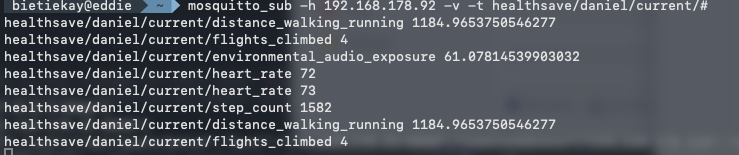

# Health Data to MQTT

Health Data to MQTT is a drop-in server for the [HealthSave iOS app](https://apps.apple.com/app/id6759843047). It accepts HealthKit-derived sync batches through the same HTTP API as the original [Health Data Hub](https://github.com/umutkeltek/health-data-hub/tree/main) server and is being ported toward an MQTT-first data pipeline instead of making TimescaleDB and Grafana the primary destination.

The repository currently contains a Node.js + TypeScript Fastify server with the frozen Health Data Hub V1 compatibility surface, optional API-key authentication, raw and normalized MQTT publishing, a durable local status ledger for `GET /api/apple/status`, a durable idempotency index, HealthSave sync receipt endpoints, optional raw batch storage, Docker support, and tests. Replay fixtures and broader deterministic record idempotency are still planned implementation phases.



## Why This Exists

[HealthSave](https://apps.apple.com/app/id6759843047) can already send Apple Health data to a self-hosted server. The original [Health Data Hub](https://github.com/umutkeltek/health-data-hub/tree/main) project stores that data in TimescaleDB and visualizes it with Grafana. This project keeps the same client-facing sync contract but changes the integration model:

- Health data becomes available through MQTT topics.
- Home automation systems can subscribe in near real time.
- Storage, dashboards, alerts, and automations can be chosen independently.
- The existing iOS app can keep syncing without client changes.
- A reference-compatible migration path remains possible during the port.

## Current Status

This repository contains the compatibility server, a durable status ledger, a durable idempotency index, HealthSave sync receipts, and the initial raw plus normalized MQTT pipeline. Replay fixtures and broader deterministic record idempotency remain planned.

Available now:

- `README.md` - user-facing project documentation.
- `PORTING.md` - living porting plan and implementation discussion document.
- `AGENTS.md` - working instructions for coding agents and maintainers.
- `TEST_STRATEGY.md` and `TEST_MATRIX.md` - test planning and test inventory.
- `src/` - Fastify compatibility server, reference-compatible datapoint extraction, MQTT publishers, and optional raw batch storage.
- `test/` - unit, API integration, and publisher behavior tests.
- `Dockerfile` and `docker-compose.yml` - initial self-hosting setup.
- `reference-implementation/` - read-only reference copy of the original FastAPI + TimescaleDB implementation.

The `reference-implementation/` directory is included only to document existing behavior. Do not edit it as part of this port.

## Upstream Reference and Required Client

This project is a porting effort based on the original [Health Data Hub](https://github.com/umutkeltek/health-data-hub/tree/main) project.

The required client app is [HealthSave](https://apps.apple.com/app/id6759843047) for iOS. HealthSave acts as the HealthKit bridge and sends sync batches to the configured server URL.

## Intended Usage

Run the development server:

```bash
npm install
npm run dev
```

Run tests:

```bash
npm test
```

Build and start:

```bash
npm run build
npm start
```

Run with Docker Compose:

```bash
cp .env.default .env
docker compose up --build
```

Run locally with a configuration file:

```bash
cp config/app.config.example.yaml config/app.config.local.yaml
npm run build
npm run start:local
```

The configuration file path is only intended for plain local `npm start` runs. Docker and Docker Compose deployments should use environment variables through `.env` instead.

Local development config quick guide:

1. Copy `config/app.config.example.yaml` to `config/app.config.local.yaml`.
2. Edit `config/app.config.local.yaml` for your machine, for example local port, API key, MQTT broker URL, or log level.
3. Build the TypeScript output with `npm run build`.
4. Start the server with `npm run start:local`.
5. Point HealthSave at `http://your-machine-ip:8000` or the port configured in your local YAML file.

`config/app.config.local.yaml` is ignored by Git, so it is safe to keep local secrets or machine-specific values there. Environment variables still override local YAML values when both are set.

Use the service as the HealthSave server endpoint:

```text
http://your-server-ip:8000
```

HealthSave app flow:

1. Open HealthSave on iOS.
2. Go to Settings -> Server Sync.
3. Set the server URL to your deployed Health Data to MQTT instance.
4. Optionally enter the configured API key.
5. Run "Sync New Data".

The app appends the API paths itself, so users should configure only the base URL.

## What It Will Receive

The server is designed to receive the same HealthSave batch payloads as the reference implementation:

- heart rate
- heart rate variability
- blood oxygen
- body temperature
- activity summaries
- sleep analysis
- workouts
- any other HealthKit quantity metric through a generic fallback

Supported client-facing endpoints:

| Endpoint | Method | Purpose |
| --- | --- | --- |
| `/health` | GET | Basic service health check |
| `/api/health` | GET | App-compatible health check. HealthSave 1.5 checks this first and falls back to `/health` if needed. |
| `/ready` | GET | Unauthenticated reference-compatible readiness check for local state writability |
| `/api/apple/batch` | POST | Receive one metric batch |
| `/api/apple/status` | GET | Return flat sync/status objects with `count`, `oldest`, and `newest` |
| `/metrics` | GET | Prometheus text endpoint with reference metric names |
| `/api/insights/latest` | GET | Reference-shaped no-data insight response |
| `/api/insights/daily` | GET | Reference-shaped empty daily briefing |
| `/api/insights/weekly` | GET | Reference-shaped empty weekly summary |
| `/api/insights/anomalies` | GET | Reference-shaped empty anomaly list with query validation |
| `/api/insights/trends` | GET | Reference-shaped empty trend list with query validation |
| `/api/insights/trigger` | POST | Reference-shaped no-op analysis trigger response |
| `/api/insights/runs` | GET | Reference-shaped empty analysis run list |
| `/api/v2/meta` | GET | Unauthenticated v2 version axes for contract/ontology/normalizer/fusion policy |
| `/api/v2/metrics` | GET | Unauthenticated canonical metric catalog |
| `/api/v2/metrics/{metric_id}/series` | GET | Local time series for one canonical metric from accepted batches |
| `/api/v2/series` | GET | Batch time-series read for up to 24 metric ids |
| `/api/v2/sources` | GET | Source integrations observed during ingest |
| `/api/v2/devices` | GET | Distinct device labels derived from streams |
| `/api/v2/streams` | GET | Source-device streams with stable deterministic UUIDs |
| `/api/v2/streams/{stream_id}` | GET | One source-device stream |
| `/api/v2/setup/diagnostics` | GET | Unauthenticated setup diagnostics for confirming the API base URL |
| `/api/v2/sync/runs/latest` | GET | Latest HealthSave sync delivery receipt, or an empty success response before any sync-run receipt exists |
| `/api/v2/sync/runs/{sync_run_id}` | GET | Delivery receipt summary for one HealthSave sync run |
| `/api/v2/sync/coverage` | GET | Metric-level receipt coverage summary with destination counts |
| `/api/v2/sync/anomalies` | GET | Empty overlapping-sync anomaly list until deeper sync analysis exists |
| `/api/v2/readiness` | GET | Per-metric local data sufficiency summary |
| `/api/v2/changes` | GET | ETag-backed change fingerprint for polling clients |
| `/api/v2/receipts` | GET | Intelligence audit trail plus ingest freshness |
| `/api/v2/export/metrics` | GET | Exportable metric counts and date ranges |
| `/api/v2/export` | GET | JSON or CSV export from local normalized read state |
| `/api/v2/privacy` | GET | Current local/cloud egress posture |
| `/api/v2/intelligence*` | GET/PUT/POST | Stored narrator settings, consent, local detection, and no-health-data connection probe |
| `/api/v2/insights/*` | GET/POST | Typed empty/no-op v2 insight surfaces until an analysis engine is added |
| `/api/v2/experiments*` | GET/POST | Lightweight local self-experiment records |
| `/api/v2/agents/proposals*` | GET/POST | Typed empty/proposal-decision surface for future local agents |
| `/api/v2/sources/whoop/webhook` | POST | Whoop webhook endpoint with optional HMAC verification |

`/health` and `/api/health` are lightweight liveness checks. `/ready` follows the updated reference shape and returns `{"status":"ready","database":"ok"}` when local state is writable, or `503` when file-backed local state cannot be written. Docker keeps using `/health` for container liveness by default.

The updated upstream API reference documents an `ALLOW_NO_AUTH` default-deny mode for keyed routes when `API_KEY` is unset. This port intentionally keeps its existing compatibility behavior for now: an empty `API_KEY` disables API-key enforcement. Set a long random `API_KEY` for production deployments.

## Multiple Client Contexts

The root URL continues to work as the `default` context:

```text
http://your-server:8000
```

Additional clients can use configured prefixes as their HealthSave server URL:

```text
http://your-server:8000/daniel
http://your-server:8000/alice
```

HealthSave still appends the same API paths, so a client configured with `/daniel` sends batches to:

```text
/daniel/api/apple/batch
```

Each context has its own MQTT topic templates and status ledger. This allows one self-hosted server to receive multiple clients while keeping MQTT output and `/api/apple/status` results separated by context.

Context topic templates support:

| Placeholder | Value |
| --- | --- |
| `{metric}` | Normalized metric name or incoming generic metric name |
| `{context}` | Context name such as `default`, `daniel`, or `alice` |

## MQTT Output

The service publishes one raw MQTT event for each source sample, one normalized MQTT event for each accepted datapoint, and a scalar current value for datapoints that have a single primary value. Normalization follows the reference implementation's field extraction rules for dedicated metrics, generic quantities, activity summaries, sleep sessions, and workouts.

When MQTT is enabled, non-empty batch requests are only accepted after MQTT publishing succeeds. If publishing fails, the endpoint returns `502` so the client can retry instead of silently dropping data.

Default topics:

| Topic | Purpose |
| --- | --- |
| `healthsave/raw/{metric}` | Original batch sample with ingestion metadata |
| `healthsave/normalized/{metric}` | Extracted datapoint with stable metric-specific fields |
| `healthsave/current/{metric}` | Latest scalar value for metrics with one primary value |
| `healthsave/status/sync` | Planned sync/status event |

Example raw topic:

```text
healthsave/raw/heart_rate
```

Raw payload shape:

```json
{
  "metric": "heart_rate",
  "event_type": "raw_sample",
  "ingested_at": "2026-04-10T12:00:00.000Z",
  "batch_index": 0,
  "total_batches": 1,
  "device_id": "Apple Watch",
  "sample_index": 0,
  "sample": {
    "date": "2026-04-10T11:58:00.000Z",
    "qty": 72,
    "source": "Apple Watch"
  },
  "idempotency_key": "..."
}
```

Example normalized topic:

```text
healthsave/normalized/heart_rate
```

Normalized payload shape:

```json
{
  "metric": "heart_rate",
  "normalized_metric": "heart_rate",
  "event_type": "normalized_sample",
  "ingested_at": "2026-04-10T12:00:00.000Z",
  "batch_index": 0,
  "total_batches": 1,
  "device_id": "Apple Watch",
  "record_index": 0,
  "normalized_sample": {
    "time": "2026-04-10T11:58:00.000Z",
    "bpm": 72,
    "source_id": "Apple Watch"
  },
  "idempotency_key": "..."
}
```

Timestamp fields are parsed from ISO 8601 input and published as UTC ISO strings. Date-only activity summaries are published as `YYYY-MM-DD`.

Example current topic:

```text
healthsave/current/heart_rate
```

Current payload:

```text
72
```

Current messages publish scalar values to logical metric topics. Single-value metrics use the metric topic directly, such as `heart_rate`, `hrv`, `blood_oxygen`, `body_temperature`, or generic quantity metrics like `walking_speed` and `blood_pressure_systolic`. Multi-field normalized records fan out into subtopics under the logical metric, for example `daily_activity/steps`, `daily_activity/active_calories`, `sleep_sessions/awake`, `sleep_sessions/total_duration_ms`, `workouts/calories`, or `workouts/distance_m`. For backward compatibility, sleep awake state still also publishes to `sleep_sessions` and workout calories still also publish to `workouts`. Blood oxygen accepts common saturation fields such as `qty`, `oxygenSaturation`, `spo2`, or `value`; fractional values like `0.97` are converted to percent before publishing.

Set `LOG_LEVEL=debug` while capturing new client payload shapes. Batch debug logs include top-level request field names, metric name, batch counters, processed record count, status observation counts, the first sample's field names, and MQTT publish counts without logging complete health samples by default. When a batch contains an unsupported metric, rejected samples, or fields not used by the current mapper, the service emits a warning log with an `unknown_health_data` JSON object. That object includes the context, metric, batch counters, unmapped keys, candidate timestamp/value fields, source identity field names/counts, redacted per-field profiles, limited categorical previews, and implementation hints so new mappers can be added without enabling full raw-body logs. Normal warning logs do not include raw numeric health values, source/device names, or arbitrary string values. Set `LOG_LEVEL=trace` only when you intentionally need raw request bodies in the logs.

Example warning shape:

```json
{
  "msg": "detected unmapped apple health batch data",
  "unknown_health_data": {
    "schema_version": 2,
    "metric": "new_quantity_metric",
    "mapper": "generic_quantity_fallback",
    "unsupported_metric": true,
    "field_summary": {
      "unmapped_keys": ["healthKitIdentifier", "value"],
      "candidate_time_fields": ["startDate"],
      "candidate_numeric_fields": ["value"],
      "categorical_preview_fields": ["healthKitIdentifier"],
      "source_identity_fields": ["sourceName"],
      "source_id_count": 1
    },
    "implementation_hint": {
      "add_or_update_mapper_for_metric": "new_quantity_metric",
      "candidate_time_fields": ["startDate"],
      "candidate_value_fields": ["value"],
      "used_generic_fallback": true,
      "has_rejected_samples": true
    },
    "samples": [
      {
        "sample_index": 0,
        "reasons": ["unsupported_metric", "unmapped_sample_fields", "rejected_sample"],
        "field_profiles": [
          {
            "field": "value",
            "value_type": "number",
            "roles": ["unmapped_field", "candidate_numeric_field"],
            "parseable_number": true
          },
          {
            "field": "healthKitIdentifier",
            "value_type": "string",
            "roles": ["unmapped_field", "candidate_string_field", "categorical_preview_field"],
            "preview": "HKQuantityTypeIdentifierNewQuantityMetric"
          }
        ]
      }
    ]
  }
}
```

Exact normalized payload fields may still change while the porting plan is finalized. Compatibility requirements and open decisions are tracked in `PORTING.md`.

## Local State

`GET /api/apple/status` returns a flat JSON object whose top-level keys are the HealthSave status metrics. Each value has the shape `{ "count": number, "oldest": string | null, "newest": string | null }`. The file-backed implementation stores exact dedupe rows in SQLite when `STATE_BACKEND=file`, so retries do not inflate counts and `oldest` / `newest` survive restarts without loading all historical identities into memory.

Batch responses include the legacy `status`, `metric`, `batch`, `total_batches`, and `records` fields plus additive delivery receipt fields such as `receipt_id`, `records_received`, `records_accepted`, `records_rejected`, `records_deduped_in_batch`, `sample_window`, `verification_level`, and `per_metric`.

When HealthSave sends retry metadata, the service records a lightweight idempotency entry for every successful batch so matching retries replay the original response without publishing or counting the same batch again. The idempotency key is resolved like the reference implementation: explicit `Idempotency-Key`, then `X-HealthSave-Batch-ID`, then `X-HealthSave-Sync-Run-ID` plus metric and batch index. Reusing an idempotency key with a different `X-HealthSave-Payload-Hash` returns `409 Conflict`.

When HealthSave also sends sync receipt headers such as `X-HealthSave-Sync-Run-ID`, the service records delivery receipts. These receipts contain batch metadata and counts, not raw health samples. They power the `/api/v2/sync/*` endpoints and can show both processed and failed batch attempts for a sync run.

`GET /api/v2/sync/runs/latest` is always a supported route. Before the first sync-run receipt is recorded, it returns `200` with `status: "empty"`, zero counts, and no metrics. A request for a specific unknown sync run, such as `GET /api/v2/sync/runs/{sync_run_id}`, still returns `404`.

Docker example:

```env
DATA_PATH=/data
STATE_BACKEND=file
```

The file-backed status store is written under:

```text
<DATA_PATH>/status/status.sqlite
```

SQLite may also create adjacent `status.sqlite-wal` and `status.sqlite-shm` files while the service is running. Include all `status.sqlite*` files in backups. Rollbacks to versions that predate the SQLite store will ignore rows written only to SQLite.

On first startup after upgrading from the legacy NDJSON status ledger, the service scans existing `<DATA_PATH>/status/<context>/observations.ndjson` files, migrates valid observations into SQLite, renames each processed legacy file to `observations.ndjson.migrated`, and then records a migration marker. Startup logs include the selected state backend, SQLite database path, schema initialization, whether migration ran or was skipped, per-context scanned/inserted/duplicate/skipped counts, renamed ledger counts, and a final migration summary. Malformed legacy rows are logged with safe metadata only.

The file-backed sync receipt ledger is written under:

```text
<DATA_PATH>/receipts/<context>/receipts.ndjson
```

The file-backed idempotency index is written under:

```text
<DATA_PATH>/idempotency/<context>/keys.ndjson
```

Status endpoint timestamps are returned as ISO UTC strings. This keeps internal ledgers, MQTT payloads, and API responses aligned while remaining compatible with the HealthSave API note that ISO 8601 timestamps with trailing `Z` are accepted.

Docker Compose mounts `/data` as a persistent volume, so the HealthSave app can see already-observed records after container restarts. Set `STATE_BACKEND=memory` only for disposable local runs or tests.

If you previously ran a build that stored counter-only data in `<DATA_PATH>/state.json`, that file is no longer used. The flat status response needs per-record timestamps and dedupe keys, so operators should expect a one-time status reset or trigger a re-sync when upgrading from counter-only versions. Existing NDJSON status ledgers from newer builds migrate automatically.

## Raw Batch Storage

Set `RAW_STORAGE_PATH` to archive non-empty, valid HealthSave batch requests before MQTT publishing. Leave it empty to disable raw storage.

Docker example:

```env
RAW_STORAGE_PATH=/data/raw
```

The Docker Compose service already mounts persistent storage at `/data`, so `/data/raw` persists across container restarts.

Stored files contain raw health payloads. Treat the directory as sensitive personal health data and protect it with filesystem permissions, backups, and host-level encryption appropriate for your deployment.

The archive is organized by context and server ingestion month:

```text
<RAW_STORAGE_PATH>/<context>/yyyy-mm
```

Example:

```text
/data/raw/default/2026-04
/data/raw/daniel/2026-04
```

Files are newline-delimited JSON. Each line is one accepted batch request as Fastify parsed it, with minimal replay metadata:

```json
{"ingested_at":"2026-04-10T12:00:00.000Z","context":"default","metric":"heart_rate","batch_index":0,"total_batches":1,"body":{"metric":"heart_rate","batch_index":0,"total_batches":1,"samples":[{"date":"2026-04-10T12:00:00Z","qty":72}]}}
```

Empty batches are intentionally skipped. If raw storage is enabled and the archive write fails, the batch is rejected before MQTT publishing and status observations are updated so the client can retry.

## Configuration Options

The service can be configured in two ways:

- Environment variables: preferred and required for Docker/Docker Compose.
- Local YAML config file: optional for plain local `npm start` runs only.

For Docker:

```bash
cp .env.default .env
docker compose up --build
```

For local npm:

```bash
cp config/app.config.example.yaml config/app.config.local.yaml
npm run build
npm run start:local
```

Environment variables override values from the local YAML config file when both are present.

Core options:

| Variable | Default | Description |
| --- | --- | --- |
| `HOST` | `0.0.0.0` | HTTP bind address |
| `PORT` | `8000` | HTTP port |
| `HTTP_BODY_LIMIT_BYTES` | `524288000` | Maximum accepted request body size. Defaults to 500 MiB for large HealthSave sync batches. |
| `API_KEY` | empty | Optional API key. Empty disables auth enforcement. |
| `LOG_ENABLED` | `true` | Enables structured logs by default |
| `LOG_LEVEL` | `info` | Log verbosity |
| `WHOOP_WEBHOOK_SECRET` | empty | Optional HMAC secret for `/api/v2/sources/whoop/webhook`. Empty accepts the webhook as an unconfigured no-op. |

MQTT options:

| Variable | Default | Description |
| --- | --- | --- |
| `MQTT_ENABLED` | `true` | Enable MQTT publishing |
| `MQTT_URL` | `mqtt://broker:1883` | Broker URL |
| `MQTT_CLIENT_ID` | `healthsave-proxy` | MQTT client identifier |
| `MQTT_USERNAME` | empty | Optional broker username |
| `MQTT_PASSWORD` | empty | Optional broker password |
| `MQTT_QOS` | `1` | Publish QoS |
| `MQTT_RETAIN` | `false` | Retain published messages |
| `MQTT_TOPIC_RAW` | `healthsave/raw/{metric}` | Raw event topic template |
| `MQTT_TOPIC_NORMALIZED` | `healthsave/normalized/{metric}` | Normalized event topic template |
| `MQTT_TOPIC_CURRENT` | `healthsave/current/{metric}` | Scalar current value topic template |
| `CONTEXTS` | empty | Optional JSON array of prefixed client contexts |

State and migration options:

| Variable | Default | Description |
| --- | --- | --- |
| `DATA_PATH` | `/data` | Persistent application data directory |
| `STATE_BACKEND` | `file` | Local status, read API, sync receipt, intelligence, experiment, and idempotency backend. Use `file` for durable local state or `memory` for disposable runs. |
| `TIMESCALE_MODE` | `off` | Optional reference mode: `off`, `shadow`, or `bridge` |
| `TIMESCALE_URL` | empty | Optional Timescale/PostgreSQL connection string |
| `TIMESCALE_STRICT_STARTUP` | `false` | Fail startup if reference mode cannot connect |
| `RAW_STORAGE_PATH` | empty | Optional raw NDJSON batch archive path. Empty disables raw storage. |

With `STATE_BACKEND=file`, the v2 read plane stores normalized observations, Source/Device/Stream identity, intelligence settings/audit events, and experiment records under `<DATA_PATH>/read/read.sqlite`. This is a lightweight local read model for API/export/dashboard use; MQTT publishing remains the primary integration path.

### Local Config File

The commented template lives at:

```text
config/app.config.example.yaml
```

Copy it before editing:

```bash
cp config/app.config.example.yaml config/app.config.local.yaml
```

Pass it to the local server:

```bash
npm run start:local
```

The local config file uses grouped YAML sections for `http`, `auth`, `logging`, `mqtt`, `contexts`, and `state`. `config/app.config.local.yaml` is ignored by Git so local secrets and machine-specific settings are not committed. It is not used by the Docker image or `docker-compose.yml`; container deployments should use `.env` variables.

Example local adjustments:

```yaml
http:
  host: "0.0.0.0"
  port: 8000

auth:
  apiKey: "dev-secret"

mqtt:
  url: "mqtt://localhost:1883"
  topics:
    raw: "healthsave/{context}/raw/{metric}"
    normalized: "healthsave/{context}/normalized/{metric}"
    current: "healthsave/{context}/current/{metric}"

contexts:
  - name: "daniel"
    prefix: "/daniel"
    topics:
      raw: "healthsave/daniel/raw/{metric}"
      normalized: "healthsave/daniel/normalized/{metric}"
      current: "healthsave/daniel/current/{metric}"

logging:
  level: "debug"

state:
  backend: "file"

storage:
  dataPath: ".data"
  rawDataPath: ".data/raw"
```

Then start with:

```bash
npm run build
npm run start:local
```

## Deployment Model

The intended deployment is a containerized service next to an MQTT broker.

Typical services:

- `proxy-api` - this Node.js server
- `mqtt-broker` - for example Eclipse Mosquitto
- optional `timescaledb` - only during validation or bridge/shadow migration

Production deployments should place HTTPS and network-level access control in front of the API, especially when syncing from outside the local network.

## Reference Implementation

The original implementation is stored in `reference-implementation/`.

It provides the behavior this project must preserve at the HTTP/API boundary:

- FastAPI service on port `8000`
- optional `x-api-key` authentication
- TimescaleDB persistence
- Grafana-oriented schema and dashboards
- metric mapping and fallback behavior

Use it for comparison, tests, and behavioral clarification only. It is not the implementation target and should not be modified during this port.

## Porting Plan

See `PORTING.md` for the active engineering plan, compatibility notes, rollout phases, open questions, and implementation checklist.
